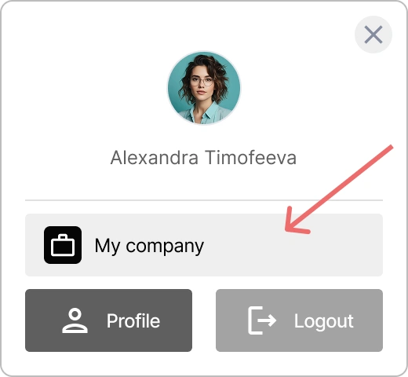
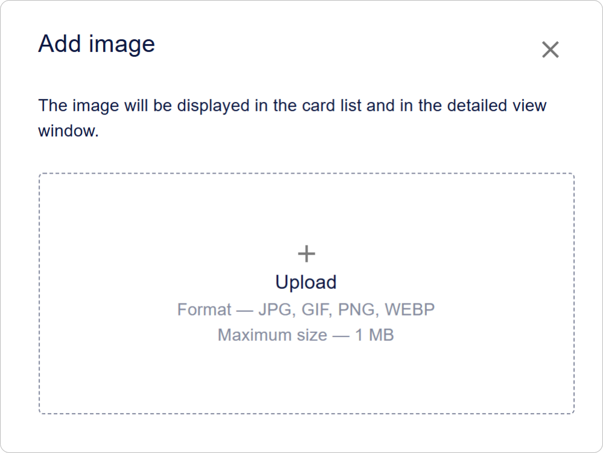

# Gérer une organisation dans Encvoy ID

Dans **Encvoy ID**, les organisations servent d'unité structurelle principale pour gérer l'accès aux applications, répartir les employés par départements et maintenir les audits d'activité des utilisateurs. Dans ce guide, nous verrons comment créer des organisations et configurer les méthodes de connexion.

**Table des matières :**

- [Bases de l'organisation](#organization-basics)
- [Accéder au tableau de bord de l'organisation](#organization-panel-access)
- [Configuration du nom et du logo de l'organisation](#organization-name-and-logo)
- [Méthodes de connexion de l'organisation](#organization-login-methods)
- [Voir aussi](#see-also)

---

## Bases de l'organisation { #organization-basics }

Une organisation dans **Encvoy ID** est une unité structurelle qui vous permet de :

- **Ségréger l'accès** aux applications entre les départements ou les projets,
- **Configurer des méthodes de connexion d'entreprise**,
- **Maintenir un audit centralisé** de l'activité des utilisateurs,
- **Gérer les applications** au sein d'une seule entreprise,
- **Configurer le branding** (logo, nom) pour les widgets de connexion.

> 💡 **Cas d'utilisation :** Les organisations sont idéales pour les entreprises qui ont besoin de gérer plusieurs applications et groupes d'utilisateurs à partir d'un point de contrôle unique.

---

## Accéder au tableau de bord de l'organisation { #organization-panel-access }

Le tableau de bord de l'organisation est conçu pour gérer les paramètres de l'organisation, les applications et les utilisateurs.

Les sections suivantes sont disponibles dans le tableau de bord de l'organisation :

- **Paramètres** — paramètres de l'organisation, méthodes de connexion et personnalisation du widget de connexion.
- **Applications** — gestion des applications de l'organisation.
- **Journal** — historique de l'activité des utilisateurs de l'organisation.

### Comment accéder au tableau de bord de l'organisation Encvoy ID

> ⚠️ Pour accéder au tableau de bord de l'organisation, vous devez disposer des autorisations **Gestionnaire**. Contactez l'administrateur de votre service pour les obtenir.

Pour ouvrir le tableau de bord de l'organisation :

1. Connectez-vous à votre compte personnel **Encvoy ID**.
2. Cliquez sur votre nom dans le coin supérieur droit de la fenêtre.
3. Dans la fenêtre du mini-widget qui s'ouvre, cliquez sur le nom de votre organisation.

Vous serez redirigé vers le **Tableau de bord de l'organisation**.

> 💡 Ajoutez les applications fréquemment utilisées au mini-widget en utilisant le paramètre **Afficher dans le mini-widget** pour un accès rapide.  
> 

## Configuration du nom et du logo de l'organisation { #organization-name-and-logo }

Le nom et le logo sont affichés dans l'interface système de **Encvoy ID** ainsi que dans le mini-widget.

Pour configurer le nom et le logo :

1. Allez dans le tableau de bord de l'organisation → onglet **Paramètres**.
2. Développez le bloc **Informations principales**.
3. Spécifiez le nouveau nom dans le champ **Nom de l'application**.
4. Dans la section **Logo de l'application**, cliquez sur **Charger** et sélectionnez le fichier du logo.

   > ⚡ Formats supportés : JPG, GIF, PNG, WEBP ; taille maximale 1 Mo.

5. Ajustez la zone d'affichage du logo.

6. Cliquez sur **Enregistrer**.

---

## Méthodes de connexion de l'organisation { #organization-login-methods }

Une **méthode de connexion** est une méthode d'authentification de l'utilisateur qui lui permet de se connecter aux applications.

Une organisation peut utiliser à la fois des méthodes de connexion publiques et des méthodes de connexion créées spécifiquement pour cette organisation.

**Vous pouvez :**

- Utiliser des **méthodes de connexion publiques** configurées par l'administrateur **Encvoy ID**
- Ajouter **vos propres méthodes de connexion** exclusivement pour votre organisation
- Configurer la **publicité** — déterminer où vos méthodes de connexion seront disponibles
- Rendre les identifiants **obligatoires** pour les utilisateurs

> ⚠️ **Restrictions :** Seuls les administrateurs **Encvoy ID** peuvent modifier les méthodes de connexion publiques.

> 🔍 Des instructions détaillées pour créer, modifier et supprimer des méthodes de connexion sont fournies dans le guide principal : [Configuration des méthodes de connexion](./docs-06-github-en-providers-settings.md#managing-login-methods).

---

## Voir aussi { #see-also }

- [Méthodes de connexion et configuration du widget de connexion](./docs-06-github-en-providers-settings.md) — un guide sur les méthodes de connexion et la configuration du widget de connexion.
- [Gestion des applications](./docs-10-common-app-settings.md) — un guide pour créer, configurer et gérer les applications OAuth 2.0 et OpenID Connect (OIDC).
- [Profil personnel et gestion des autorisations d'application](./docs-12-common-personal-profile.md) — un guide pour gérer votre profil personnel.
