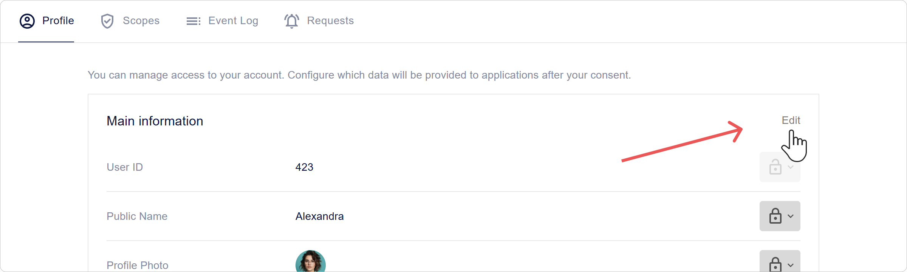
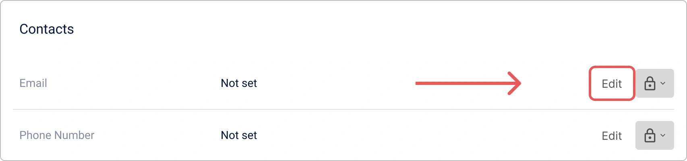
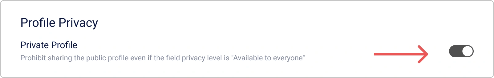
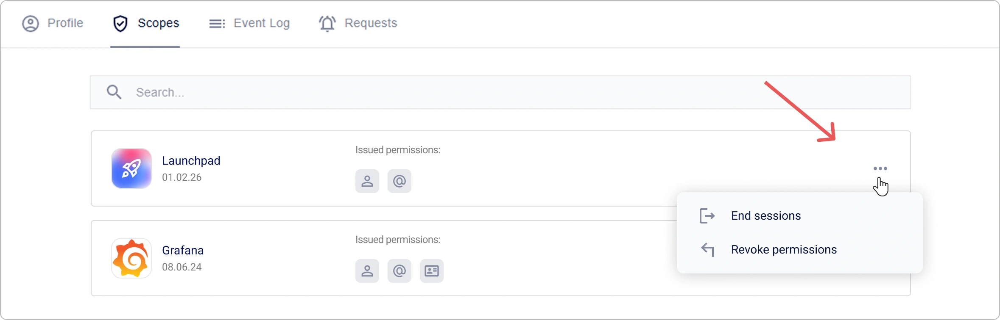
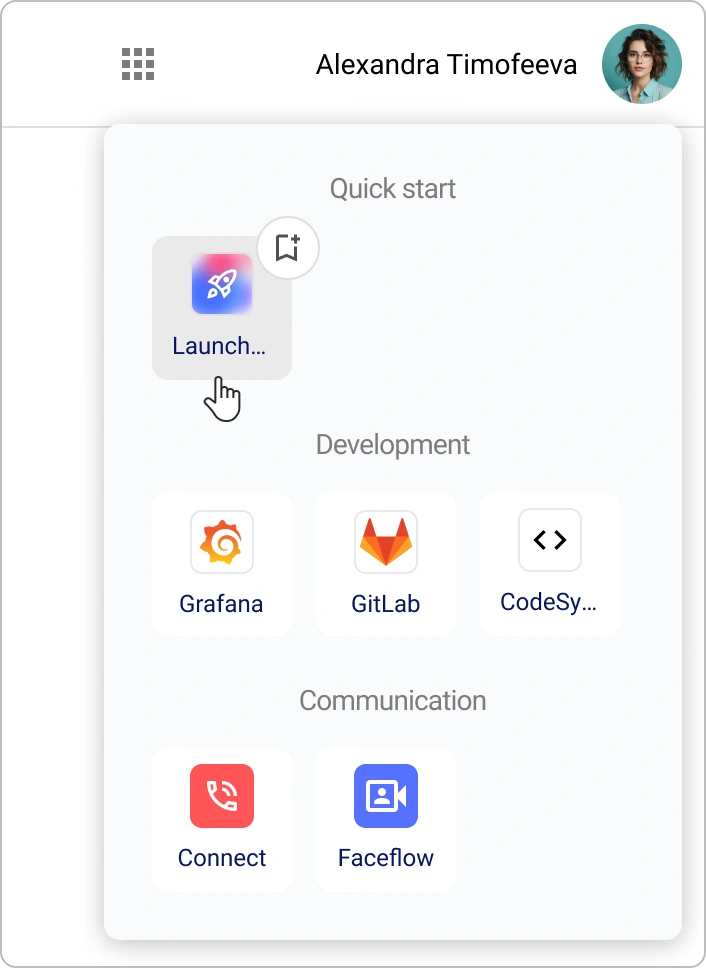

# Comment gérer votre profil personnel Encvoy ID

**Le profil Encvoy ID** est votre centre de contrôle pour les données et la sécurité de votre compte.

Dans ce guide, vous apprendrez à gérer votre profil personnel dans **Encvoy ID** : modifier les données et les paramètres de confidentialité, mettre à jour votre mot de passe, contrôler l'accès aux applications, consulter le journal d'activité et exporter les données du profil.

**Table des matières :**

- [Gestion du profil personnel](#personal-profile-management)
- [Autorisations d'application et accès OAuth](#app-permissions-and-oauth)
- [Invitations aux applications fermées](#closed-app-invitations)
- [Catalogue d'applications](#application-catalog)
- [Journal d'activité et historique de connexion](#activity-log-and-login-history)
- [Voir aussi](#see-also)

---

## Gestion du profil personnel { #personal-profile-management }

Votre profil contient des informations de base pour l'identification au sein du système. Selon la méthode d'inscription, certains champs peuvent ne pas être modifiables. Si vous devez les modifier, contactez l'administrateur du service.

### Modification des informations personnelles

1. Accédez à votre onglet **Profil**.
2. Cliquez sur **Modifier** dans le bloc **Informations principales**.



3. Apportez les modifications nécessaires dans le formulaire qui s'ouvre.

   > 💡 Des règles de validation sont définies pour certains champs. Soyez prudent lors des modifications.
   >
   > 

4. Cliquez sur **Enregistrer**.

> 📌 **Important :** Le profil peut être enregistré même avec des champs obligatoires vides. Le système demandera les données manquantes lors de votre prochaine connexion.

### Ajout d'une photo de profil

Vous pouvez télécharger une photo depuis votre appareil ou utiliser un avatar provenant de services externes liés.

1. Accédez à votre onglet **Profil**.
2. Cliquez sur **Modifier** dans le bloc **Informations principales**.
3. Le formulaire d'édition s'ouvrira.
4. Ajoutez une photo en utilisant l'une des méthodes suivantes :
   - Cliquez sur le bouton **Charger** et indiquez le chemin vers le fichier photo,

       

   - Cliquez sur le bouton **Disponibles** et sélectionnez une photo d'un système externe.

       

   > 📌 S'il n'y a pas d'identifiants de système externe liés avec une photo dans le profil, le bouton **Disponibles** sera masqué.

   > 💡 **Conseil** : Pour supprimer une photo, cliquez sur le bouton **Supprimer** dans le bloc **Photo de profil**.

5. Cliquez sur **Enregistrer** dans le formulaire d'édition.

### Ajout d'une adresse e-mail

> 💡 L'e-mail nécessite une vérification — saisie d'un code à usage unique ou clic sur un lien dans l'e-mail.

1. Accédez à votre onglet **Profil**.
2. Trouvez le bloc **Contacts** et cliquez sur **Modifier** sur le panneau **E-mail**.



3. Le formulaire d'ajout s'ouvrira.


4. Entrez l'e-mail et cliquez sur **Obtenir le code**.

   Un code de confirmation sera envoyé à l'adresse spécifiée.

5. Entrez le code et cliquez sur **Confirmer**, ou suivez le lien dans l'e-mail.

> 💡 **Conseil** : Pour supprimer un e-mail, cliquez sur le bouton **Supprimer** sur le panneau **E-mail**.

### Ajout d'un numéro de téléphone

> 💡 Le numéro de téléphone nécessite une vérification — saisie d'un code à usage unique reçu par SMS ou par un appel entrant.

1. Accédez à votre onglet **Profil**.
2. Trouvez le bloc **Contacts** et cliquez sur **Modifier** sur le panneau **Numéro de téléphone**.


3. Le formulaire d'édition s'ouvrira.


4. Entrez le numéro et cliquez sur **Obtenir le code**.

   Un SMS ou un appel sera envoyé au numéro spécifié.

5. Entrez le code de confirmation et cliquez sur **Confirmer**.

> 💡 **Conseil** : Pour supprimer un numéro de téléphone, cliquez sur le bouton **Supprimer** sur le panneau **Numéro de téléphone**.

### Changement de mot de passe

1. Accédez à votre onglet **Profil**.
2. Cliquez sur **Modifier** dans le bloc **Sécurité**.


3. Dans la fenêtre qui s'ouvre, spécifiez le mot de passe actuel et le nouveau mot de passe.


Après avoir changé le mot de passe, vous serez déconnecté. Pour continuer à travailler, vous devez vous reconnecter en utilisant le nouveau mot de passe.

### Paramètres de confidentialité { #privacy-settings }

Vous pouvez contrôler indépendamment quelles informations seront disponibles pour les autres utilisateurs ou les systèmes tiers. Cela se fait via les paramètres de confidentialité des champs.

Ce paramètre vous permet de définir la confidentialité pour chaque champ dans les blocs **Informations principales**, **Informations complémentaires**, et **Identifiants**.

#### Niveaux de confidentialité { #privacy-levels }

| Niveau                              | Icône                                                                                                  | Description                                                                                                                             |
| ----------------------------------- | ------------------------------------------------------------------------------------------------------ | --------------------------------------------------------------------------------------------------------------------------------------- |
| **Disponible uniquement pour vous** |                           | Les données ne sont pas transmises aux systèmes tiers et ne sont disponibles que pour vous.                                             |
| **Disponible sur demande**          |  | Les données sont disponibles dans les systèmes tiers intégrés à Encvoy ID. <br> Votre consentement est requis pour accéder aux données. |
| **Disponible pour tous**            |                       | Les données sont toujours publiques. Votre consentement n'est pas requis pour y accéder.                                                |

#### Comment configurer la confidentialité des champs

1. Accédez à votre onglet **Profil**.
2. Cliquez sur le bouton de paramètre de confidentialité à côté du champ.
3. Sélectionnez le niveau requis.


Selon la valeur sélectionnée, la valeur du champ dans le profil devient publique ou privée.

Le paramètre est appliqué sans confirmation supplémentaire.

### Gestion des identifiants de services externes { #external-service-identifiers }

**Les identifiants** sont des services externes que vous avez ajoutés à votre profil ou par lesquels vous vous êtes déjà connecté à des applications ou au compte personnel.

La liste des identifiants disponibles pour l'ajout dans le profil est formée à partir des méthodes de connexion publiques créées dans le tableau de bord **Encvoy ID**.

> 🔍 Les identifiants disponibles pour la liaison sont configurés dans le tableau de bord administrateur.

> 💡 Vous pouvez vous connecter aux applications en utilisant des identifiants, à condition qu'ils soient ajoutés au widget de connexion.

#### Ajout d'un nouvel identifiant

1. Accédez à votre onglet **Profil**.
2. Cliquez sur **Ajouter** dans le bloc **Identifiants**.


3. Dans la fenêtre qui s'ouvre, sélectionnez un service externe.


4. Effectuez l'authentification dans le service.

   Après une connexion réussie au compte du service externe, l'identifiant sera lié au profil.

> 💡 **Conseil** : Si un identifiant de service externe est déjà lié à un autre utilisateur, vous devez le supprimer du profil de cet utilisateur, puis le lier au nouveau compte.

#### Suppression d'un identifiant

1. Accédez à votre onglet **Profil**.
2. Cliquez sur l'identifiant que vous souhaitez supprimer.
3. Sélectionnez l'action **Supprimer**.


L'identifiant sera **immédiatement supprimé** du profil.

### Configuration du profil public

**Le profil public** se compose de données publiques consultables par les autres membres du système **Encvoy ID** et les applications connectées. Il vous permet de contrôler quelles informations utilisateur sont visibles par les autres sans accorder un accès complet au compte.

#### Consultation du profil public

1. Accédez à votre onglet **Profil**.
2. Cliquez sur le bouton **Données publiques** dans le bloc **Confidentialité du profil**.
3. Une fenêtre s'ouvrira avec le profil public contenant les données ayant le niveau **Disponible pour tous**.

#### Téléchargement des données du profil public

> 📌 Les données du profil public sont exportées au format **vCard**.

1. Accédez à votre onglet **Profil**.
2. Cliquez sur le bouton **Données publiques** dans le bloc **Confidentialité du profil**.
3. La fenêtre **Profil Public** s'ouvrira avec les données réglées sur le niveau **Disponible pour tous**.
4. Cliquez sur le bouton **Exporter vCard** .
5. Le téléchargement du fichier commencera.

Exemple d'un fichier **vCard** avec les données du profil public :

```VCARD
BEGIN:VCARD
VERSION:3.0
FN:Timofeeva Alex
N:Timofeeva;Alex;;;
PHOTO:https://service-adress/public/images/profile/90211313d753e1d1b83ab19ecfd4af5e
EMAIL:timofeeva-alexs@gmail.com
UID:null
REV:2025-05-26T12:52:24.630Z
END:VCARD
```

#### Désactivation du profil public

> 💡 **Conseil** : Vous pouvez interdire la transmission des données du profil public qui ont le niveau de confidentialité \"Disponible pour tout le monde\".

1. Accédez à votre onglet **Profil**.
2. Activez le commutateur **Profil privé** dans le bloc **Confidentialité du profil**.

   

   Le paramètre est appliqué sans confirmation supplémentaire.

Après avoir activé le paramètre, les données avec le niveau de confidentialité \"Disponible pour tout le monde\" ne deviennent disponibles que sur demande.

### Carte de visite numérique du profil personnel { #digital-business-card }

> 🔬 **Fonctionnalité expérimentale** : La disponibilité est régulée par l'administrateur système.

**La carte de visite Encvoy ID** est un remplacement numérique moderne pour une carte de visite papier, accessible via un lien unique.

**Contenu de la carte de visite :**

- Photo de profil,
- Prénom et nom,
- Coordonnées (e-mail, téléphone),
- Date de naissance.

**Caractéristiques :**

- Les données sont affichées quels que soient les [paramètres de confidentialité](#privacy-settings).
- La carte de visite est disponible via un lien unique : `https://<votre-service>/api/cards/<identifiant>`.
- Prend en charge l'exportation de la carte de visite au format **vCard** pour l'intégration dans diverses applications.

#### Activité de la carte de visite

Un paramètre d'activité est disponible pour la carte de visite.

1. Accédez à votre onglet **Profil**.
2. Dans le bloc **Carte de visite**, activez le commutateur **Activité**.

   

   Assurez-vous que votre carte de visite est maintenant accessible. Pour ce faire, suivez le lien : `https://<votre-domaine>/api/cards/<identifiant>` :

#### Configuration d'une adresse de lien personnalisée

Pour rendre le lien de la carte de visite plus court et plus facile à retenir, vous pouvez définir votre propre identifiant unique.

1. Accédez à votre onglet **Profil**.
2. Dans le bloc **Carte de visite**, spécifiez un nouvel identifiant.
3. Cliquez sur **Enregistrer**.

> 💡 L'identifiant doit être unique dans le système et ne contenir que des lettres latines, des chiffres et des traits d'union.

#### Comment partager une carte de visite

1. Accédez à votre onglet **Profil**.
2. Dans le bloc **Carte de visite** :
   - Cliquez sur **Ouvrir le code QR**  et scannez le code avec la caméra de votre appareil.
   - Cliquez sur le bouton **Copier le lien**  pour copier l'adresse du lien de la carte de visite.

### Actions supplémentaires du profil personnel

#### Terminer toutes les sessions

La fonction de fin forcée de toutes les sessions actives est un outil de sécurité important. Utilisez-la en cas de perte d'appareil, de suspicion de compromission de compte ou pour mettre à jour immédiatement les jetons d'accès.

> 📌 Cette opération invalide immédiatement tous les jetons d'accès et de rafraîchissement, mettant fin à TOUTES les sessions en cours dans toutes les applications.

Pour terminer toutes les sessions actives :

1. Accédez à votre onglet **Profil**.
2. Développez le bloc **Autres actions** et sélectionnez **Se déconnecter de tous les appareils**.

Après cela, vous devrez vous **reconnecter** sur tous les appareils.

#### Téléchargement des données du profil personnel

**Encvoy ID** vous permet d'exporter toutes les données de profil au format JSON.

Ce fichier contient toutes les informations relatives à votre profil dans **Encvoy ID**, ainsi que les détails des comptes externes que vous avez ajoutés comme méthodes de connexion, que le paramètre de confidentialité soit défini pour eux ou non.

Pour télécharger les données du profil :

1. Accédez à votre onglet **Profil**.
2. Développez le bloc **Autres actions** et sélectionnez **Télécharger les données**.
3. Le téléchargement du fichier JSON commencera automatiquement.

#### Politique de traitement des données personnelles

Lisez le document sur la manière dont **Encvoy ID** traite vos données.

Pour lire la politique :

1. Accédez à votre onglet **Profil**.
2. Développez le bloc **Autres actions** et sélectionnez **Politique de traitement des données personnelles**.
3. Le téléchargement du fichier de politique commencera.

### Suppression et récupération de compte

La suppression de compte dans **Encvoy ID** est une opération irréversible, après laquelle il sera impossible de récupérer les données. Le système utilise un mécanisme de suppression différée : votre compte est marqué pour suppression mais reste disponible pour récupération pendant une certaine période. Ceci est fait pour protéger contre une suppression accidentelle et vous donner le temps de changer d'avis.

Pour supprimer un compte :

1. Accédez à votre onglet **Profil**.
2. Développez le bloc **Autres actions** et sélectionnez l'action **Supprimer le compte**.
3. Dans la fenêtre qui s'ouvre, entrez le mot de passe de votre compte pour confirmer l'action et cliquez sur **Supprimer**.


**Ce qui se passe :**

- Le compte est marqué pour suppression
- Vous êtes automatiquement déconnecté
- La récupération du compte est disponible pendant une certaine période

Pendant une certaine période après la suppression du compte, vous avez la possibilité d'en restaurer l'accès. Pour ce faire, vous devez vous reconnecter au compte personnel **Encvoy ID**, puis cliquer sur **Restaurer le compte**.

> 💡 La récupération de compte n'est disponible que lors de la connexion au compte personnel **Encvoy ID**. Lors de la connexion à une application via le service **Encvoy ID**, la récupération de compte n'est pas disponible.

---

## Autorisations d'application et accès OAuth { #app-permissions-and-oauth }

**Les autorisations** sont les droits que vous accordez aux applications externes pour accéder à des données spécifiques de votre profil **Encvoy ID**. Vous pouvez restreindre l'accès, terminer les sessions actives ou révoquer complètement les autorisations à tout moment.

Toutes les applications qui ont accès à vos données sont affichées dans le **Profil** sous l'onglet **Permissions**.

### Navigation vers une application depuis la liste des autorisations

Pour ouvrir rapidement une application à laquelle vous avez précédemment accordé l'accès :

1. Accédez à votre onglet **Profil** → onglet **Permissions**.


2. Cliquez sur le **nom de l'application** dans la liste.
3. Vous serez automatiquement redirigé vers l'application sélectionnée.

### Fin des sessions d'application actives

Si vous souhaitez mettre fin immédiatement à toutes les sessions dans une application spécifique :

1. Accédez à votre onglet **Profil** → onglet **Permissions**.
2. Ouvrez le menu d'action pour l'application où vous devez terminer les sessions.
3. Sélectionnez l'action **Terminer les sessions**.



4. Confirmez l'action dans la fenêtre modale.

**Ce qui se passera :** Toutes les sessions actives dans cette application seront terminées. Lors de votre prochain accès à l'application, une **ré-autorisation** sera requise.

Mettre fin aux sessions est utile si vous soupçonnez un accès non autorisé ou si vous avez utilisé l'application sur un appareil partagé.

### Révocation des autorisations d'application

Pour interdire complètement à une application d'accéder à vos données :

1. Accédez à votre onglet **Profil** → onglet **Permissions**.
2. Ouvrez le menu d'action pour l'application dont vous souhaitez révoquer les autorisations.
3. Sélectionnez l'action **Révoquer l'autorisation**.
4. Confirmez l'action dans la fenêtre modale.

**Conséquences :** L'application **perdra l'accès** à toutes vos données de profil. Lors de votre prochaine connexion, le système demandera un **nouveau consentement** pour l'accès.

---

## Invitations aux applications fermées { #closed-app-invitations }

Une **invitation** est un moyen d'accéder à une application fermée. L'administrateur de l'application envoie une invitation à votre e-mail, après quoi vous pouvez vous connecter à l'application qui est indisponible pour les autres utilisateurs.

### Comment recevoir une invitation ?

Une invitation arrive de deux manières :

1. **Par e-mail** : Vous recevrez un e-mail avec une invitation et un lien pour un accès rapide à l'application.
2. **Dans votre profil Encvoy ID** : une nouvelle invitation apparaît dans la section **Requêtes**.

### Comment accepter une invitation ?

Vous pouvez accepter une invitation de n'importe quelle manière pratique.

#### Méthode 1 : Accepter l'invitation depuis l'e-mail

1. Ouvrez l'e-mail d'invitation.
2. Cliquez sur le lien dans l'e-mail.
3. Ensuite, deux options sont possibles :
   - si vous êtes déjà connecté au système — vous entrerez immédiatement dans l'application ;
   - si vous n'êtes pas connecté — connectez-vous au système.

> 🔐 Vous devez vous connecter **sous le compte** lié à l'e-mail spécifié dans l'invitation.

#### Méthode 2 : Accepter l'invitation depuis le profil

1. Accédez à votre onglet **Profil** → onglet **Requêtes**.
2. Trouvez l'invitation requise dans la liste.
3. Cliquez sur le bouton **Accepter**.


Après cela, l'accès à l'application sera activé et vous pourrez y naviguer.

#### Si vous n'avez pas encore de compte

Si vous avez reçu une invitation mais n'êtes pas encore inscrit dans le système **Encvoy ID** :

1. Suivez le lien de l'e-mail d'invitation.
2. Inscrivez-vous dans le système **Encvoy ID**.
3. Lors de l'inscription, spécifiez la même adresse e-mail que celle à laquelle l'invitation a été envoyée.
4. Une fois l'inscription terminée, vous recevrez automatiquement l'accès à l'application.

---

## Catalogue d'applications { #application-catalog }

> 🔬 **Fonctionnalité expérimentale** : La disponibilité est régulée par l'administrateur système.

### Qu'est-ce que le catalogue ?

**Le catalogue** est une place de marché centralisée pour toutes les applications disponibles dans l'écosystème **Encvoy ID**.

Le catalogue regroupe toutes les applications publiques en un seul endroit, vous permettant de trouver rapidement les applications dont vous avez besoin, de consulter les noms et descriptions, et d'accéder aux applications sans avoir à mémoriser des liens ou des chemins complexes.

Pour plus de commodité, toutes les applications du catalogue sont divisées par type.

Les applications du catalogue peuvent être ajoutées aux favoris. Pour un accès rapide, toutes les applications favorites sont affichées dans la barre latérale gauche.

### Comment utiliser les applications du catalogue ?

1. Cliquez sur le bouton .
2. Une fenêtre s'ouvrira avec une liste d'applications ajoutées au catalogue.



3. Sélectionnez l'application souhaitée dans le catalogue.
4. Vous serez automatiquement redirigé vers la page de l'application.
5. Authentifiez-vous dans l'application en utilisant **Encvoy ID** et accordez à l'application l'accès à vos données.

Vous pouvez maintenant vous connecter à l'application avec votre profil **Encvoy ID**.

### Actions dans le catalogue

#### Ajout d'une application aux favoris

1. Cliquez sur le bouton **Catalogue d'applications** .
2. Une fenêtre s'ouvrira avec une liste d'applications ajoutées au catalogue.
3. Cliquez sur le bouton  situé à côté de l'application que vous souhaitez ajouter aux favoris.

   L'application sera ajoutée aux favoris et affichée dans le groupe correspondant.

   

#### Suppression d'une application des favoris

1. Cliquez sur le bouton **Catalogue d'applications** .
2. Une fenêtre s'ouvrira avec une liste d'applications ajoutées au catalogue.
3. Cliquez sur le bouton  situé à côté de l'application que vous souhaitez supprimer des favoris.

L'application sera supprimée des favoris et disparaîtra du menu latéral.

---

## Journal d'activité et historique de connexion { #activity-log-and-login-history }

**Le journal d'activité** est un outil de sécurité qui vous permet de savoir où et depuis quels appareils vous vous êtes connecté à **Encvoy ID** ou à des applications.

### Détails de l'événement

Des informations détaillées sont disponibles pour chaque événement.

| Paramètre                  | Contient                                 |
| -------------------------- | ---------------------------------------- |
| **En-tête de l'événement** | Catégorie d'action                       |
| **Date et heure**          | Horodatages exacts                       |
| **Application**            | Identifiant de l'application (client_id) |
| **Utilisateur**            | Identifiant de l'utilisateur (id)        |
| **Appareil**               | Type d'appareil et navigateur            |
| **Localisation**           | Adresse IP                               |

### Comment consulter le journal d'activité ?

1. Accédez à votre onglet **Profil**.
2. Ouvrez l'onglet **Journal**.

---

## Voir aussi { #see-also }

- [Inscription et connexion de l'utilisateur](./docs-13-common-user-authentication.md) — instructions pour créer un compte, se connecter avec un nom d'utilisateur/mot de passe et services d'authentification externes.
