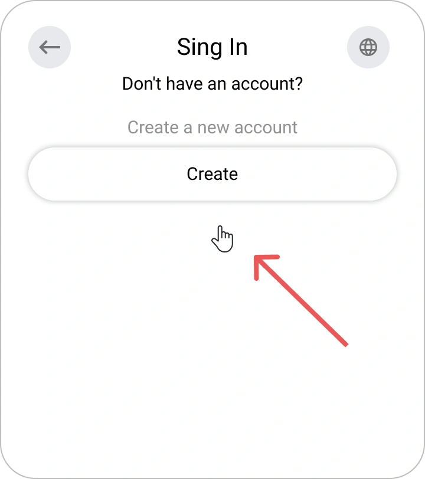
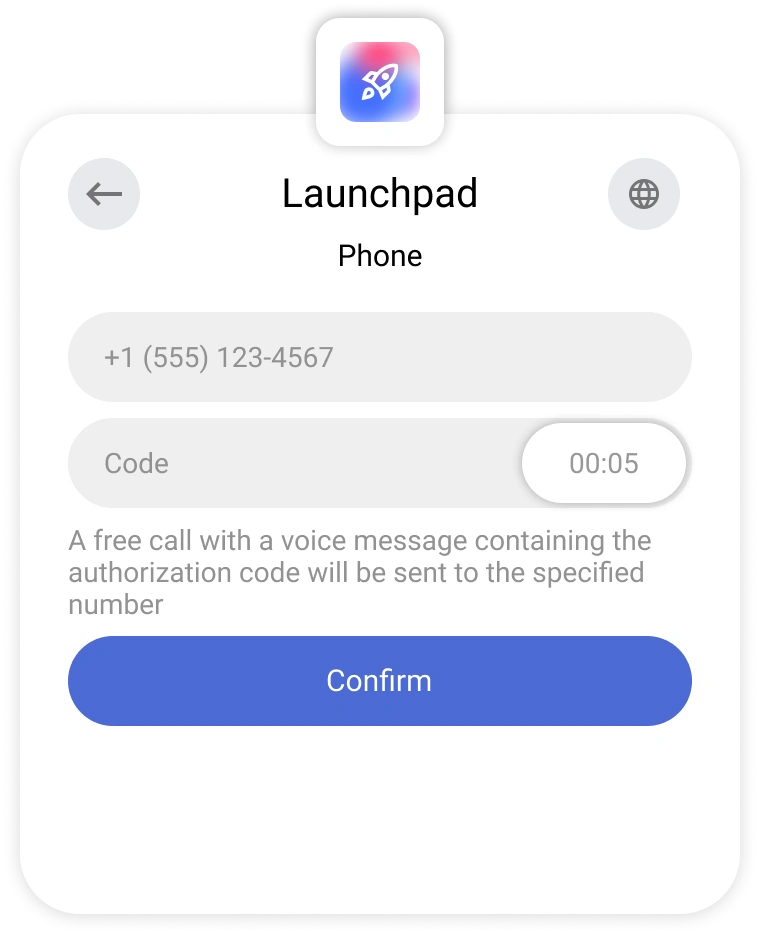
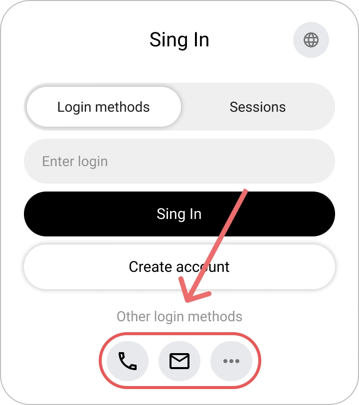
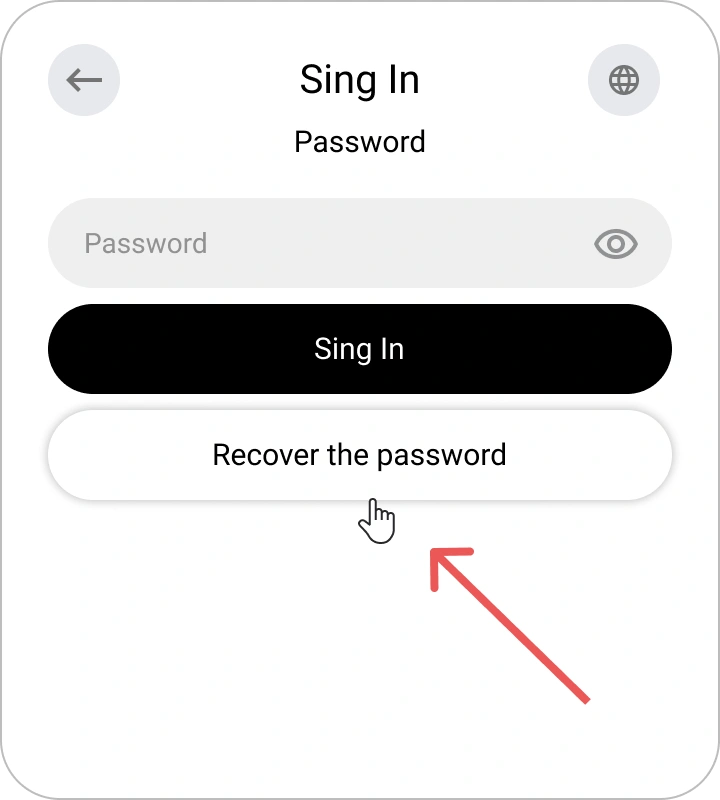

# Inscription, Connexion et Récupération de mot de passe dans Encvoy ID

Dans ce guide, vous apprendrez comment créer un compte dans **Encvoy ID**, vous connecter à l'aide d'un nom d'utilisateur et d'un mot de passe ou via des services externes, et récupérer l'accès à votre profil en toute sécurité si nécessaire.

**Table des matières :**

- [Inscription, Connexion et Récupération de mot de passe dans Encvoy ID](#inscription-connexion-et-récupération-de-mot-de-passe-dans-encvoy-id)
  - [Inscription d'un nouveau compte { #new-account-registration }](#inscription-dun-nouveau-compte--new-account-registration-)
    - [Où l'inscription est-elle disponible ?](#où-linscription-est-elle-disponible-)
    - [Comment créer un compte dans Encvoy ID](#comment-créer-un-compte-dans-encvoy-id)
  - [Connexion avec nom d'utilisateur et mot de passe { #login-with-password }](#connexion-avec-nom-dutilisateur-et-mot-de-passe--login-with-password-)
  - [Connexion via des services externes { #login-via-external-services }](#connexion-via-des-services-externes--login-via-external-services-)
  - [Connexion rapide pour les utilisateurs authentifiés { #quick-login-for-authenticated-users }](#connexion-rapide-pour-les-utilisateurs-authentifiés--quick-login-for-authenticated-users-)
  - [Récupération de mot de passe { #password-recovery }](#récupération-de-mot-de-passe--password-recovery-)
    - [Comment récupérer un mot de passe dans Encvoy ID](#comment-récupérer-un-mot-de-passe-dans-encvoy-id)
  - [Voir aussi { #see-also }](#voir-aussi--see-also-)

---

## Inscription d'un nouveau compte { #new-account-registration }

### Où l'inscription est-elle disponible ?

La fonction de création de compte peut être disponible dans deux cas :

1. **Sur le formulaire de connexion** ;

2. **Sur le formulaire de sélection d'action lors de la connexion via une méthode d'authentification**, si l'identifiant spécifié n'est lié à aucun profil dans **Encvoy ID**

> 💡 **Le design du formulaire** peut varier en fonction des paramètres de l'application spécifique.

### Comment créer un compte dans Encvoy ID

1. Cliquez sur **Créer un compte** sur le formulaire de connexion ou de sélection d'action.
2. Saisissez les données requises dans le formulaire d'inscription.

   Exemple de la fenêtre de saisie du nom :

   

3. Si le système demande un e-mail — fournissez une adresse qui n'est pas liée à d'autres utilisateurs.
4. Saisissez le code ou suivez le lien figurant dans l'e-mail envoyé à l'adresse spécifiée.

   

   > 💡 Si la confirmation est effectuée via un lien, la fenêtre de saisie du code peut être fermée.

5. Lors de la première connexion à l'application, accordez l'accès aux données nécessaires.

Une fois ces étapes terminées, le compte sera créé et vous serez connecté au système.

> 🔗 Si l'inscription est initiée via un service externe, l'identifiant du système externe sera automatiquement lié au nouveau profil. Il pourra être utilisé pour les connexions ultérieures.

---

## Connexion avec nom d'utilisateur et mot de passe { #login-with-password }

Vous pouvez vous autoriser dans l'application en utilisant votre compte **Encvoy ID**.

> 📌 **Note** : Dans certaines applications, la connexion par mot de passe peut être désactivée. Dans ce cas, utilisez les [méthodes de connexion externes](#login-via-external-services).

Pour vous connecter :

1. À la première étape du widget de connexion, saisissez vos données d'identification (ex: nom d'utilisateur, e-mail ou numéro de téléphone) et cliquez sur **Se connecter**.

2. Saisissez votre mot de passe à la deuxième étape et cliquez sur **Se connecter**.

   > 💡 Si vous avez fait une erreur lors de la saisie des données, suivez les instructions à l'écran.

   

**Après une authentification réussie :**

- lors de la première connexion, un formulaire de confirmation d'accès aux données s'ouvrira ;

  Exemple d'un formulaire demandant l'accès aux données du profil :

    

- si l'application requiert des champs de profil obligatoires, le système demandera de les remplir ;

  Exemple de demande de numéro de téléphone :

    

- si les données sont masquées par les [paramètres de confidentialité](./docs-12-common-personal-profile.md#privacy-levels), vous serez invité à modifier le niveau d'accès.

  Exemple de modification de la confidentialité de la date de naissance :

    

---

## Connexion via des services externes { #login-via-external-services }

Les services d'identification externes (ou méthodes de connexion) incluent les réseaux sociaux et les services tiers.

Pour vous connecter via un service externe :

1. Sélectionnez la méthode de connexion souhaitée dans le widget.

2. Terminez l'autorisation dans le service sélectionné en utilisant les méthodes disponibles pour les réseaux sociaux.
3. Lors de la première connexion, un formulaire de demande d'accès aux données s'ouvrira. Donnez votre consentement pour accéder à vos données.

---

## Connexion rapide pour les utilisateurs authentifiés { #quick-login-for-authenticated-users }

Si vous vous êtes déjà connecté à **Encvoy ID** dans votre navigateur, une nouvelle autorisation ne sera pas nécessaire.

1. Lors de l'accès, une fenêtre de sélection d'un compte enregistré s'ouvrira.
2. Cliquez sur le nom d'utilisateur.

3. Après avoir sélectionné l'utilisateur, la connexion s'effectuera.

De plus :

- Pour vous connecter en tant qu'utilisateur différent, sélectionnez **Méthodes de connexion** et identifiez-vous sous un autre compte.
- Pour mettre fin à la session actuelle, cliquez sur le bouton **Se déconnecter**.

---

## Récupération de mot de passe { #password-recovery }

Si vous avez oublié le mot de passe de votre compte **Encvoy ID**, vous pouvez facilement le récupérer.

### Comment récupérer un mot de passe dans Encvoy ID

1. À la première étape du widget de connexion, saisissez vos données d'identification (ex: nom d'utilisateur, e-mail ou numéro de téléphone) et cliquez sur **Se connecter**.
2. À l'étape suivante, sélectionnez **Récupérer le mot de passe**.

3. Un code de confirmation sera envoyé à votre e-mail.
4. Saisissez le code reçu par e-mail.

   > ⚠️ Le code est valide pour une durée limitée. S'il a expiré, demandez un nouveau code.

   

5. Définissez un nouveau mot de passe et cliquez sur **Enregistrer**.

Après la mise à jour du mot de passe, la connexion sera effectuée automatiquement.

> ✅ Mot de passe récupéré avec succès ; vous pouvez désormais utiliser la nouvelle combinaison lors de votre connexion au système.

---

## Voir aussi { #see-also }

- [Profil personnel et gestion des permissions d'application](./docs-12-common-personal-profile.md) — un guide pour gérer votre profil personnel.
