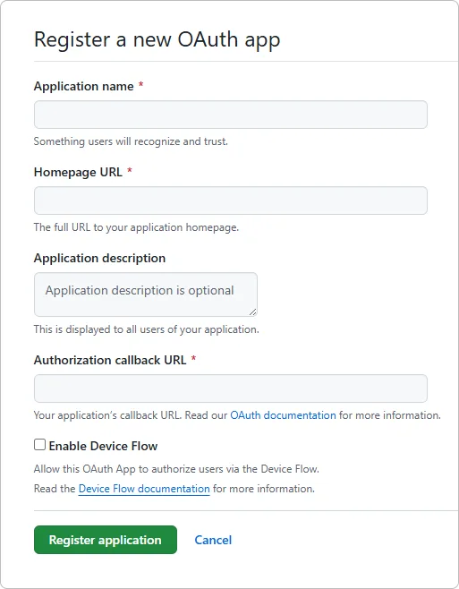

# Comment connecter la connexion GitHub dans Encvoy ID

> 📋 Cette instruction fait partie d'une série d'articles sur la configuration des méthodes de connexion. Pour plus de détails, lisez le guide [Méthodes de connexion et configuration du widget](./docs-06-github-en-providers-settings.md).

Dans ce guide, vous apprendrez comment connecter l'authentification à l'aide d'un compte **GitHub** au système **Encvoy ID**. Cette méthode de connexion permet aux utilisateurs de se connecter aux applications en utilisant leur compte de service **GitHub**.

La configuration de la connexion **GitHub** se compose de trois étapes clés effectuées dans deux systèmes différents.

- [Étape 1. Configurer l'application GitHub](#étape-1-configurer-lapplication-github)
- [Étape 2. Créer la méthode de connexion](#étape-2-créer-la-méthode-de-connexion)
- [Étape 3. Ajouter au widget](#étape-3-ajouter-au-widget)

---

## Étape 1. Configurer l'application GitHub { #step-1-configure-github-app }

Avant de configurer la méthode de connexion dans **Encvoy ID**, vous devez enregistrer votre application dans la console développeur **GitHub** et obtenir des clés d'accès :

1. Accédez aux paramètres **GitHub** via le lien :
   [https://github.com/settings/developers](https://github.com/settings/developers)

2. Dans la section **OAuth Apps**, cliquez sur **New OAuth App**.
3. Remplissez les paramètres d'application requis :
   - **Application name** - le nom de l'application,
   - **Homepage URL** - l'adresse de l'installation du service,
   - **Authorization callback URL** - l'adresse au format `https://<adresse_installation>/api/interaction/code`.

   

4. Cliquez sur **Register application**.
5. Après avoir créé l'application, ouvrez ses paramètres et copiez :
   - **Client ID**
   - **Client Secret** (créé via le bouton **Generate a new client secret**)

   

Ces valeurs seront nécessaires à l'étape suivante.

---

## Étape 2. Créer la méthode de connexion { #step-2-create-login-method }

1. Allez dans la Console d'administration → onglet **Paramètres**.

   > 💡 Pour créer une méthode de connexion pour une organisation, ouvrez la **Console d'organisation**. Si la méthode de connexion est nécessaire pour une application spécifique, ouvrez les **paramètres de cette application**.

2. Trouvez le bloc **Méthodes de connexion** et cliquez sur **Configurer**.
3. Dans la fenêtre qui s'ouvre, cliquez sur le bouton **Créer** .
4. Une fenêtre avec une liste de modèles s'ouvrira.
5. Sélectionnez le modèle **GitHub**.
6. Remplissez le formulaire de création :

   **Informations de base**
   - **Nom** — Le nom que les utilisateurs verront.
   - **Description** (facultatif) — Une brève description.
   - **Logo** (facultatif) — Vous pouvez télécharger votre propre icône, sinon l'icône standard sera utilisée.

   **Paramètres d'authentification**
   - **Identifiant client (client_id)** — Collez le **Client ID** copié.
   - **Secret client (client_secret)** — Collez le **Client Secret** copié.
   - **URL de redirection (Redirect URI)** — Ce champ sera rempli automatiquement en fonction de votre domaine.

   **Paramètres supplémentaires**
   - **Méthode de connexion publique** — Activez cette option si vous souhaitez que cette méthode de connexion puisse être ajoutée à d'autres applications du système (ou de l'organisation), ainsi qu'au profil utilisateur en tant qu'[identifiant de service externe](./docs-12-common-personal-profile.md#external-service-identifiers).
   - **Publicité** — Configurez le niveau de publicité par défaut pour l'identifiant de service externe dans le profil utilisateur.

7. Cliquez sur **Créer**.

Après une création réussie, la nouvelle méthode de connexion apparaîtra dans la liste générale des fournisseurs.

---

## Étape 3. Ajouter au widget { #step-3-add-to-widget }

Pour rendre le bouton **Se connecter avec GitHub** visible sur le formulaire d'autorisation, vous devez activer cette fonctionnalité dans les paramètres du widget :

1. Dans la liste générale des fournisseurs, trouvez la méthode de connexion créée.
2. Activez l'interrupteur sur le panneau du fournisseur.

> **Vérification** : Après avoir enregistré, ouvrez le formulaire de connexion dans une application de test. Un nouveau bouton avec le logo **GitHub** devrait apparaître sur le widget.

---

## Descriptions des paramètres

### Informations de base

| Nom             | Description                                                                                   | Type                  | Contraintes         |
| --------------- | --------------------------------------------------------------------------------------------- | --------------------- | ------------------- |
| **Nom**         | Le nom qui sera affiché dans l'interface du service **Encvoy ID**                             | Texte                 | Max. 50 caractères  |
| **Description** | Une brève description qui sera affichée dans l'interface du service **Encvoy ID**             | Texte                 | Max. 255 caractères |
| **Logo**        | L'image qui sera affichée dans l'interface du service **Encvoy ID** et le widget de connexion | JPG, GIF, PNG ou WEBP | Taille max. : 1 Mo  |

### Paramètres d'authentification

| Nom                                                    | Paramètre       | Description                                                                                                     |
| ------------------------------------------------------ | --------------- | --------------------------------------------------------------------------------------------------------------- |
| **Identifiant client (client_id)**                     | `Client_id`     | L'ID de l'application créée dans **GitHub**                                                                     |
| **Secret client (client_secret)**                      | `Client_secret` | La clé d'accès au service de l'application créée dans **GitHub**                                                |
| **URL de redirection (Redirect URI)** (non modifiable) | `Redirect URI`  | L'adresse **Encvoy ID** vers laquelle l'utilisateur est redirigé après l'authentification dans le service tiers |

### Paramètres supplémentaires

| Nom                               | Description                                                                                                                                                                                                                                                                                                                            |
| --------------------------------- | -------------------------------------------------------------------------------------------------------------------------------------------------------------------------------------------------------------------------------------------------------------------------------------------------------------------------------------- |
| **Méthode de connexion publique** | Lorsqu'activé :   - La méthode de connexion devient disponible pour être ajoutée à d'autres applications du service.   - La méthode de connexion devient disponible pour être ajoutée en tant qu'[identifiant de service externe](./docs-12-common-personal-profile.md#external-service-identifiers) dans le profil utilisateur. |
| **Publicité**                     | Définit le niveau de publicité par défaut pour l'identifiant de service externe dans le profil utilisateur                                                                                                                                                                                                                             |

---

## Voir aussi

- [Méthodes de connexion et configuration du widget de connexion](./docs-06-github-en-providers-settings.md) — un guide sur les méthodes de connexion et la configuration du widget de connexion.
- [Gestion de l'organisation](./docs-09-common-mini-widget-settings.md) — un guide sur le travail avec les organisations dans le système **Encvoy ID**.
- [Profil personnel et gestion des permissions d'application](./docs-12-common-personal-profile.md) — un guide sur la gestion du profil personnel.
