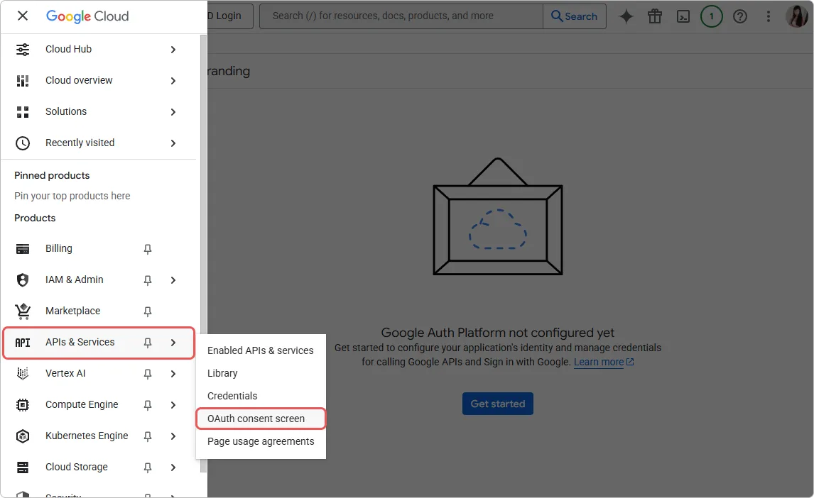
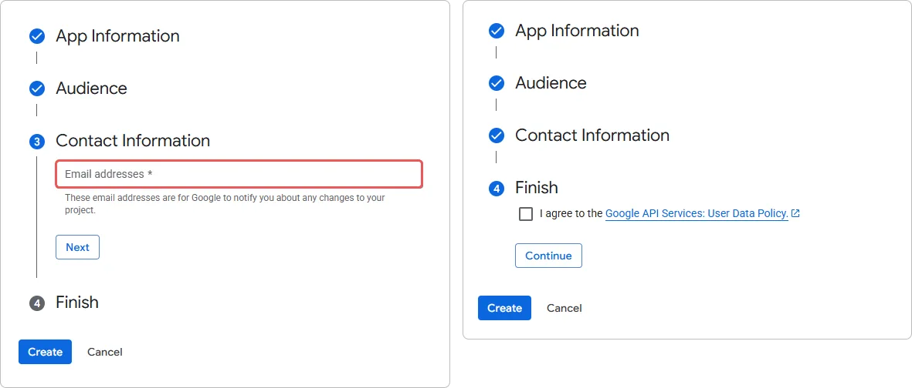

# Comment connecter la connexion Google dans Encvoy ID

> 📋 Cette instruction fait partie d'une série d'articles sur la configuration des méthodes de connexion. Pour plus de détails, lisez le guide [Méthodes de connexion et configuration du widget](./docs-06-github-en-providers-settings.md).

Dans ce guide, vous apprendrez comment connecter l'authentification à l'aide d'un compte **Google** au système **Encvoy ID**. Cette méthode de connexion permet aux utilisateurs de se connecter aux applications en utilisant leur compte de service **Google**.

La configuration de la connexion **Google** se compose de trois étapes clés réalisées dans deux systèmes différents :

- [Étape 1. Configurer l'application dans Google](#step-1-configure-google-app)
- [Étape 2. Créer la méthode de connexion](#step-2-create-login-method)
- [Étape 3. Ajouter au widget](#step-3-add-to-widget)
- [Description des paramètres](#parameters-description)
- [Voir aussi](#see-also)

---

## Étape 1. Configurer l'application dans Google { #step-1-configure-google-app }

Avant de configurer la méthode de connexion dans **Encvoy ID**, vous devez enregistrer votre application dans la console développeur **Google** et obtenir des clés d'accès :

1. Connectez-vous avec votre compte **Google**.
2. Ouvrez la [Google Cloud Console](https://code.google.com/apis/console#access).
3. Créez un nouveau projet :
   - Dans le panneau supérieur, cliquez sur **Sélectionner un projet** → **Nouveau projet**.
   - Spécifiez le nom du projet (par exemple, `Encvoy.ID Login` ou le nom de votre site web).
   - Cliquez sur **Créer**.

   > 🔗 Pour plus de détails, lisez les instructions sur [developers.google.com](https://developers.google.com/workspace/guides/create-project?hl=fr).

4. Configurez l'**écran de consentement OAuth**. Si vous avez déjà effectué ces réglages, ignorez cette étape.
   - Allez dans **API et services** → **Écran de consentement OAuth**.

     

   - Ouvrez la section **Branding**.
   - Cliquez sur le bouton **Commencer** au centre de la fenêtre.
   - Fournissez les **Informations sur l'application** : le nom de l'application et l'adresse e-mail qui seront affichés aux utilisateurs sur l'écran de consentement.
   - Sélectionnez le type d'**Audience** → **Externe**.

     

   - Fournissez une adresse e-mail pour recevoir les notifications du projet.
   - Acceptez la politique d'utilisation.

     

5. Créez un **ID client OAuth** :
   - Allez dans **API et services** → **Identifiants**.
   - Cliquez sur **Créer des identifiants** → **ID client OAuth**.

     

   - Sélectionnez **Type** → **Application Web**.
   - Remplissez le nom et l'URL de retour n°1 (`Redirect_uri`).
   - Cliquez sur **Créer**.

     

     > ⚠️ Après la création, une fenêtre apparaîtra avec les données : `ID client` et `Code secret client`. Enregistrez ces valeurs — vous en aurez besoin lors de la configuration dans **Encvoy ID**.

     

6. Vérifiez les paramètres de l'**écran de consentement OAuth** :

   Avant utilisation, assurez-vous que :
   - Le statut de l'écran de consentement est **Publié** (Activé), et non **En développement**,
   - Les **champs d'application** (scopes) requis — `email` et `profile` — ont été ajoutés.

---

## Étape 2. Créer la méthode de connexion { #step-2-create-login-method }

Maintenant, avec les clés de **Google**, créons le fournisseur correspondant dans le système **Encvoy ID**.

1. Allez dans le panneau d'administration → onglet **Paramètres**.

   > 💡 Pour créer une méthode de connexion pour une organisation, ouvrez le **tableau de bord de l'organisation**. Si la méthode de connexion est nécessaire pour une application spécifique, ouvrez **les paramètres de cette application**.

2. Trouvez le bloc **Méthodes de connexion** et cliquez sur **Configurer**.
3. Dans la fenêtre qui s'ouvre, cliquez sur le bouton **Créer** .
4. Une fenêtre avec une liste de modèles s'ouvrira.
5. Sélectionnez le modèle **Google**.
6. Remplissez le formulaire de création :

   **Informations de base**
   - **Nom** — Le nom que les utilisateurs verront.
   - **Description** (facultatif) — Une brève description.
   - **Logo** (facultatif) — Vous pouvez télécharger votre propre icône, sinon l'icône standard sera utilisée.

   **Paramètres d'authentification**
   - **Identifiant client (client_id)** — Collez l'**ID de l'application** (`Client ID`) copié.
   - **Secret client (client_secret)** — Collez le **Code secret** (`Client Secret`) copié.
   - **URL de redirection (Redirect URI)** — Ce champ sera rempli automatiquement en fonction de votre domaine.

   **Paramètres supplémentaires**
   - **Méthode de connexion publique** — Activez cette option si vous souhaitez que cette méthode de connexion soit disponible pour être ajoutée à d'autres applications du système (ou de l'organisation), ainsi qu'au profil utilisateur en tant qu'[identifiant de service externe](./docs-12-common-personal-profile.md#external-service-identifiers).
   - **Publicité** — Définissez le niveau de publicité par défaut pour l'identifiant de service externe dans le profil utilisateur.

7. Cliquez sur **Créer**.

Après une création réussie, la nouvelle méthode de connexion apparaîtra dans la liste générale des fournisseurs.

---

## Étape 3. Ajouter au widget { #step-3-add-to-widget }

Pour rendre le bouton **Se connecter avec Google** visible sur le formulaire d'autorisation, vous devez activer cette fonction dans les paramètres du widget :

1. Dans la liste générale des fournisseurs, trouvez la méthode de connexion créée.
2. Activez l'interrupteur sur le panneau du fournisseur.

> **Vérification** : Après l'enregistrement, ouvrez le formulaire de connexion dans une application de test. Un nouveau bouton avec le logo **Google** devrait apparaître sur le widget.

---

## Description des paramètres { #parameters-description }

### Informations de base

| Nom             | Description                                                                                   | Type                   | Contraintes        |
| --------------- | --------------------------------------------------------------------------------------------- | ---------------------- | ------------------ |
| **Nom**         | Le nom qui sera affiché dans l'interface du service **Encvoy ID**                             | Texte                  | Max 50 caractères  |
| **Description** | Une brève description qui sera affichée dans l'interface du service **Encvoy ID**             | Texte                  | Max 255 caractères |
| **Logo**        | L'image qui sera affichée dans l'interface du service **Encvoy ID** et le widget de connexion | JPG, GIF, PNG, ou WEBP | Taille max : 1 Mo  |

### Paramètres d'authentification

| Nom                                                    | Paramètre       | Description                                                                                                     |
| ------------------------------------------------------ | --------------- | --------------------------------------------------------------------------------------------------------------- |
| **Identifiant client (client_id)**                     | `Client_id`     | L'ID de l'application créée dans **Google**                                                                     |
| **Secret client (client_secret)**                      | `Client_secret` | La clé d'accès au service de l'application créée dans **Google**                                                |
| **URL de redirection (Redirect URI)** (non modifiable) | `Redirect URI`  | L'adresse **Encvoy ID** vers laquelle l'utilisateur est redirigé après l'authentification dans le service tiers |

### Paramètres supplémentaires

| Nom                               | Description                                                                                                                                                                                                                                                                                                                            |
| --------------------------------- | -------------------------------------------------------------------------------------------------------------------------------------------------------------------------------------------------------------------------------------------------------------------------------------------------------------------------------------- |
| **Méthode de connexion publique** | Lorsqu'activé :   - La méthode de connexion devient disponible pour être ajoutée à d'autres applications du service.   - La méthode de connexion devient disponible pour être ajoutée en tant qu'[identifiant de service externe](./docs-12-common-personal-profile.md#external-service-identifiers) dans le profil utilisateur. |
| **Publicité**                     | Définit le niveau de publicité par défaut pour l'identifiant de service externe dans le profil utilisateur                                                                                                                                                                                                                             |

---

## Voir aussi { #see-also }

- [Méthodes de connexion et configuration du widget de connexion](./docs-06-github-en-providers-settings.md) — un guide sur les méthodes de connexion et la configuration du widget de connexion.
- [Gestion de l'organisation](./docs-09-common-mini-widget-settings.md) — un guide sur le travail avec les organisations dans le système **Encvoy ID**.
- [Profil personnel et gestion des permissions d'application](./docs-12-common-personal-profile.md) — un guide sur la gestion du profil personnel.
