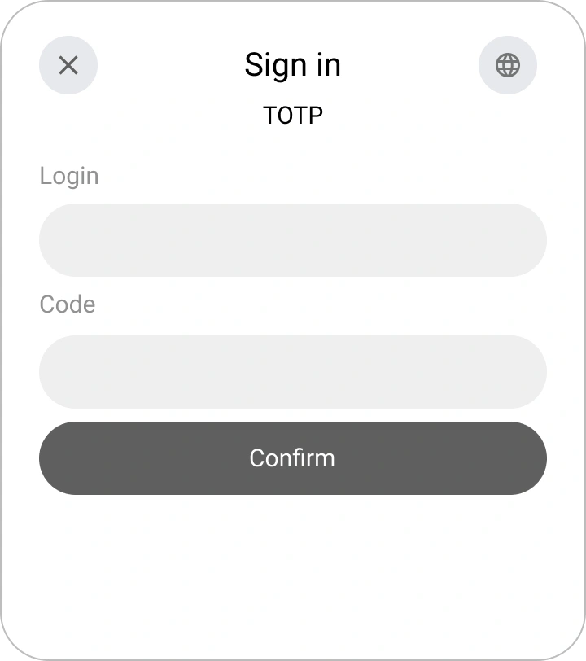

# Comment connecter la connexion TOTP dans Encvoy ID

> 📋 Cette instruction fait partie d'une série d'articles sur la configuration des méthodes de connexion. Pour plus de détails, lisez le guide [Méthodes de connexion et configuration du widget](./docs-06-github-en-providers-settings.md).

Dans ce guide, vous apprendrez comment connecter l'authentification par mot de passe à usage unique **TOTP** au système **Encvoy ID**.

À qui s'adresse cette instruction :

- **Administrateurs** — pour configurer la méthode de connexion dans le système.
- **Utilisateurs** — pour lier le **TOTP** à leur profil.

La configuration de la connexion **TOTP** se compose de plusieurs étapes clés :

- [Configuration de l'authentification pour les administrateurs](#admin-authentication-setup)
- [Liaison TOTP pour les utilisateurs](#totp-user-binding)

---

## Informations générales

**TOTP** (Time-based One-Time Password) est un algorithme de génération de mots de passe à usage unique valables pendant une courte période.

> 💡 Pour créer une méthode de connexion basée sur **HOTP**, utilisez l'instruction [Comment connecter la connexion HOTP](./instructions-common-provider-hotp.md).

La principale différence entre **TOTP** et **HOTP** est que la génération du mot de passe est basée sur l'heure actuelle. Généralement, il n'utilise pas un horodatage exact mais plutôt l'intervalle actuel avec des limites prédéfinies (généralement 30 secondes).

**Composants principaux :**

- **Serveur d'authentification** — le serveur qui génère la clé secrète et vérifie les codes saisis.
- **Authentificateur** — une application qui stocke la clé secrète et génère l'OTP actuel.
- **Clé secrète** — une base partagée entre le serveur et l'application utilisée pour la génération du code.

### Flux de travail TOTP

1. **Configuration préliminaire**
   - L'administrateur crée une méthode de connexion **TOTP** et l'active pour les widgets des applications requises.
   - L'utilisateur ajoute un nouvel identifiant **TOTP** dans son profil en scannant un code QR contenant la clé secrète via une application d'authentification.

2. **Génération et vérification du code**
   - L'application d'authentification calcule un mot de passe à usage unique basé sur la clé secrète et l'intervalle de temps actuel (généralement 30 secondes) en utilisant l'algorithme `SHA1`, `SHA256` ou `SHA512`.
   - Lorsque l'utilisateur saisit le code sur le formulaire de connexion, le serveur recalcule le code attendu en utilisant le même secret et l'heure actuelle.
   - Si le code saisi correspond au code attendu, l'accès est accordé à l'utilisateur.

> 🚨 **Important** : L'heure sur l'appareil de l'utilisateur et sur le serveur doit être synchronisée. Le décalage horaire est la raison la plus courante de rejet du code. Pour compenser les petites différences de temps, le serveur peut accepter des codes provenant d'intervalles de temps adjacents (généralement ±1 intervalle).

---

## Configuration de l'authentification pour les administrateurs { #admin-authentication-setup }

### Étape 1. Création d'une méthode de connexion

1. Allez dans le Panneau d'administration → onglet **Paramètres**.

   > 💡 Pour créer une méthode de connexion pour une organisation, ouvrez le **Tableau de bord de l'organisation**. Si la méthode de connexion est nécessaire pour une application spécifique, ouvrez **les paramètres de cette application**.

2. Trouvez le bloc **Méthodes de connexion** et cliquez sur **Configurer**.
3. Dans la fenêtre qui s'ouvre, cliquez sur le bouton **Créer** .
4. Une fenêtre avec une liste de modèles s'ouvrira.
5. Sélectionnez le modèle **TOTP**.
6. Remplissez le formulaire de création :

   **Informations de base**
   - **Nom** — Le nom que les utilisateurs verront.
   - **Description** (facultatif) — Une brève description.
   - **Logo** (facultatif) — Vous pouvez télécharger votre propre icône, sinon celle par défaut sera utilisée.

   **Paramètres**
   - **Nombre de chiffres** — Nombre de chiffres dans le mot de passe à usage unique (généralement 6).
   - **Période de validité** — Période de validité du mot de passe à usage unique en secondes (30 est recommandé).
   - **Algorithme** — Algorithme de hachage (`SHA1`, `SHA256` ou `SHA512`) (généralement `SHA-1`).

   **Paramètres supplémentaires**
   - **Méthode de connexion publique** — Activez cette option si vous souhaitez que cette méthode de connexion soit disponible pour être ajoutée à d'autres applications du système (ou de l'organisation), ainsi qu'au profil utilisateur en tant qu'[identifiant de service externe](./docs-12-common-personal-profile.md#external-service-identifiers).
   - **Publicité** — Configurez le niveau de publicité par défaut pour l'identifiant de service externe dans le profil utilisateur.

7. Cliquez sur **Créer**.

Après une création réussie, la nouvelle méthode de connexion apparaîtra dans la liste générale des fournisseurs.

### Étape 2. Ajout du fournisseur TOTP au Widget

Pour que les utilisateurs voient le bouton **TOTP** sur le formulaire d'autorisation, vous devez activer cette fonctionnalité dans les paramètres du widget :

1. Trouvez la méthode de connexion créée dans la liste générale des fournisseurs.
2. Basculez l'interrupteur sur le panneau du fournisseur en position "On".

> **Vérification** : Après l'enregistrement, ouvrez le formulaire de connexion dans une application de test. Un nouveau bouton avec le logo **TOTP** devrait apparaître sur le widget.

---

## Liaison TOTP pour les utilisateurs { #totp-user-binding }

> 📌 Cette instruction est destinée aux utilisateurs qui doivent se connecter au système via **TOTP**.

### Étape 1. Installation d'une application d'authentification

Vous devez installer une application sur votre appareil mobile qui génère des codes TOTP.

Les options les plus populaires sont :

- **Google Authenticator** (Google)

> 💡 Assurez-vous que l'heure de votre appareil mobile est réglée pour se mettre à jour automatiquement (via le réseau). Une heure incorrecte est la raison la plus courante pour laquelle les codes ne sont pas acceptés.

### Étape 2. Ajout d'un identifiant TOTP au profil

1. Allez dans votre **Profil**.
2. Cliquez sur **Ajouter** dans le bloc **Identifiants**.

3. Dans la fenêtre qui s'ouvre, sélectionnez la méthode de connexion **TOTP**.
4. Scannez le code QR à l'aide de votre application d'authentification.

5. Saisissez le code de l'application et confirmez.

> 💡 **Conseil** : Si l'identifiant est déjà lié à un autre utilisateur, vous devez le supprimer du profil de cet utilisateur avant de le lier au nouveau compte.

### Étape 3. Vérification

1. Allez sur la page de connexion où la méthode de connexion **TOTP** est activée.
2. Sélectionnez l'icône de la méthode de connexion **TOTP**.
3. Un formulaire de saisie du code s'ouvrira.
4. Saisissez votre identifiant.

5. Sans fermer la page, ouvrez l'application d'authentification sur votre téléphone. Copiez le code à 6 chiffres et collez-le dans le formulaire.

6. Cliquez sur le bouton **Confirmer**.

> 🔄 **Si le code n'est pas accepté** : Assurez-vous que l'heure de votre téléphone et celle du serveur sont synchronisées. Essayez d'attendre la génération du code suivant (un nouveau apparaît toutes les 30 secondes). Si le problème persiste, contactez votre administrateur.

---

## Voir aussi

- [Méthodes de connexion et configuration du widget de connexion](./docs-06-github-en-providers-settings.md) — un guide sur les méthodes de connexion et la configuration du widget.
- [Gestion de l'organisation](./docs-09-common-mini-widget-settings.md) — un guide pour travailler avec les organisations dans le système **Encvoy ID**.
- [Profil personnel et gestion des permissions d'application](./docs-12-common-personal-profile.md) — un guide pour gérer votre profil personnel.
