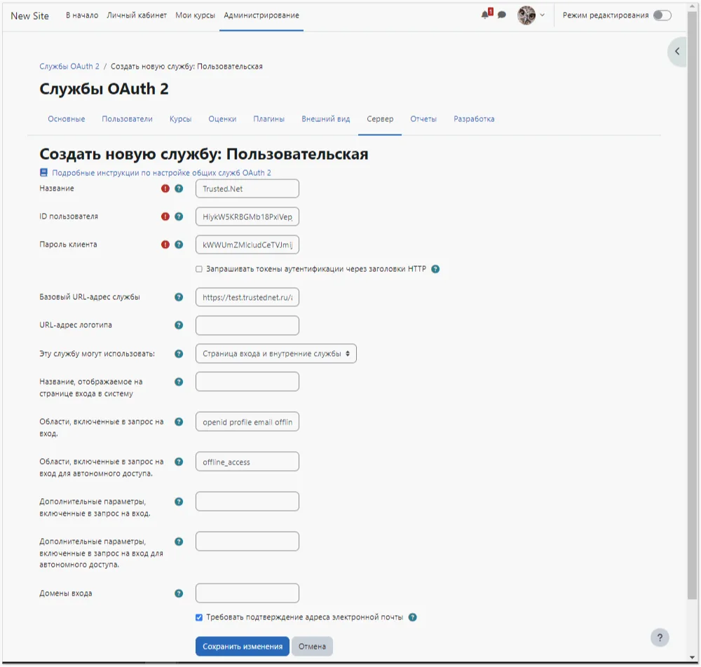

# Comment configurer l'intégration de Moodle avec Encvoy ID

Dans ce guide, vous apprendrez à configurer l'authentification unique (SSO) dans **Moodle** en utilisant le système **Encvoy ID**.

> 📌 [Moodle](https://moodle.org/) est un système de gestion de l'apprentissage pour les cours éducatifs électroniques (e-learning).

La configuration de la connexion via **Encvoy ID** se compose de plusieurs étapes clés réalisées dans deux systèmes différents :

- [Étape 1. Créer l'application](#step-1-create-application)
- [Étape 2. Configurer le système Moodle](#step-2-configure-moodle)
- [Étape 3. Vérifier la connexion](#step-3-verify-connection)

---

## Étape 1. Créer l'application { #step-1-create-application }

1. Connectez-vous au système **Encvoy ID**.
2. Créez une application avec les paramètres suivants :
   - **Adresse de l'application** - l'adresse de votre installation **Moodle** ;
   - **URL de redirection \#1 (Redirect_uri)** - `<Adresse de l'installation Moodle>/admin/oauth2callback.php`.

   Pour plus de détails sur la création d'applications, lisez les [instructions](./docs-10-common-app-settings.md#creating-application).

3. Ouvrez les [paramètres de l'application](./docs-10-common-app-settings.md#editing-application) et copiez les valeurs des champs suivants :
   - **Identifiant** (`Client_id`),
   - **Clé secrète** (`client_secret`).

---

## Étape 2. Configurer le système Moodle { #step-2-configure-moodle }

> Les droits d'administrateur dans **Moodle** sont requis pour configurer l'authentification des utilisateurs.

### Activer le plugin OAuth2

1. Connectez-vous à **Moodle** avec des droits administratifs.
2. Allez dans **Administration du site - Plugins - Authentification** et activez le plugin **OAuth 2** en l'activant dans la colonne **Activer**.

### Créer un fournisseur personnalisé

1. Allez dans **Administration du site** → **Serveur** → **Services OAuth 2**.
2. Cliquez sur le bouton **Personnalisé**.

3. Le formulaire de création de fournisseur s'ouvrira.
4. Remplissez les champs :
   - **Nom** — n'importe quel nom d'affichage pour le service ;
   - **ID client** — le `Client_id` de l'application **Encvoy ID** ;
   - **Secret client** — le `Client_secret` de l'application **Encvoy ID** ;
   - **URL de base du service** — `<Adresse de Encvoy ID>/api/oidc` ;
   - **Afficher sur la page de connexion** — **Page de connexion et services internes** ;
   - **Scopes inclus dans une demande de connexion** — `openid profile email offline_access` ;
   - **Scopes inclus dans une demande de connexion pour accès hors ligne** — `offline_access`.

   

5. Enregistrez les modifications.

### Configurer les points de terminaison (Endpoints)

1. Cliquez sur **Configurer les points de terminaison** dans la colonne **Modifier**.

2. Si toutes les données ont été saisies correctement, les paramètres seront renseignés automatiquement.

   

   > Si nécessaire, vous pouvez remplir les URL des points de terminaison manuellement. Consultez la liste des URL disponibles à l'adresse : `https://<adresse du service Encvoy ID>/api/oidc/.well-known/openid-configuration`

### Configurer la correspondance des champs utilisateur

1. Cliquez sur **Configurer la correspondance des champs utilisateur** dans la colonne **Modifier**.

2. Si toutes les données ont été saisies correctement, les paramètres seront renseignés automatiquement.

   

   > Si nécessaire, les correspondances peuvent être configurées manuellement.

### Configurer l'envoi d'e-mails dans Moodle

Si le LMS nécessite l'envoi d'e-mails aux utilisateurs, vous devez configurer les paramètres de messagerie (si cela n'a pas été fait précédemment) :

1. Allez dans **Administration du site → Serveur → Courriel → Configuration du courriel sortant**.
2. Remplissez les champs :
   - **Serveurs SMTP** — le nom complet du serveur SMTP, incluant le port séparé par deux-points ;
   - **Sécurité SMTP** — sélectionnez une valeur dans la liste ;
   - **Type d'authentification SMTP** — sélectionnez la valeur requise. Si le type d'authentification **LOGIN** est sélectionné, remplissez les champs **Nom d'utilisateur SMTP** et **Mot de passe SMTP**. Il est recommandé de remplir le champ **Adresse de non-réponse** pour éviter d'éventuels problèmes lors de l'envoi d'e-mails.

   

> 💡 La liaison entre un utilisateur du LMS Moodle et un utilisateur Encvoy ID est basée sur l'adresse e-mail. L'absence d'e-mail dans le profil Encvoy ID rendra l'authentification dans Moodle impossible. La suppression d'une adresse e-mail précédemment liée à Moodle dans Encvoy ID et l'ajout d'une nouvelle adresse e-mail entraînera la création d'un nouvel utilisateur dans Moodle.

---

## Étape 3. Vérifier la connexion { #step-3-verify-connection }

1. Revenez à la liste des **Services OAuth 2** et assurez-vous que le fournisseur créé est actif.

2. Ouvrez la page de connexion de **Moodle**.
3. Assurez-vous que le bouton **Se connecter avec Encvoy ID** est apparu.
4. Cliquez sur le bouton et connectez-vous en utilisant vos identifiants d'entreprise :
   - Vous serez redirigé vers la page d'authentification de **Encvoy ID** ;
   - Après une connexion réussie, vous serez redirigé vers **Moodle** en tant qu'utilisateur autorisé.

   
