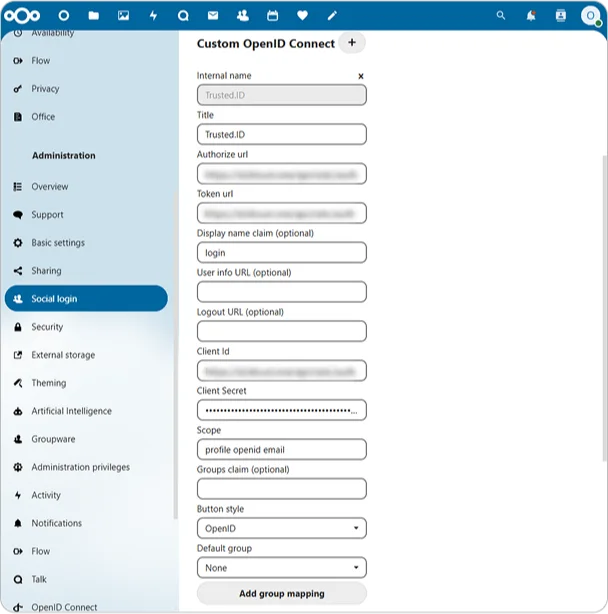

# Comment configurer l'intégration de Nextcloud avec Encvoy ID

Dans ce guide, vous apprendrez comment configurer l'authentification unique (Single Sign-On - SSO) dans **Nextcloud** en utilisant le système **Encvoy ID**.

> 📌 [Nextcloud](https://nextcloud.com/) est un écosystème de services pour la communication et la collaboration en entreprise, combinant appels, vidéoconférences, chats et gestion de tâches.

La configuration de la connexion avec **Encvoy ID** se compose de deux étapes clés réalisées dans deux systèmes différents.

- [Étape 1. Créer l'application](#step-1-create-application)
- [Étape 2. Configurer Nextcloud](#step-2-configure-nextcloud)
- [Étape 3. Vérifier la connexion](#step-3-verify-connection)

---

## Étape 1. Créer l'application { #step-1-create-application }

1. Connectez-vous à **Encvoy ID**.
2. Créez une nouvelle application et spécifiez :
   - **Adresse de l'application** - l'adresse de votre installation **Nextcloud**. Par exemple : `https://<adresse-installation-nextcloud>`.
   - **URL de redirection \#1** (`Redirect_uri`) - l'adresse au format `https://<adresse-installation-nextcloud>/api/oauth/return`.

     > 🔍 Pour plus de détails sur la création d'applications, lisez les [instructions](./docs-10-common-app-settings.md#creating-application).

3. Ouvrez les [paramètres de l'application](./docs-10-common-app-settings.md#editing-application) et copiez les valeurs des champs suivants :
   - **Identifiant** (`Client_id`),
   - **Clé secrète** (`client_secret`).

---

## Étape 2. Configurer Nextcloud { #step-2-configure-nextcloud }

1. Connectez-vous à **Nextcloud** avec des privilèges d'administrateur.
2. Installez l'application **Social Login**. Cette application permet aux utilisateurs de se connecter au système **Nextcloud** en utilisant des comptes de services tiers. En savoir plus sur l'application sur [apps.nextcloud.com](https://apps.nextcloud.com/apps/sociallogin).
   - Allez dans la section **Applications** → **Social & communication**.

     

   - Cliquez sur **Télécharger et activer** pour l'application **Social Login**.

     

     Après l'installation de l'application, une sous-section **Social login** apparaîtra dans la section **Paramètres d'administration**.

3. Allez dans **Paramètres d'administration** → sous-section **Social login**.
4. Cliquez sur le bouton  à côté du champ **Custom OpenID Connect**.
5. Remplissez les paramètres de connexion :
   - **Nom interne** - spécifiez le nom interne du service d'authentification tel qu'il apparaîtra dans les paramètres de **Nextcloud**.
   - **Titre** - spécifiez un nom convivial pour le service d'authentification. Ce nom sera affiché sur le bouton de la page de connexion et dans les paramètres de **Nextcloud**.
   - **URL d'autorisation** - spécifiez l'URL d'autorisation. Par exemple, `https://<adresse-installation-Encvoy ID>/api/oidc/auth`.
   - **URL du jeton** - spécifiez l'URL pour obtenir le jeton d'accès. Par exemple, `https://<adresse-installation-Encvoy ID>/api/oidc/token`.
   - **ID Client** - spécifiez la valeur créée à l'**Étape 1**.
   - **Secret Client** - spécifiez la valeur créée à l'**Étape 1**.
   - **Portée (Scope)** - spécifiez les permissions requises pour la récupération des données. La portée obligatoire est `openid` et la portée standard est `profile`. Lors de la spécification de plusieurs permissions, séparez-les par un espace. Par exemple : `profile email openid`.

   

6. Si nécessaire, configurez des paramètres supplémentaires :

Une fois toutes les étapes terminées, le bouton de connexion pour **Encvoy ID** s'affichera dans le widget d'autorisation de **Nextcloud**.

---

## Étape 3. Vérifier la connexion { #step-3-verify-connection }

1. Ouvrez la page de connexion de **Nextcloud**.
2. Assurez-vous que le bouton **Connexion avec Encvoy ID** est apparu.
3. Cliquez sur le bouton et connectez-vous en utilisant vos identifiants d'entreprise :
   - Vous serez redirigé vers la page d'authentification de **Encvoy ID** ;
   - Après une connexion réussie, vous serez renvoyé vers **Nextcloud** en tant qu'utilisateur autorisé.

   
