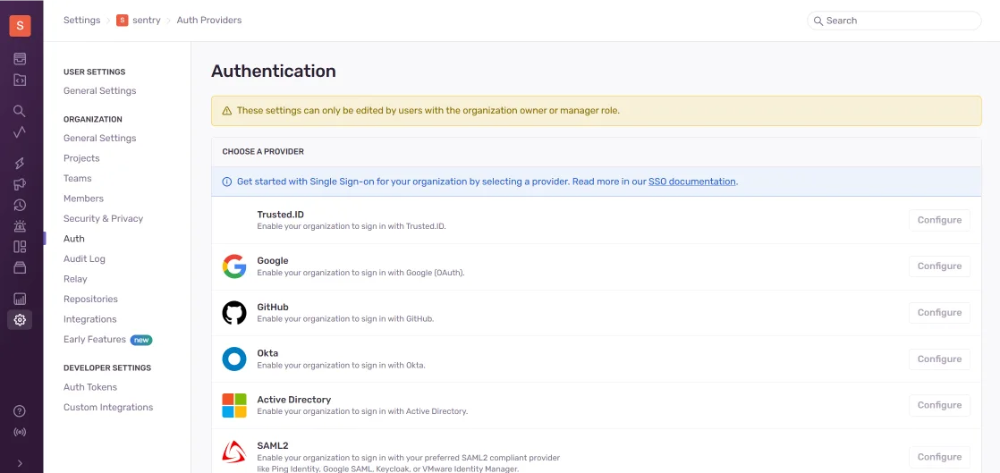

# Comment configurer l'intégration de Sentry avec Encvoy ID

Dans ce guide, vous apprendrez comment configurer l'authentification unique (SSO) pour **Sentry** en utilisant le système **Encvoy ID**.

**Sentry** est une plateforme de surveillance et de suivi des erreurs d'application. Elle aide les développeurs à identifier, analyser et corriger les bogues en temps réel, améliorant ainsi la qualité du logiciel.

La version de base du produit ne prend pas en charge l'authentification **OpenID Connect**. Pour implémenter cette fonctionnalité, vous pouvez utiliser une solution supplémentaire — [sentry-auth-oidc](https://github.com/siemens/sentry-auth-oidc). Il s'agit d'un fournisseur spécialisé qui active l'intégration **OpenID Connect** avec **Sentry** et vous permet de configurer l'authentification unique (SSO) dans le système.

La configuration de la connexion via **Encvoy ID** se compose de plusieurs étapes clés effectuées dans deux systèmes différents :

- [Étape 1. Créer une application](#step-1-create-application)
- [Étape 2. Installer sentry-auth-oidc](#step-2-install-sentry-auth-oidc)
- [Étape 3. Vérifier la connexion](#step-3-verify-connection)

---

## Étape 1. Créer une application { #step-1-create-application }

1. Connectez-vous ou inscrivez-vous sur **Encvoy ID**.
2. Créez une application avec les paramètres suivants :

   | Champ                                 | Valeur                                   |
   | ------------------------------------- | ---------------------------------------- |
   | URL de l'application                  | Adresse de votre installation **Sentry** |
   | URL de redirection \#1 (Redirect_uri) | `<adresse d'installation>/auth/sso`      |

   > 🔍 Pour plus de détails sur la création d'applications, lisez les [instructions](./docs-10-common-app-settings.md#creating-application).

3. Ouvrez les [paramètres de l'application](./docs-10-common-app-settings.md#editing-application) et copiez les valeurs des champs suivants :
   - **ID Client** (`Client_id`),
   - **Secret Client** (`client_secret`).

---

## Étape 2. Installer sentry-auth-oidc { #step-2-install-sentry-auth-oidc }

1. Pour installer le fournisseur, exécutez la commande console :

   ```python
   $ pip install sentry-auth-oidc
   ```

   ou créez un script Shell avec le contenu suivant :

   ```sh
   #!/bin/bash
   set -euo pipefail
   apt-get update
   pip install sentry-auth-oidc
   ```

   et exécutez-le depuis le répertoire `<chemin vers Sentry>/sentry/`.

2. Après avoir installé le fournisseur, éditez le fichier de configuration **Sentry** `sentry.conf.py`. Dans le fichier de configuration, ajoutez un bloc de variables avec les paramètres **OIDC_CLIENT_ID** et **OIDC_CLIENT_SECRET** copiés depuis l'application **Encvoy ID**.

   ```sh
   #################
   # OIDC #
   #################

   #SENTRY_MANAGED_USER_FIELDS = ('email', 'first_name', 'last_name', 'password', )

   OIDC_CLIENT_ID = "client id from Encvoy ID application"
   OIDC_CLIENT_SECRET = "client secret from Encvoy ID application"
   OIDC_SCOPE = "openid email profile"
   OIDC_DOMAIN = "https://<Encvoy ID address>/api/oidc"
   OIDC_ISSUER = "module name for issuing permissions"
   ```

   Après cela, exécutez le script `install.sh` situé à la racine du projet **Sentry**, attendez la fin de l'exécution du script et démarrez le projet.

3. Allez dans le panneau d'administration de **Sentry** à l'adresse `https://<chemin vers Sentry>/settings/sentry/` et sélectionnez la section **Auth**. Sélectionnez ensuite l'application **Encvoy ID**.



Configurez tous les paramètres nécessaires et enregistrez les modifications. Après cela, l'autorisation via **Encvoy ID** sera activée et la connexion via nom d'utilisateur/mot de passe sera désactivée.

---

## Étape 3. Vérifier la connexion { #step-3-verify-connection }

1. Ouvrez la page de connexion de **Sentry**.
2. Assurez-vous que le bouton **Login via Encvoy ID** est apparu.
3. Cliquez sur le bouton et connectez-vous en utilisant vos identifiants d'entreprise :
   - Vous serez redirigé vers la page d'authentification de **Encvoy ID** ;
   - Après une connexion réussie, vous serez redirigé vers **Sentry** en tant qu'utilisateur autorisé.


