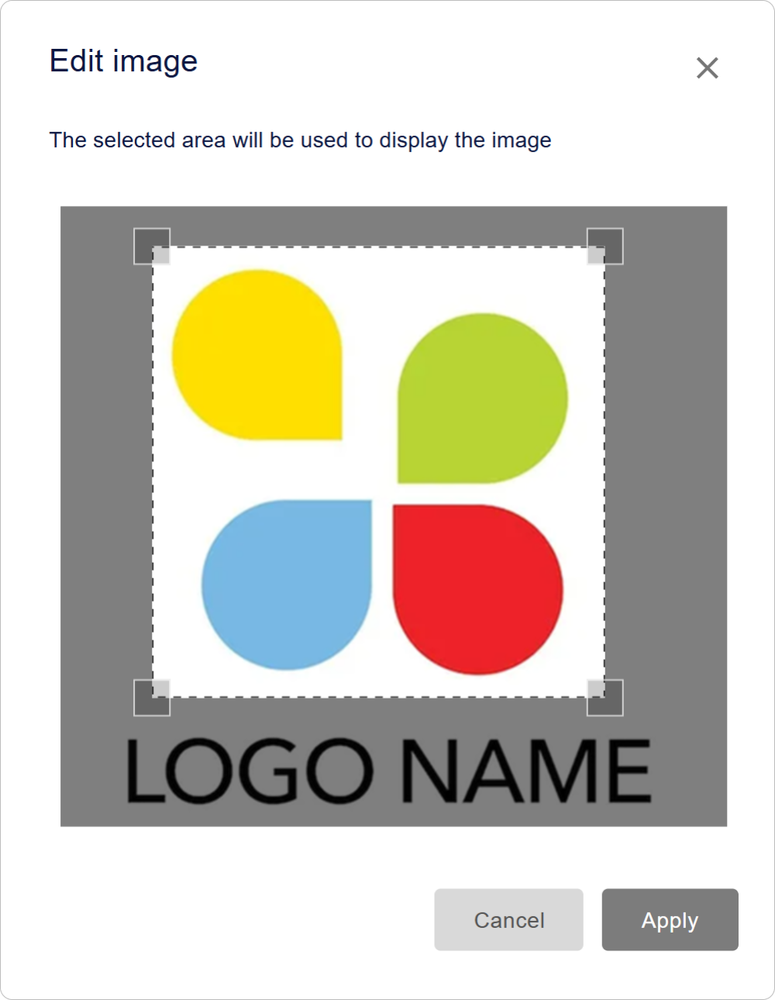
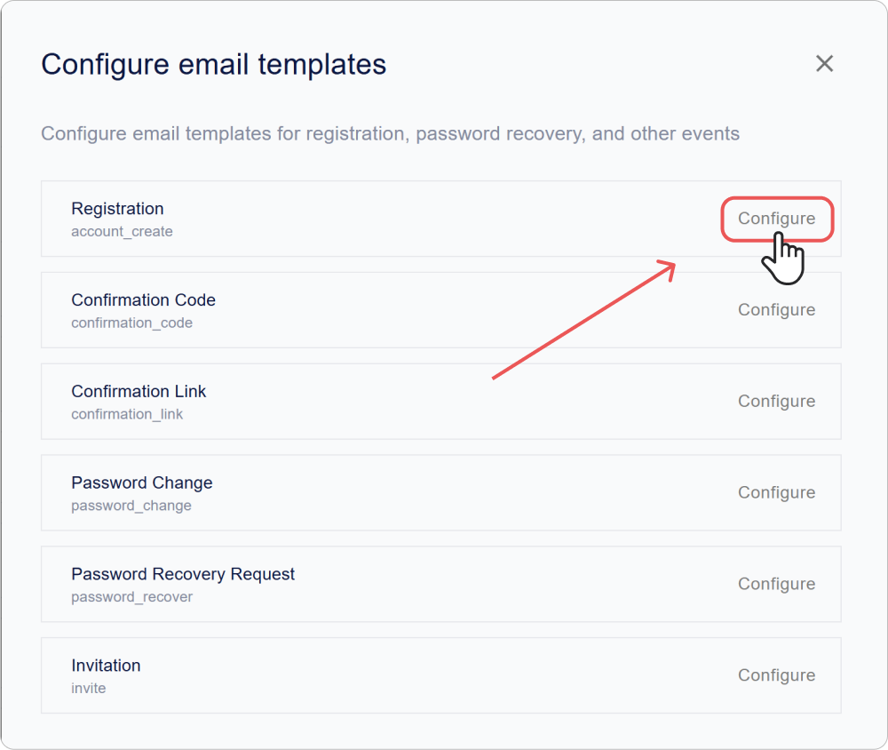
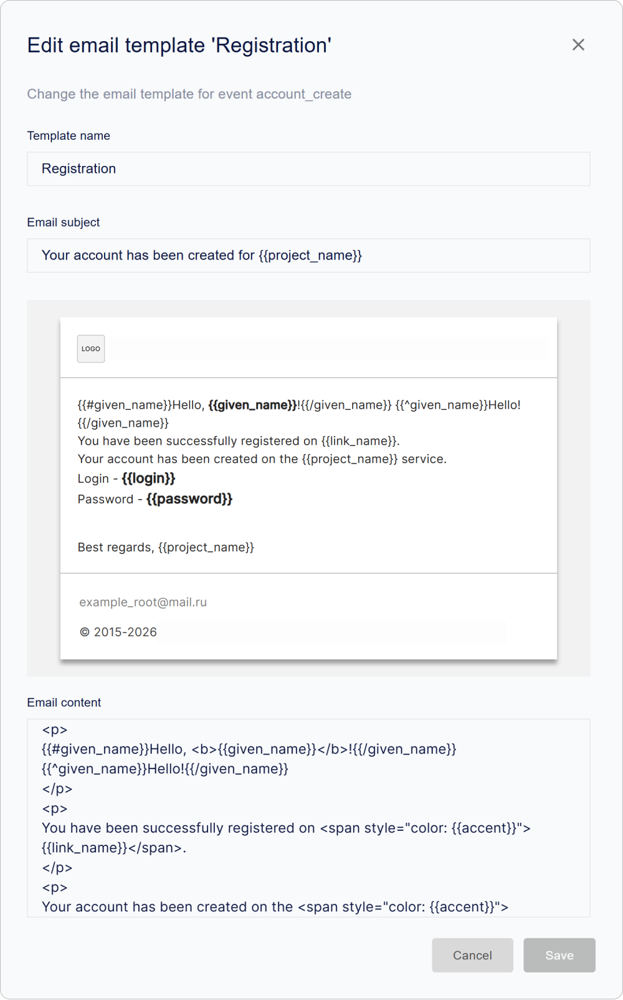
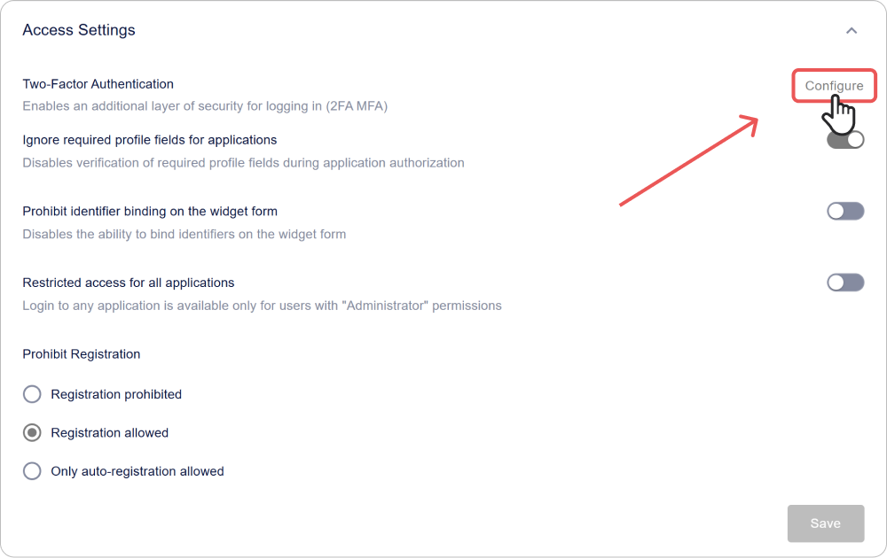
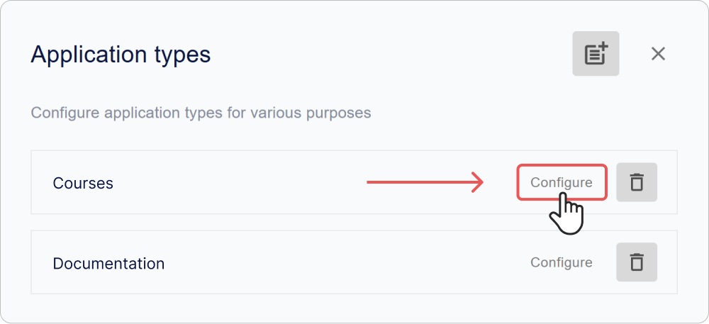

# Come configurare Encvoy ID: sicurezza, interfaccia e accesso

In questa guida imparerai come configurare l'interfaccia e la localizzazione di **Encvoy ID**, creare tipi di applicazioni, gestire l'accesso degli utenti, abilitare l'autenticazione a due fattori e integrare il servizio con Sentry per il monitoraggio degli eventi.

Questa sezione è destinata agli amministratori e agli specialisti della sicurezza che desiderano gestire efficacemente le impostazioni di **Encvoy ID**, inclusi OAuth 2.0 e OpenID Connect.

**Contenuti:**

- [Configurazione dell'interfaccia e della localizzazione](#interface-and-localization)
- [Sicurezza e accesso](#security-and-access)
- [Tipi di applicazioni](#application-types)
- [Funzioni sperimentali](#experimental-features)
- [Vedi anche](#see-also)

> 💡 Le impostazioni di sistema si trovano nel pannello di amministrazione. Per accedere al pannello è necessario il ruolo **Amministratore** del servizio. [Come aprire il pannello di amministrazione →](./docs-02-box-system-install.md#admin-panel-access)

---

## Configurazione dell'interfaccia e della localizzazione { #interface-and-localization }

> 💡 La configurazione di colori, font e aspetto degli elementi dell'interfaccia è disponibile nella variabile `CUSTOM_STYLES` nel file `.env`. Maggiori dettagli nella sezione [Variabili d'ambiente](./docs-03-box-system-configuration.md#interface-customization).

### Configurazione del nome e del logo del sistema { #system-name-and-logo }

Il nome e il logo vengono visualizzati nell'interfaccia del sistema **Encvoy ID**, così come nel [mini-widget](./docs-09-common-mini-widget-settings.md) e nel [widget di accesso](./docs-06-github-en-providers-settings.md#login-widget-settings).

Per configurare il nome e il logo:

1. Vai al pannello di amministrazione → scheda **Impostazioni**.
2. Espandi il blocco **Informazioni principali**.

3. Inserisci il nuovo nome nel campo **Nome dell'applicazione**.
4. Nel blocco **Logo dell'applicazione** clicca su **Carica** e seleziona il file del logo.

   

   > ⚡ Formati supportati: JPG, GIF, PNG, WEBP; dimensione massima 1 MB.

5. Configura la visualizzazione e clicca su **Applica**.

6. Clicca su **Salva**.

> 💡 **Suggerimento:** Usa il formato SVG per un logo vettoriale, per garantire una visualizzazione nitida su tutti i dispositivi e risoluzioni dello schermo.

### Configurazione della localizzazione

**Encvoy ID** supporta l'interfaccia in **sei lingue**:

- Russo (ru)
- Inglese (en)
- Francese (fr)
- Spagnolo (es)
- Tedesco (de)
- Italiano (it)

La lingua selezionata influisce sulla visualizzazione del testo in tutte le interfacce di **Encvoy ID**, inclusi il [widget di accesso](./docs-06-github-en-providers-settings.md#login-widget-settings) e il [mini-widget](./docs-09-common-mini-widget-settings.md).

Se utilizzi [campi profilo utente aggiuntivi](./docs-05-box-userfields-settings.md#additional-profile-fields) e [template email](./docs-04-box-system-settings.md#email-notification-templates), assicurati che vengano visualizzati correttamente.

#### Come cambiare la lingua dell'interfaccia

1. Vai al pannello di amministrazione → scheda **Impostazioni**.
2. Espandi il blocco **Localizzazione** e seleziona la lingua desiderata dall'elenco.

3. Clicca su **Salva**.

Il cambio di lingua avverrà automaticamente, senza riavviare il servizio o aggiornare la pagina.

> 🚨 **Avvertenza:** Dopo aver cambiato la lingua, tutti i testi dell'interfaccia, inclusi i messaggi di sistema e le notifiche, verranno visualizzati nella lingua selezionata. Assicurati che i tuoi utenti comprendano la lingua scelta.

### Configurazione dei template delle notifiche email { #email-notification-templates }

I **template email** sono modelli di messaggi elettronici che contengono formattazione ed elementi grafici predefiniti. Vengono utilizzati per creare notifiche automatiche, come email di registrazione, recupero password e altri eventi.

#### Cos'è Mustache?

**Mustache** è un semplice motore di template per l'inserimento di dati in modelli testuali. In **Encvoy ID** viene utilizzato per:

- Inserire i dati dell'utente (`{{user.name}}`),
- Generare dinamicamente link (`{{confirmation_link}}`),
- Visualizzare blocchi in modo condizionale.

> 🔗 [Documentazione ufficiale Mustache](https://mustache.github.io/)

#### Tipi di email disponibili

| Tipo di email               | Evento              | Scopo                                  |
| --------------------------- | ------------------- | -------------------------------------- |
| Registrazione               | `account_create`    | Email di benvenuto per un nuovo utente |
| Codice di conferma          | `confirmation_code` | Email con codice di verifica           |
| Link di conferma            | `confirmation_link` | Email con link di verifica             |
| Cambio password             | `password_change`   | Notifica di avvenuto cambio password   |
| Richiesta recupero password | `password_recover`  | Email con codice di verifica           |
| Invito                      | `invite`            | Email di invito all'applicazione       |

#### Come configurare un template

1. Vai al pannello di amministrazione → scheda **Impostazioni**.
2. Trova il blocco **Modelli e-mail** e clicca su **Configura**.
3. Seleziona il template desiderato e clicca su **Configura**.

4. Nel modulo di modifica che si apre, specifica:
   - **Nome del template**,
   - **Oggetto dell'email**,
   - **Contenuto dell'email**.

   > 💡 Usa la formattazione HTML e le variabili nel formato `{{variable_name}}`. Assicurati che le variabili utilizzate corrispondano ai [campi profilo utente](./docs-05-box-userfields-settings.md#basic-profile-fields) disponibili per evitare errori durante l'invio dell'email.

   

5. Clicca su **Salva**.

---

## Sicurezza e accesso { #security-and-access }

### Impostazioni di accesso { #access-settings }

#### Autenticazione a due fattori { #two-factor-authentication }

L'autenticazione a due fattori (2FA) aggiunge un ulteriore livello di protezione durante l'accesso al sistema. Dopo aver inserito il primo fattore (login/password o altro metodo), l'utente deve confermare la propria identità con un secondo fattore (telefono, email, WebAuthn).

##### Come configurare l'autenticazione a due fattori

1. Vai al pannello di amministrazione → scheda **Impostazioni**.
2. Espandi il blocco **Impostazioni di accesso** e clicca su **Configura**.

3. Specifica i provider per il primo e il secondo fattore:
   - Provider del **primo fattore** — metodo di autenticazione principale (login/password o altro).
   - Provider del **secondo fattore** — metodo di conferma dell'identità (telefono, email, WebAuthn).

   

4. Clicca su **Salva**.

#### Ignorare i campi obbligatori del profilo all'accesso all'applicazione

Alcuni campi del profilo utente (ad esempio, telefono, email, ecc.) possono essere contrassegnati come obbligatori nell'area personale.

Per impostazione predefinita, durante l'autorizzazione nelle applicazioni, **Encvoy ID** verifica la presenza di tutti i campi obbligatori e può sospendere l'accesso finché l'utente non compila i dati mancanti. L'impostazione **Ignora i campi obbligatori del profilo dell'area personale per le applicazioni** consente di disattivare questa verifica.

Questo può essere utile se l'organizzazione utilizza fonti di dati esterne per gli utenti e non richiede la compilazione manuale del profilo.

##### Cosa succede abilitando l'impostazione

- Gli utenti potranno autenticarsi nelle applicazioni anche se il loro profilo nell'area personale non è completo.
- La verifica dei campi obbligatori non verrà eseguita.
- Nell'interfaccia dell'area personale, le notifiche sui campi non compilati rimarranno visibili.

##### Come abilitare l'impostazione

1. Vai al pannello di amministrazione → scheda **Impostazioni**.
2. Espandi il blocco **Impostazioni di accesso**.
3. Attiva l'interruttore **Ignora i campi obbligatori del profilo dell'area personale per le applicazioni**.
4. Clicca su **Salva**.

Dopo l'applicazione dell'impostazione, gli utenti potranno completare l'autorizzazione senza la verifica dei campi obbligatori del profilo.

> 💡 **Raccomandazione**: Abilita questa opzione solo se il controllo della completezza del profilo è gestito con altri mezzi.

#### Divieto di associazione identificatori

Questa impostazione impedisce agli utenti di associare autonomamente nuovi identificatori esterni al proprio profilo tramite il widget di accesso.

Per vietare l'associazione:

1. Vai al pannello di amministrazione → scheda **Impostazioni**.
2. Espandi il blocco **Impostazioni di accesso**.
3. Attiva l'interruttore **Vieta il collegamento degli identificatori nel modulo del widget**.
4. Clicca su **Salva**.

#### Restrizioni di accesso

Questa impostazione consente di limitare l'accesso all'applicazione a tutti gli utenti, eccetto gli **Amministratore** del servizio. Tutti gli altri utenti non potranno autenticarsi.

> 🚨 **Importante:** abilitando la restrizione di accesso, tutti gli utenti, tranne gli amministratori del servizio, perderanno la possibilità di accedere. Usa questa impostazione per lavori tecnici o situazioni di emergenza.

Per limitare l'accesso:

1. Vai al pannello di amministrazione → scheda **Impostazioni**.
2. Espandi il blocco **Impostazioni di accesso**.
3. Attiva l'interruttore **Accesso limitato per tutte le applicazioni**.
4. Clicca su **Salva**.

#### Divieto di registrazione

Questa impostazione consente di vietare la creazione di nuovi account nel widget di accesso.

Per configurare il divieto di registrazione:

1. Vai al pannello di amministrazione → scheda **Impostazioni**.
2. Espandi il blocco **Impostazioni di accesso**.
3. Seleziona l'impostazione desiderata:
   - **Registrazione vietata** — blocca completamente la creazione di nuovi account.
   - **Registrazione consentita** (predefinito) — modalità standard, gli utenti possono creare account autonomamente.

4. Clicca su **Salva**.

### Parametri tecnici

Le impostazioni tecniche, come gli ID client, i parametri di sicurezza, gli URL di autorizzazione, i metodi di autenticazione del client, i parametri dei token e altro, si trovano nella sezione **Parametri dell'applicazione**.

Di seguito sono elencate le impostazioni modificabili nel pannello di amministrazione. Gli altri parametri vengono modificati tramite il [file di configurazione](./docs-03-box-system-configuration.md).

Per modificare i parametri nel pannello di amministrazione:

1. Vai al pannello di amministrazione → scheda **Impostazioni**.
2. Espandi il blocco **Parametri dell'applicazione**.
3. Configura i parametri:
   - [Restrizione di accesso](#access-settings)
   - [Tempo di autenticazione](#authentication-time)
   - [Token di accesso](#access-token)
   - [Token di aggiornamento](#refresh-token)

4. Clicca su **Salva**.

### Descrizione dei parametri

#### Identificatori principali

| Nome                               | Parametro       | Descrizione                                                                          |
| ---------------------------------- | --------------- | ------------------------------------------------------------------------------------ |
| **Identificatore (client_id)**     | `client_id`     | Identificatore unico dell'applicazione                                               |
| **Chiave segreta (client_secret)** | `client_secret` | Chiave riservata dell'applicazione                                                   |
| **Indirizzo dell'applicazione**    | -               | URL di base del servizio **Encvoy ID** nel formato `protocollo://nome-dominio:porta` |

#### Restrizione di accesso

Limita l'accesso all'area personale solo agli utenti con ruoli amministrativi.

| Nome                 | Descrizione                                                                                                                 |
| -------------------- | --------------------------------------------------------------------------------------------------------------------------- |
| **Accesso limitato** | Se abilitato, l'accesso all'area personale sarà consentito solo agli utenti con permessi di **Amministratore** del servizio |

#### URL di reindirizzamento

| Nome                          | Parametro      | Descrizione                                                            |
| ----------------------------- | -------------- | ---------------------------------------------------------------------- |
| **URL di reindirizzamento #** | `Redirect_uri` | URL a cui l'utente verrà reindirizzato dopo un'autenticazione riuscita |

#### URL di logout

| Nome                     | Parametro                  | Descrizione                                                                                                       |
| ------------------------ | -------------------------- | ----------------------------------------------------------------------------------------------------------------- |
| **URL di post-logout #** | `post_logout_redirect_uri` | URL a cui il servizio reindirizzerà l'utente dopo il logout. Se non specificato, viene utilizzato `Redirect_uri`. |

#### URL richiesta autenticazione

| Nome                                                                           | Parametro      | Descrizione                                                                                                                                           |
| ------------------------------------------------------------------------------ | -------------- | ----------------------------------------------------------------------------------------------------------------------------------------------------- |
| **URL della richiesta di autenticazione o ripristino dopo l'autenticazione #** | `request_uris` | Elenco di URL per ospitare richieste di autorizzazione JWT `Request Object`. Il server recupera il JWT dall'URL specificato durante l'autorizzazione. |

#### Tipi di risposta

| Nome                                  | Parametro        | Descrizione                                                                                                                                                                                                                                                                                                                                                                            |
| ------------------------------------- | ---------------- | -------------------------------------------------------------------------------------------------------------------------------------------------------------------------------------------------------------------------------------------------------------------------------------------------------------------------------------------------------------------------------------- |
| **Tipo di risposte (response_types)** | `response_types` | 
 Definisce quali token e codici vengono restituiti dal server di autorizzazione:
 
 - `code` — solo codice di autorizzazione  - `id_token` — solo ID token   - `code id_token` — codice + ID token   - `code token` — codice + token di accesso   - `code id_token token` — codice + ID token + token di accesso   - `none` — solo conferma autenticazione 
 |

#### Tipi di concessione (Grant Types)

| Nome                                  | Parametro     | Descrizione                                                                                                                                                                                                                                                                   |
| ------------------------------------- | ------------- | ----------------------------------------------------------------------------------------------------------------------------------------------------------------------------------------------------------------------------------------------------------------------------- |
| **Tipi di concessione (grant_types)** | `grant_types` | 
 Metodi per ottenere l'autorizzazione: 
 - `authorization code` — codice sicuro tramite il server del client (raccomandato);   - `implicit` — ottenimento diretto del token (per client pubblici)   - `refresh_token` — aggiornamento del token senza nuovo login |

#### Metodo di autenticazione del client

> 💡 La scelta del metodo dipende dai requisiti di sicurezza e dalle capacità del client. I metodi JWT offrono una sicurezza superiore poiché non trasmettono direttamente il segreto.

| Nome                      | Parametro                                                                                             | Descrizione                                                                                                                                                                                                                                                                                                                                                                                                                                                            |
| ------------------------- | ----------------------------------------------------------------------------------------------------- | ---------------------------------------------------------------------------------------------------------------------------------------------------------------------------------------------------------------------------------------------------------------------------------------------------------------------------------------------------------------------------------------------------------------------------------------------------------------------- |
| **Autenticazione client** | `token_endpoint_auth_method`, `introspection_endpoint_auth_method`, `revocation_endpoint_auth_method` | 
 Definisce il metodo di autenticazione del client quando contatta i vari endpoint (`token`, `introspection`, `revocation`). 
 Metodi disponibili:   - `none` — senza credenziali;  - `client_secret_post` — credenziali nel corpo della richiesta;  - `client_secret_basic` — HTTP Basic Authentication;  - `client_secret_jwt` — JWT firmato con il segreto del client;  - `private_key_jwt` — JWT firmato con la chiave privata del client.
 |

#### Algoritmo di firma dell'ID token

| Nome                                                                                                    | Parametro                      | Descrizione                                                                                                                                                            |
| ------------------------------------------------------------------------------------------------------- | ------------------------------ | ---------------------------------------------------------------------------------------------------------------------------------------------------------------------- |
| **Algoritmo di firma utilizzato per la creazione dell'ID Token firmato (id_token_signed_response_alg)** | `id_token_signed_response_alg` | 
 Indica l'algoritmo utilizzato per firmare l'ID token. 
 L'`ID token` è un JSON Web Token (JWT) che contiene asserzioni (claims) sull'autenticazione dell'utente |

#### Tempo di autenticazione { #authentication-time }

| Nome                                                                       | Parametro           | Descrizione                                                                                           |
| -------------------------------------------------------------------------- | ------------------- | ----------------------------------------------------------------------------------------------------- |
| **Verifica della presenza dell'ora di autenticazione (require_auth_time)** | `require_auth_time` | Se abilitato, nell'ID token viene aggiunto `auth_time` — l'ora dell'ultima autenticazione dell'utente |

#### Parametri di sicurezza aggiuntivi

| Nome                                                                                              | Parametro                       | Descrizione                                                                                                                                                                                                                                                                                                                                                                                                                                                                |
| ------------------------------------------------------------------------------------------------- | ------------------------------- | -------------------------------------------------------------------------------------------------------------------------------------------------------------------------------------------------------------------------------------------------------------------------------------------------------------------------------------------------------------------------------------------------------------------------------------------------------------------------- |
| Parametro per garantire la sicurezza del trasferimento dati tra client e server di autorizzazione | `require_signed_request_object` | 
Indica se è richiesto un `Request Object` firmato quando si invia una richiesta di autorizzazione.
 Il `Request Object` è un modo per trasmettere in sicurezza i parametri di autorizzazione dal client al server, solitamente sotto forma di JWT (JSON Web Token).
 
Quando `require_signed_request_object` è attivo, il client deve firmare il `Request Object` utilizzando un algoritmo di firma concordato specificato nella configurazione del client.
 |

#### Tipo di trasmissione dell'identificatore utente

| Nome                                                                                  | Parametro      | Descrizione                                                                                                                                                                                                  |
| ------------------------------------------------------------------------------------- | -------------- | ------------------------------------------------------------------------------------------------------------------------------------------------------------------------------------------------------------ |
| **Metodo di trasmissione dell'ID utente nel token di identificazione (subject_type)** | `subject_type` | Definisce come viene formato il `sub claim` nell'ID token: 
 - `public` — lo stesso identificatore per tutti i client   - `pairwise` — un identificatore unico per ogni client, aumenta la privacy 
 |

#### Token di accesso { #access-token }

| Nome                                    | Parametro          | Descrizione                                   |
| --------------------------------------- | ------------------ | --------------------------------------------- |
| **Token di accesso (access_token_ttl)** | `access_token_ttl` | Tempo di vita dell' `access_token` in secondi |

#### Token di aggiornamento { #refresh-token }

| Nome                                           | Parametro           | Descrizione                                  |
| ---------------------------------------------- | ------------------- | -------------------------------------------- |
| **Token di aggiornamento (refresh_token_ttl)** | `refresh_token_ttl` | Tempo di vita del `refresh_token` in secondi |

### Collegamento di Sentry

**Sentry** è una piattaforma per il monitoraggio degli errori e delle prestazioni delle applicazioni.

> 📚 [Risorsa ufficiale Sentry](https://sentry.io/welcome/)

Il collegamento di **Sentry** consente di:

- monitorare errori ed eccezioni in tempo reale;
- ottenere tracce degli eventi per utente;
- analizzare le prestazioni del sistema.

#### Come collegare Sentry

##### Passaggio 1. Creazione del progetto in Sentry

1. Vai sul sito [Sentry.io](https://sentry.io/welcome/).
2. Registrati o accedi al tuo account.
3. Crea un nuovo progetto.

Dopo aver creato il progetto, **Sentry** fornirà un **DSN (Data Source Name)** — un identificatore unico per collegare **Encvoy ID** a **Sentry**.

> 💡 **Suggerimento**: Copia il **DSN (Data Source Name)** per non perderlo durante il passaggio successivo.

##### Passaggio 2. Collegamento di Sentry

Per collegare **Sentry**:

1. Vai al pannello di amministrazione → scheda **Impostazioni**.
2. Trova il blocco **Sentry** e clicca su **Configura**.
3. Nel modulo di collegamento che si apre, specifica:
   - **DSN** — l'identificatore unico creato al **passaggio 1**.
   - **Attività** — abilita per iniziare a inviare errori e tracce a **Sentry**.
   - **ID utente** (se necessario) — specifica se desideri monitorare errori ed eventi per utenti specifici.

     

4. Clicca su **Salva**.

### Registro eventi

Nel **Registro** è possibile vedere da dove e con quali dispositivi gli utenti hanno effettuato l'accesso all'area personale o alle applicazioni.

Per ogni evento è disponibile la visualizzazione dei dettagli.

| Parametro               | Contenuto                                      |
| ----------------------- | ---------------------------------------------- |
| **Intestazione evento** | Categoria dell'azione                          |
| **Data e ora**          | Timestamp precisi                              |
| **Applicazione**        | Identificatore (`client_id`) dell'applicazione |
| **Utente**              | Identificatore (`id`) dell'utente              |
| **Dispositivo**         | Tipo di dispositivo e browser                  |
| **Posizione**           | Indirizzo IP                                   |

#### Come accedere al registro

1. Vai al pannello di amministrazione.
2. Apri la scheda **Log**.

---

## Tipi di applicazioni { #application-types }

I **tipi di applicazioni** sono categorie per sistematizzare le applicazioni nel **[catalogo](./docs-12-common-personal-profile.md#application-catalog)**. Aiutano a organizzare la struttura e semplificare la navigazione degli utenti.

**Perché sono necessari i tipi**:

- Aiutano a raggruppare le applicazioni per categoria
- Semplificano la ricerca delle applicazioni necessarie
- Aiutano a organizzare la struttura del catalogo

### Creazione di un tipo di applicazione { #creating-app-type }

1. Vai al pannello di amministrazione → scheda **Impostazioni**.
2. Trova il blocco **Tipi di applicazioni** e clicca su **Configura**.
3. Nella finestra che appare, clicca sul pulsante **Crea** .
4. Si aprirà il modulo di creazione.

5. Specifica il nome del tipo.

   > 💡 Il nome del tipo deve essere unico all'interno del sistema.

6. Clicca su **Salva**.

   Il tipo creato apparirà nell'elenco.

> 💡 L'assegnazione del tipo avviene durante la [creazione dell'applicazione](./docs-10-common-app-settings.md#creating-application).

### Modifica di un tipo di applicazione

1. Vai al pannello di amministrazione → scheda **Impostazioni**.
2. Trova il blocco **Tipi di applicazioni** e clicca su **Configura**.
3. Si aprirà una finestra con l'elenco dei tipi.

4. Clicca sul pulsante **Configura** nel pannello del tipo che desideri modificare.
5. Si aprirà il modulo di modifica.
6. Apporta le modifiche necessarie.
7. Clicca su **Salva**.

> 💡 Dopo la modifica di un tipo, tutte le applicazioni collegate riceveranno automaticamente il nome della categoria aggiornato.

### Eliminazione di un tipo di applicazione

1. Vai al pannello di amministrazione → scheda **Impostazioni**.
2. Trova il blocco **Tipi di applicazioni** e clicca su **Configura**.
3. Si aprirà una finestra con l'elenco dei tipi.
4. Clicca sul pulsante **Elimina**  nel pannello del tipo che desideri eliminare.

L'eliminazione avviene senza ulteriore conferma.

> 💡 Dopo l'eliminazione, il tipo verrà rimosso dal catalogo e le applicazioni a cui era stato assegnato riceveranno automaticamente il tipo **Altro**.

---

## Funzioni sperimentali { #experimental-features }

Le **funzioni sperimentali** sono nuove funzionalità del servizio **Encvoy ID** in fase di test e perfezionamento.

**Caratteristiche principali:**

- Regolate dall'amministratore del servizio
- Le funzionalità possono cambiare senza preavviso
- Contengono caratteristiche operative non documentate
- Le prestazioni e la stabilità possono differire dalle funzioni principali

La sezione con le funzioni sperimentali è disponibile all'indirizzo: `https://ID_HOST/experimental`.

> 🚧 **Stato**: Le funzioni sperimentali possono essere rimosse, modificate o trasferite alle funzionalità principali senza preavviso.

#### Quali funzioni sono disponibili

1. **Biglietto da visita utente**
   - Analogo digitale di un biglietto da visita con dati di contatto
   - Supporto al formato vCard per l'esportazione
   - Possibilità di condivisione tramite link o codice QR

   [Maggiori dettagli sul biglietto da visita →](./docs-12-common-personal-profile.md#digital-business-card)

2. **Catalogo applicazioni**
   - Piattaforma centralizzata per le applicazioni del sistema **Encvoy ID**
   - Contiene un comodo sistema di categorie
   - Possibilità di aggiungere applicazioni ai preferiti

   [Maggiori dettagli sul catalogo →](./docs-12-common-personal-profile.md#application-catalog)

   

---

## Vedi anche { #see-also }

- [Configurazione della policy delle password e del profilo utente](./docs-05-box-userfields-settings.md) — guida alla configurazione dei profili utente.
- [Metodi di accesso e configurazione del widget di accesso](./docs-06-github-en-providers-settings.md) — guida al collegamento e alla configurazione dei servizi di autenticazione esterni.
- [Gestione delle applicazioni](./docs-10-common-app-settings.md) — guida alla creazione, configurazione e gestione delle applicazioni OAuth 2.0 e OpenID Connect (OIDC).
