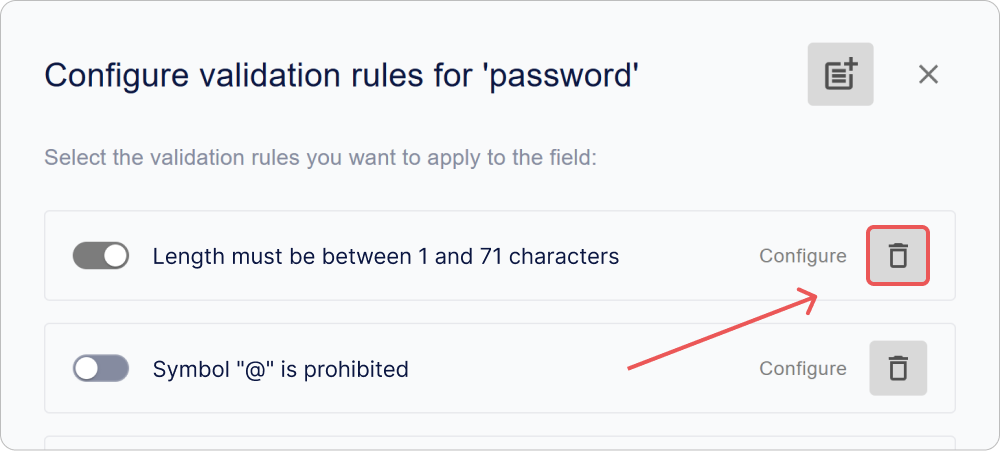
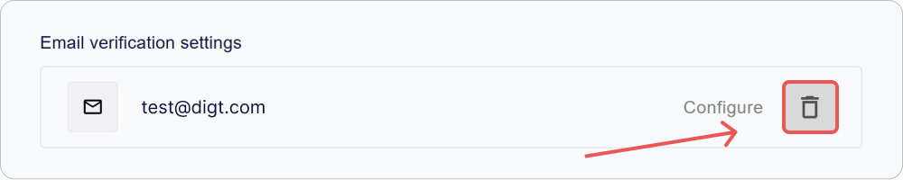

# Come configurare il profilo utente Encvoy ID

In questa guida spiegheremo come configurare il profilo utente e la politica delle password in **Encvoy ID**. Imparerai a gestire i campi del profilo, la validazione dei campi e a impostare la conferma dell'indirizzo email e del numero di telefono.

**Sommario:**

- [Politica delle Password](#password-policy)
- [Campi Base del Profilo](#basic-profile-fields)
- [Campi Aggiuntivi del Profilo](#additional-profile-fields)
- [Regole di Validazione dei Campi Profilo e Password](#validation-rules)
- [Impostazioni di Conferma Email](#email-confirmation-settings)
- [Impostazioni di Conferma Numero di Telefono](#phone-confirmation-settings)
- [Vedi Anche](#see-also)

> 📌 Le impostazioni del profilo utente si trovano nel pannello di amministrazione. Per accedere al pannello, è richiesto il ruolo di servizio **Amministratore**. [Come aprire il pannello di amministrazione →](./docs-02-box-system-install.md#admin-panel-access)

---

## Politica delle Password { #password-policy }

La **politica delle password in Encvoy ID** è un insieme di regole che definiscono i requisiti per la complessità e la sicurezza delle password degli utenti. Aiuta a proteggere gli account da hacking e accessi non autorizzati.

Le regole stabilite vengono applicate:

- durante la creazione di una password nel widget di registrazione,
- durante il ripristino di una password nel widget di login,
- durante la modifica di una password nel profilo utente.

### Come configurare le regole della Politica delle Password

1. Vai al pannello di amministrazione → scheda **Impostazioni**.
2. Espandi il blocco **Configurazione profilo utente** e clicca sul pannello **Password**.

3. Nella finestra che appare, clicca su **Configura**.

4. Si aprirà una finestra con l'elenco delle regole di validazione disponibili.

   > 🔗 Per informazioni sulla creazione e configurazione delle regole di validazione dei campi del profilo, leggi le istruzioni [Regole di Validazione dei Campi Profilo](#validation-rules).

5. Seleziona le caselle per le regole che desideri applicare alla password.

6. Chiudi la finestra dell'elenco delle regole.
7. Clicca su **Salva** nel modulo di modifica del campo.

Le modifiche vengono applicate automaticamente.

Ora, le regole selezionate verranno utilizzate per verificare la complessità della password dell'utente.

> ⚠️ **Nota**: Le nuove regole si applicano solo alle password in fase di creazione o modifica. Le password esistenti rimangono invariate.

### Raccomandazioni di Sicurezza

Per garantire una protezione robusta dell'account, si raccomanda di abilitare i seguenti parametri:

| Raccomandazione                                | Esempio di Regola                          |
| ---------------------------------------------- | ------------------------------------------ |
| Lunghezza minima password — almeno 8 caratteri | `Lunghezza minima = 8`                     |
| Uso di diversi formati (maiuscole/minuscole)   | `Contiene caratteri minuscoli e maiuscoli` |
| Presenza obbligatoria di cifre                 | `Contiene almeno una cifra`                |
| Presenza obbligatoria di caratteri speciali    | `Contiene caratteri speciali (!@#$% ecc.)` |

---

## Campi Base del Profilo Utente { #basic-profile-fields }

I **campi base del profilo** sono attributi di sistema obbligatori creati automaticamente per ogni utente al momento della registrazione. Costituiscono la struttura di base del profilo e garantiscono il corretto funzionamento dei meccanismi di autenticazione, identificazione e comunicazione tra sistemi.

### Elenco dei Campi Base

> 📌 L'elenco dei campi base è fisso. L'aggiunta, la ridenominazione o l'eliminazione di questi campi non è disponibile.

| Campo                    | Identificatore              |
| ------------------------ | --------------------------- |
| Identificatore           | `sub`                       |
| Login                    | `login`                     |
| Email                    | `email`                     |
| Nome                     | `given_name`                |
| Cognome                  | `family_name`               |
| Telefono                 | `phone_number`              |
| Data di Nascita          | `birthdate`                 |
| Nickname                 | `nickname`                  |
| Foto                     | `picture`                   |
| Accordo Trattamento Dati | `data_processing_agreement` |

### Indicatori di Impostazione

Nell'interfaccia è disponibile una visualizzazione rapida delle impostazioni per ogni campo sotto forma di identificatori:

| Icona                                                                 | Parametro                                                   |
| --------------------------------------------------------------------- | ----------------------------------------------------------- |
|  | Il campo è disponibile per la modifica da parte dell'utente |
|    | Il campo è obbligatorio da compilare                        |
|                | Il valore del campo deve essere unico                       |
|          | Livello di pubblicità del campo                             |
|           | Il campo può essere usato come login durante l'accesso      |

### Come configurare un Campo Base

1. Vai al pannello di amministrazione → scheda **Impostazioni**.
2. Espandi il blocco **Configurazione profilo utente**.
3. Clicca sul pannello del campo che devi configurare.

" style="max-width:600px; width:100%">

4. Nel modulo che si apre, specifica:
   - [parametri](#basic-field-parameters),
   - [regole di validazione](#validation-rules).

5. Salva le modifiche nel modulo di modifica.

### Parametri dei Campi Base { #basic-field-parameters }

| Nome                                         | Descrizione                                                                                                                                                                                                                                                                                                                                                                                                                                                                                                              |
| -------------------------------------------- | ------------------------------------------------------------------------------------------------------------------------------------------------------------------------------------------------------------------------------------------------------------------------------------------------------------------------------------------------------------------------------------------------------------------------------------------------------------------------------------------------------------------------ |
| **Nome**                                     | Nome del campo. Non modificabile.                                                                                                                                                                                                                                                                                                                                                                                                                                                                                        |
| **Descrizione del campo**                    | Nome del campo nell'interfaccia. Non modificabile.                                                                                                                                                                                                                                                                                                                                                                                                                                                                       |
| **Usa come login**                           | Consente l'autorizzazione utilizzando questo campo. Disponibile per la configurazione nei campi **Login**, **E-mail** e **Numero di telefono**.                                                                                                                                                                                                                                                                                                                                                                          |
| **Attività**                                 | Determina la presenza obbligatoria del campo nel profilo utente. Parametro immutabile.                                                                                                                                                                                                                                                                                                                                                                                                                                   |
| **Modificabile**                             | Consente all'utente di modificare il valore del campo nel proprio profilo.                                                                                                                                                                                                                                                                                                                                                                                                                                               |
| **Obbligatorio**                             | Richiede che il campo sia compilato durante la registrazione o il login. L'autenticazione è impossibile senza di esso.                                                                                                                                                                                                                                                                                                                                                                                                   |
| **Univocità**                                | Verifica che il valore del campo non sia ripetuto in tutti i profili.                                                                                                                                                                                                                                                                                                                                                                                                                                                    |
| **Pubblicità**                               | 
 Determina chi può accedere ai dati utente: 
 - **Accessibile solo a te** — i dati sono privati e accessibili solo all'utente.   - **Disponibile su richiesta** — i dati utente sono disponibili a sistemi di terze parti dopo il loro consenso;   - **Accessibile a tutti** — i dati sono sempre pubblici per sistemi di terze parti, non richiedono consenso per l'accesso. I dati verranno trasmessi al sistema di terze parti tramite hash email (simile al servizio [Gravatar](https://gravatar.com/)). |
| **Impostazioni conferma email**              | 
Destinato alla configurazione dei parametri per la conferma dell'indirizzo email nel profilo utente.
 🔗 Descrizione dettagliata delle impostazioni nelle istruzioni [Impostazioni di Conferma Email](./docs-05-box-userfields-settings.md#email-confirmation-settings).                                                                                                                                                                                                                                           |
| **Impostazioni conferma numero di telefono** | 
Destinato alla configurazione dei parametri per la conferma del numero di telefono nel profilo utente.
 🔗 Descrizione dettagliata delle impostazioni nelle istruzioni [Impostazioni di Conferma Telefono](./docs-05-box-userfields-settings.md#phone-confirmation-settings).                                                                                                                                                                                                                                      |
| **Regole di validazione**                    | 
Un insieme di regole per verificare la correttezza dei dati inseriti.
 🔗 Descrizione dettagliata nelle istruzioni [Configurazione Regole di Validazione](./docs-05-box-userfields-settings.md#validation-rules).                                                                                                                                                                                                                                                                                                  |

---

## Campi Aggiuntivi del Profilo Utente { #additional-profile-fields }

I **campi aggiuntivi del profilo** sono attributi personalizzati che possono essere creati per memorizzare dati specifici non inclusi nel set standard.

Aiutano ad adattare il profilo a compiti specifici:

- memorizzare identificatori interni, titoli di lavoro, ruoli, dipartimenti, ecc.
- stati di verifica dei dati e altri attributi aziendali.

### Indicatori di Impostazione

Nell'interfaccia è disponibile una visualizzazione rapida delle impostazioni per ogni campo sotto forma di identificatori:

| Icona                                                                 | Parametro                                                   |
| --------------------------------------------------------------------- | ----------------------------------------------------------- |
|  | Il campo è disponibile per la modifica da parte dell'utente |
|    | Il campo è obbligatorio da compilare                        |
|                | Il valore del campo deve essere unico                       |
|          | Livello di pubblicità del campo                             |
|         | Attività del campo                                          |

### Aggiunta di un Campo Aggiuntivo

1. Vai al pannello di amministrazione → scheda **Impostazioni**.
2. Espandi il blocco **Configurazione profilo utente**.
3. Clicca sul pulsante **Aggiungi** nella sezione **Informazioni aggiuntive**.
4. Nel modulo che si apre, specifica:
   - [parametri](#additional-field-parameters),
   - [regole di validazione](#validation-rules).

5. Clicca su **Salva**.

### Modifica di un Campo Aggiuntivo

1. Vai al pannello di amministrazione → scheda **Impostazioni**.
2. Espandi il blocco **Configurazione profilo utente**.
3. Clicca sul pannello con il campo aggiuntivo le cui impostazioni devono essere modificate.
4. Nel modulo che si apre, modifica i parametri e le regole di validazione.
5. Clicca su **Salva**.

> 💡 Le modifiche hanno effetto immediato e si applicano a tutti i profili in cui viene utilizzato questo campo.

### Eliminazione di un Campo Aggiuntivo

1. Vai al pannello di amministrazione → scheda **Impostazioni**.
2. Espandi il blocco **Configurazione profilo utente**.
3. Clicca sul pulsante **Elimina**  accanto al campo che desideri eliminare.

> ⚠️ **Nota**: Quando un campo viene eliminato, tutti i dati utente memorizzati in esso andranno persi permanentemente.

### Parametri dei Campi Aggiuntivi { #additional-field-parameters }

| Nome                      | Descrizione                                                                                                                                                                                                                                                                                                                                                                                                                                                                                                              |
| ------------------------- | ------------------------------------------------------------------------------------------------------------------------------------------------------------------------------------------------------------------------------------------------------------------------------------------------------------------------------------------------------------------------------------------------------------------------------------------------------------------------------------------------------------------------ |
| **Descrizione del campo** | Nome del campo nel sistema                                                                                                                                                                                                                                                                                                                                                                                                                                                                                               |
| **Attività**              | Determina se il campo è visualizzato nel profilo utente                                                                                                                                                                                                                                                                                                                                                                                                                                                                  |
| **Modificabile**          | Consente all'utente di modificare il valore del campo in modo indipendente                                                                                                                                                                                                                                                                                                                                                                                                                                               |
| **Obbligatorio**          | Richiede che il campo sia compilato durante la registrazione o il login. Senza un campo compilato, l'utente non potrà accedere.                                                                                                                                                                                                                                                                                                                                                                                          |
| **Univocità**             | Verifica che il valore non sia ripetuto in tutti i profili                                                                                                                                                                                                                                                                                                                                                                                                                                                               |
| **Pubblicità**            | 
 Configura a chi sarà disponibile il campo: 
 - **Accessibile solo a te** — i dati sono privati e accessibili solo all'utente.   - **Disponibile su richiesta** — i dati utente sono disponibili a sistemi di terze parti dopo il loro consenso;   - **Accessibile a tutti** — i dati sono sempre pubblici per sistemi di terze parti, non richiedono consenso per l'accesso. I dati verranno trasmessi al sistema di terze parti tramite hash email (simile al servizio [Gravatar](https://gravatar.com/)). |
| **Attributo vCard**       | Consente di mappare il campo a un attributo durante l'esportazione del profilo in formato vCard                                                                                                                                                                                                                                                                                                                                                                                                                          |
| **Valore predefinito**    | Imposta un valore pre-compilato durante la creazione di un profilo                                                                                                                                                                                                                                                                                                                                                                                                                                                       |
| **Regole di validazione** | 
Definiscono la logica per il controllo del valore inserito.
 🔗 Maggiori dettagli nelle istruzioni [Configurazione Regole di Validazione](./docs-05-box-userfields-settings.md#validation-rules).                                                                                                                                                                                                                                                                                                                  |

---

## Regole di Validazione dei Campi Profilo e Password { #validation-rules }

Le **regole di validazione dei campi** sono un insieme di controlli con cui il sistema valuta la correttezza dei dati inseriti dall'utente.

Puoi impostare le tue regole per:

- password dell'account,
- [campi base del profilo](#basic-profile-fields),
- [campi aggiuntivi del profilo](#additional-profile-fields).

Tali controlli consentono di migliorare la qualità dei dati, ad esempio impedendo indirizzi email errati, numeri di telefono non validi o password senza caratteri speciali.

Le regole di validazione definite sono visualizzate nell'interfaccia. Ad esempio, nel modulo di modifica del profilo, appare una speciale icona vicino a un campo base o aggiuntivo; passandoci sopra con il mouse si apre l'elenco delle regole definite.

### Creazione di una Regola

1. Vai al pannello di amministrazione → scheda **Impostazioni**.
2. Espandi il blocco **Configurazione profilo utente**.
3. Clicca sul pannello con la password, il campo base o aggiuntivo.

4. Si aprirà il modulo di modifica.
5. Clicca su **Configura** nella sezione **Regole di validazione**.

6. Nella finestra dell'elenco delle regole di validazione che si apre, clicca sul pulsante **Aggiungi** .
7. Si aprirà il modulo di creazione della regola.

8. Compila i campi della regola:
   - **Nome**;
   - **Testo dell'errore** — il messaggio che verrà visualizzato quando la regola viene attivata;
   - **Espressione regolare** — l'espressione che il valore nel campo deve soddisfare;
   - **Attività** — quando abilitata, questa regola può essere selezionata per la validazione del campo. Le regole inattive non sono disponibili per la selezione e vengono ignorate durante i controlli del valore del campo.

9. Clicca su **Salva**.

La regola creata verrà aggiunta all'elenco delle regole e diventerà disponibile per la configurazione della validazione dei campi.

### Modifica di una Regola

1. Vai al pannello di amministrazione → scheda **Impostazioni**.
2. Espandi il blocco **Configurazione profilo utente**.
3. Clicca sul pannello con il campo base o aggiuntivo.
4. Si aprirà il modulo di modifica.
5. Clicca su **Configura** nella sezione **Regole di validazione**.
6. Si aprirà la finestra dell'elenco delle regole di validazione.
7. Sul pannello della regola, clicca sul pulsante **Configura**.

8. Nel modulo di modifica che si apre, cambia i campi necessari.
9. Clicca su **Salva**.

### Eliminazione di una Regola

1. Vai al pannello di amministrazione → scheda **Impostazioni**.
2. Espandi il blocco **Configurazione profilo utente**.
3. Clicca sul pannello con il campo base o aggiuntivo.
4. Si aprirà il modulo di modifica.
5. Clicca su **Configura** nella sezione **Regole di validazione**.
6. Si aprirà la finestra dell'elenco delle regole di validazione.
7. Sul pannello della regola, clicca sul pulsante **Elimina** .

Le modifiche vengono applicate automaticamente.

### Come aggiungere una Regola a un Campo del Profilo Utente

Per configurare le regole di validazione in un campo base o aggiuntivo:

1. Vai al pannello di amministrazione → scheda **Impostazioni**.
2. Espandi il blocco **Configurazione profilo utente**.
3. Clicca sul pannello con il campo base o aggiuntivo.
4. Si aprirà il modulo di modifica.
5. Clicca su **Configura** nella sezione **Regole di validazione**.

6. Si aprirà la finestra dell'elenco delle regole di validazione.

7. Seleziona la casella accanto alle regole che desideri applicare al campo selezionato.
8. Chiudi la finestra dell'elenco delle regole.

Le modifiche vengono applicate automaticamente.

---

## Impostazioni di Conferma Email { #email-confirmation-settings }

La **conferma email in Encvoy ID** è un meccanismo per verificare la validità dell'indirizzo fornito dall'utente durante la registrazione, l'autorizzazione o la modifica dei dati del profilo.

Dopo che l'indirizzo è stato fornito, il sistema invia un'email con un codice di conferma o un link unico.
L'utente deve seguire il link o inserire il codice — dopo di che, l'indirizzo è considerato confermato.

Questa verifica garantisce:

- protezione contro la registrazione con indirizzi errati o altrui;
- sicurezza dell'accesso all'account;
- la possibilità di usare l'email per il recupero dell'accesso e le notifiche;
- controllo sulla pertinenza dei dati di contatto dell'utente.

Le impostazioni di conferma email sono definite dall'amministratore e includono i parametri del server di posta (SMTP), l'indirizzo del mittente, il tempo di vita del codice di conferma e altri parametri tecnici.

> 💡 **Suggerimento**: Prima di salvare le impostazioni, assicurati che i parametri SMTP specificati siano corretti — se c'è un errore, il sistema non sarà in grado di inviare email.

### Aggiunta di un'Impostazione

1. Vai al pannello di amministrazione → scheda **Impostazioni**.
2. Espandi il blocco **Configurazione profilo utente**.
3. Clicca sul pannello **E-mail**.
4. Si aprirà il modulo di modifica.
5. Nella sezione **Impostazioni conferma email**, clicca su **Aggiungi**.

6. Nella finestra che si apre, specifica i parametri:

   | Parametro                                   | Descrizione                                                                                        |
   | ------------------------------------------- | -------------------------------------------------------------------------------------------------- |
   | **Indirizzo email principale**              | L'indirizzo email da cui verranno inviate le email automatiche                                     |
   | **Indirizzo del server di posta in uscita** | Indirizzo del server SMTP                                                                          |
   | **Porta del server di posta in uscita**     | Porta per il server SMTP                                                                           |
   | **Password email**                          | Password regolare o password dell'app creata nelle impostazioni dell'account del servizio di posta |
   | **Usa per l'accesso tramite codice**        | L'email verrà utilizzata per accedere alle applicazioni tramite password monouso                   |
   | **Immagine email**                          | Icona che verrà visualizzata nell'interfaccia del servizio **Encvoy ID**                           |
   | **Tempo di vita del codice di conferma**    | Tempo di vita per i codici di conferma dell'indirizzo email in secondi                             |

7. Clicca su **Salva**.

### Modifica di un'Impostazione

1. Vai al pannello di amministrazione → scheda **Impostazioni**.
2. Espandi il blocco **Configurazione profilo utente**.
3. Clicca sul pannello **E-mail**.
4. Si aprirà il modulo di modifica.
5. Nella sezione **Impostazioni conferma email**, clicca sul pulsante **Configura**.

6. Si aprirà il modulo di modifica.
7. Apporta le modifiche necessarie.
8. Clicca su **Salva**.

### Eliminazione di un'Impostazione

1. Vai al pannello di amministrazione → scheda **Impostazioni**.
2. Espandi il blocco **Configurazione profilo utente**.
3. Clicca sul pannello **E-mail**.
4. Si aprirà il modulo di modifica.
5. Clicca sul pulsante **Elimina**  nella sezione **Impostazioni conferma email**.

6. Conferma l'azione nella finestra modale.

---

## Impostazioni di Conferma Numero di Telefono { #phone-confirmation-settings }

La **conferma del numero di telefono in Encvoy ID** è un meccanismo per verificare la validità del numero di contatto fornito dall'utente durante la registrazione, il login o la modifica del profilo.

Dopo aver inserito il numero, il sistema invia all'utente un codice di verifica o avvia una chiamata automatica. L'utente inserisce il codice ricevuto, confermando che il numero specificato appartiene effettivamente a lui.

Questa verifica svolge diverse funzioni chiave:

- impedisce l'uso di numeri non validi o altrui;
- fornisce un ulteriore livello di protezione dell'account;
- consente di utilizzare il numero per il login tramite codice monouso;
- garantisce il corretto funzionamento delle notifiche relative alla sicurezza.

Nella versione attuale di **Encvoy ID**, la conferma del numero è implementata tramite l'integrazione con il servizio [Call Authorization](https://kloud.one/id/) della piattaforma **Kloud.One**. Affinché questo meccanismo funzioni, è necessario configurare la connessione a **Kloud.One** specificando l'ID cliente e il segreto.

> 💡 **Suggerimento:** Prima di salvare l'impostazione, assicurati che l'applicazione sia correttamente registrata in **Kloud.One** e che i dati forniti (`client_id` e `client_secret`) siano validi. Senza questi, la conferma del numero non funzionerà.  

> 📚 [Documentazione Kloud.One](https://docs.kloud.one)

### Aggiunta di un'Impostazione

1. Vai al pannello di amministrazione → scheda **Impostazioni**.
2. Espandi il blocco **Configurazione profilo utente**.
3. Clicca sul pannello **Numero di telefono**.
4. Si aprirà il modulo di modifica.
5. Nella sezione **Impostazioni conferma numero di telefono**, clicca su **Aggiungi**.

6. Nella finestra che appare, imposta i parametri necessari:

   | Parametro                                     | Nome            | Descrizione                                                                                                                       |
   | --------------------------------------------- | --------------- | --------------------------------------------------------------------------------------------------------------------------------- |
   | **Indirizzo base di autorizzazione (issuer)** | `issuer`        | Indirizzo dell'applicazione [Call Authorization](https://kloud.one/id/). Nella versione attuale — `<https://flashcall.kloud.one>` |
   | **Identificativo risorsa (client_id)**        | `client_id`     | Identificatore dell'applicazione creata nel servizio [Call Authorization](https://kloud.one/id/)                                  |
   | **Chiave segreta (client_secret)**            | `client_secret` | Chiave segreta dell'applicazione creata nel servizio [Call Authorization](https://kloud.one/id/)                                  |
   | **Usa per l'accesso tramite codice**          | -               | Il numero di telefono verrà utilizzato per accedere alle applicazioni tramite password monouso                                    |
   | **Immagine telefono**                         | -               | Icona che verrà visualizzata nell'interfaccia del servizio **Encvoy ID**                                                          |

7. Clicca su **Salva**.

### Modifica di un'Impostazione

1. Vai al pannello di amministrazione → scheda **Impostazioni**.
2. Espandi il blocco **Configurazione profilo utente**.
3. Clicca sul pannello **Numero di telefono**.
4. Si aprirà il modulo di modifica.
5. Nella sezione **Impostazioni conferma numero di telefono**, clicca su **Configura**.
6. Si aprirà il modulo di modifica.
7. Apporta le modifiche necessarie.
8. Clicca su **Salva**.

### Eliminazione di un'Impostazione

1. Vai al pannello di amministrazione → scheda **Impostazioni**.
2. Espandi il blocco **Configurazione profilo utente**.
3. Clicca sul pannello **Numero di telefono**.
4. Si aprirà il modulo di modifica.
5. Clicca sul pulsante **Elimina**  nella sezione **Impostazioni conferma numero di telefono**.

6. Conferma l'azione nella finestra modale.

---

## Vedi Anche { #see-also }

- [Metodi di Login e Configurazione Widget di Login](./docs-06-github-en-providers-settings.md) — guida sulla connessione e configurazione di servizi di autenticazione esterni.
- [Gestione Applicazioni](./docs-10-common-app-settings.md) — guida sulla creazione, configurazione e gestione di applicazioni OAuth 2.0 e OpenID Connect (OIDC).
- [Gestione Utenti](./docs-08-box-manage-users.md) — guida sulla gestione degli account utente.
