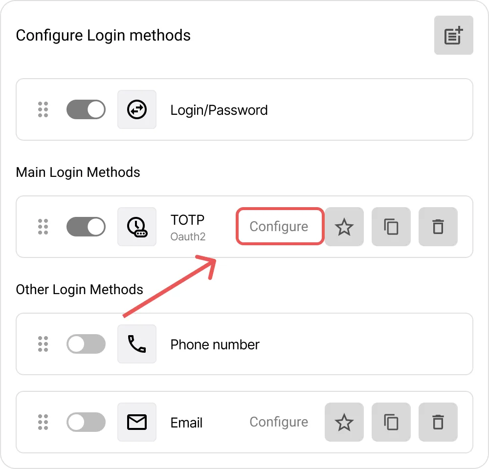

# Come Configurare i Metodi di Accesso in Encvoy ID

In questa guida imparerai come configurare i metodi di accesso in **Encvoy ID**, inclusi i provider OAuth standard e i metodi di autenticazione avanzati (WebAuthn, mTLS, TOTP). Spiegheremo inoltre come impostare e personalizzare correttamente il widget di autorizzazione per rendere il processo di login sicuro e intuitivo.

**Sommario:**

- [Panoramica sui Metodi di Accesso](#login-methods-overview)
- [Gestione dei Metodi di Accesso](#managing-login-methods)
- [Impostazioni del Widget di Accesso](#login-widget-settings)
- [Vedi Anche](#see-also)

---

## Panoramica sui Metodi di Accesso { #login-methods-overview }

Un **metodo di accesso** è una modalità di autenticazione per gli utenti che consente loro di autorizzarsi nell'account personale o nelle applicazioni collegate. È un elemento chiave del sistema Single Sign-On, che fornisce un'identificazione flessibile e sicura.

### Tipi di Provider di Autenticazione in Encvoy ID

**Encvoy ID** supporta i seguenti tipi di metodi di accesso:

- **Metodi di base**: login e password, email,
- **Provider di identità esterni**: social network, sistemi aziendali affidabili e altri servizi,
- **Metodi avanzati e senza password:** autenticazione crittografica tramite **mTLS** (certificati client) e **WebAuthn** (biometria, chiavi hardware), oltre alle password monouso **TOTP/HOTP**.

Combina i metodi di accesso per aumentare la sicurezza. Implementa l'**autenticazione a due fattori**, dove dopo aver inserito il primo fattore (login, password o altro metodo), l'utente deve confermare la propria identità utilizzando un secondo fattore (telefono, email o WebAuthn). [Come configurare l'autenticazione a due fattori →](./docs-04-box-system-settings.md#two-factor-authentication)

### Livelli di Gestione e Pubblicità dei Metodi di Accesso { #management-levels-and-publicity }

I metodi di accesso possono essere creati in diversi tipi di dashboard di **Encvoy ID**:

- **Admin Dashboard** — livello dell'intero servizio;
- **Organization Dashboard** — livello aziendale;
- **Application Dashboard (ADM)** — livello della singola applicazione.

Per i metodi di accesso creati a livello di **servizio** o **organizzazione**, è possibile configurare la **pubblicità** — determinando esattamente dove saranno disponibili.

| Tipo di Metodo di Accesso                    | Impostazione Pubblicità | Dove Disponibile                                     | Gestione                                      |
| -------------------------------------------- | ----------------------- | ---------------------------------------------------- | --------------------------------------------- |
| **Creato in Admin Dashboard**                | ✔ Sì                    | Dashboard admin e tutte le applicazioni del servizio | Gestito solo dalla **Admin Dashboard**        |
| **Creato in Organization Dashboard**         | ✔ Sì                    | Tutte le applicazioni di questa organizzazione       | Gestito solo dalla **Organization Dashboard** |
| **Creato in Applicazione (Small Dashboard)** | ✘ No                    | Solo in questa applicazione                          | Gestito nelle **Impostazioni Applicazione**   |

---

## Gestione dei Metodi di Accesso { #managing-login-methods }

### Creazione di un Nuovo Metodo di Accesso

Per i servizi più popolari, **Encvoy ID** fornisce modelli pronti all'uso con impostazioni predefinite. Semplificano il processo di connessione poiché contengono parametri precompilati specifici per ogni provider.

**Il processo di configurazione prevede tre passaggi:**

1. **Preparazione:** ottieni un `Client ID` e un `Client Secret` dal servizio provider.
2. **Configurazione in Encvoy ID:** crea un provider del tipo corrispondente.

   Fai riferimento alle istruzioni separate per la configurazione del provider selezionato:
   - **Email**: [Email](./instructions-common-provider-email.md)
   - **Social Network:** [Google](./instructions-common-provider-google.md), [GitHub](./instructions-common-provider-github.md)
   - **Universale:** [OpenID Connect](./instructions-common-provider-oidc.md) (per qualsiasi sistema conforme a OIDC)
   - **Metodi Avanzati:** [mTLS](./instructions-common-provider-mtls.md), [WebAuthn](./instructions-common-provider-webauthn.md), [TOTP](./instructions-common-provider-totp.md), [HOTP](./instructions-common-provider-hotp.md)

3. **Posizionamento sul Widget:** aggiungi il metodo di accesso al modulo di login disponibile per gli utenti del sistema.

### Modifica di un Metodo di Accesso Esistente

Se è necessario aggiornare le impostazioni di un metodo di accesso esistente (ad esempio, a causa di un cambio di chiave segreta o di dominio):

1. Vai alla Admin Dashboard (Impostazioni Organizzazione o dell'Applicazione corrispondente) → sezione **Impostazioni**.
2. Clicca su **Configura** nel blocco **Metodi di accesso**.
3. Si aprirà una finestra con l'elenco dei metodi di accesso creati.
4. Clicca sul pulsante **Configura** nel pannello del metodo di accesso che desideri modificare.

5. Si aprirà il modulo di modifica.
6. Apporta le modifiche necessarie.
7. Clicca su **Salva**.

### Eliminazione di un Metodo di Accesso

1. Vai alla Admin Dashboard (Impostazioni Organizzazione o dell'Applicazione corrispondente) → sezione **Impostazioni**.
2. Espandi il blocco **Metodi di accesso**.
3. Clicca su **Configura**.
4. Si aprirà una finestra con l'elenco dei metodi di accesso creati.
5. Clicca sul pulsante **Elimina**  situato nel pannello del metodo di accesso che desideri eliminare.

6. Conferma l'azione nella finestra modale.

Dopo l'eliminazione riuscita, il metodo di accesso scomparirà dai widget di tutte le applicazioni collegate.

### Copia delle Impostazioni del Metodo di Accesso

La copia delle impostazioni consente di creare un nuovo metodo basato su uno creato in precedenza.

1. Copia le impostazioni del metodo di accesso utilizzando il pulsante **Copia**  situato nel pannello del metodo di accesso.

2. Successivamente, apri il modulo di creazione per un nuovo metodo di accesso utilizzando un modello dello stesso tipo e clicca su **Incolla** .

> ⚠️ **Nota**: Se i tipi non corrispondono, il nuovo provider potrebbe non funzionare correttamente.

### Configurazione di un Identificatore Obbligatorio nel Profilo Utente

**Identificatori** sono servizi esterni che l'utente ha aggiunto al proprio profilo o attraverso i quali ha precedentemente effettuato l'accesso al sistema.

L'elenco degli identificatori disponibili per l'aggiunta è formato dai metodi di accesso nella dashboard di **Encvoy ID** con un'impostazione di pubblicità attiva.

- Se un metodo di accesso è configurato come **pubblico**, apparirà nell'elenco degli identificatori disponibili per l'aggiunta nel profilo utente.
- Il posizionamento di questo metodo di accesso sul widget dell'applicazione è facoltativo — può essere disponibile nel profilo anche senza un pulsante nella schermata principale di login.
- L'utente può anche aggiungere un identificatore durante l'accesso tramite il widget se tale metodo di accesso è disponibile.

In **Encvoy ID**, è possibile configurare l'obbligatorietà del collegamento di un identificatore di account esterno al profilo utente. In questo caso, all'accesso all'applicazione, un utente che non ha un identificatore collegato vedrà una richiesta di aggiungerne uno al proprio profilo.

#### Come Rendere Obbligatorio un Identificatore

1. Vai alla Admin Dashboard (Impostazioni Organizzazione o dell'Applicazione corrispondente) → sezione **Impostazioni**.
2. Espandi il blocco **Metodi di accesso** e clicca su **Configura**.
3. Si aprirà una finestra con l'elenco dei metodi di accesso creati.
4. Clicca sul pulsante **Rendi obbligatorio**  nel pannello del metodo di accesso che desideri rendere obbligatorio.

L'impostazione viene applicata senza ulteriore conferma.

> 💡 **Suggerimento**: Cliccando nuovamente sul pulsante **Rendi obbligatorio**, l'identificatore tornerà ad essere facoltativo nel profilo.

---

## Impostazioni del Widget di Accesso { #login-widget-settings }

### Cos'è il Widget di Accesso?

Il **Widget di Accesso** è il modulo di autorizzazione visualizzato all'utente quando tenta di accedere a un'applicazione o al sistema **Encvoy ID** se non è ancora autenticato.

Il widget supporta:

- login classico tramite nome utente e password,
- login tramite vari provider,
- configurazione flessibile dell'aspetto e della struttura,
- raggruppamento dei metodi di accesso.

Nel widget, i metodi di accesso sono divisi in:

- **Metodi primari** — visualizzati come pulsanti separati sotto il pulsante **Accedi** e sono i più utilizzati.
- **Metodi aggiuntivi** — posizionati nel blocco **Altri metodi** come pulsanti compatti per evitare di affollare l'interfaccia.

Esempio di widget:

> 💡 Il **Widget di Accesso** è la prima cosa che un utente vede durante l'autorizzazione, quindi è importante che corrisponda allo stile visivo dell'azienda e sia il più chiaro possibile.

### Configurazione del Widget di Accesso: Aspetto e Pulsanti

Per configurare l'aspetto del widget:

1. Vai alla Admin Dashboard (Impostazioni Organizzazione o dell'Applicazione corrispondente) → sezione **Impostazioni**.
2. Trova il blocco **Metodi di accesso** e clicca su **Configura**.
3. Si aprirà la finestra **Configura l'aspetto del widget**.
4. Nel primo blocco, vengono definiti gli elementi visivi chiave:
   - **Titolo del widget** — Visualizzato nella parte superiore del modulo. Per visualizzare il nome dell'applicazione nel titolo del widget, usa il valore `APP_NAME`.
   - **Copertina del widget** — Immagine di sfondo del modulo di autorizzazione.
   - **Modalità di sostituzione automatica della copertina sui widget delle applicazioni**:
     - **Disattivato** — Viene utilizzata la copertina dell'applicazione,
     - **Predefinito** — Solo per le applicazioni senza copertina,
     - **Forzato** — Applicata a tutte le applicazioni.

5. Nel secondo blocco, configura la visibilità degli elementi del modulo di login:
   - **Mostra il logo dell'applicazione nel widget** — Se abilitato, visualizza il logo accanto al nome dell'applicazione. Viene utilizzata l'immagine della sezione [Informazioni di Base](./docs-04-box-system-settings.md#system-name-and-logo).
   - **Nascondi il pulsante crea account** — Se abilitato, nasconde il pulsante di creazione account dal widget.
   - **Nascondi il piè di pagina** — Se abilitato, nasconde il footer del widget con il testo "© 2015-2025".
   - **Nascondi i loghi dei principali provider di accesso** — Se abilitato, nasconde i loghi dei metodi di accesso dal gruppo **Primari**.

     

6. Nel terzo blocco, configura il design dei pulsanti:
   - **Colore di sfondo dei pulsanti** — Schema colori per lo sfondo del pulsante (codice hex).
   - **Colore del carattere sui pulsanti** — Schema colori per il testo del pulsante (codice hex).

     

7. Se necessario, specifica il testo:
   - **Campo informativo aggiuntivo all'interno del modulo** — Testo aggiuntivo che verrà visualizzato nella parte inferiore del widget,
   - **Campo aggiuntivo all'esterno del widget** — Testo aggiuntivo che verrà visualizzato sotto il widget.

     

   > I campi supportano l'inserimento di codice HTML5 con markup semantico completo, inclusi stili CSS incorporati e inline. L'uso del tag `script` è vietato. Al salvataggio dei dati, qualsiasi tag `script` (inclusi contenuto e attributi) verrà rimosso automaticamente dal campo a livello di database.

8. Clicca su **Salva** per applicare le modifiche.

   > 💡 Puoi visualizzare i risultati delle modifiche nella sezione **Anteprima**.

### Aggiunta e Disattivazione dei Metodi di Accesso sul Widget

Per configurare la visualizzazione di un metodo di accesso nel widget:

1. Vai alla Admin Dashboard (Impostazioni Organizzazione o dell'Applicazione corrispondente) → sezione **Impostazioni**.
2. Trova il blocco **Metodi di accesso** e clicca su **Configura**.
3. Abilita o disabilita gli interruttori per i metodi di accesso desiderati.
4. Se necessario, configura i gruppi dei metodi di accesso.

> ⚠️ **Nota**:
>
> 1. È impossibile disabilitare il metodo **Login/Password**. Se tutti i metodi di accesso sono disabilitati, il metodo **Login/Password** viene abilitato automaticamente, poiché il widget deve avere almeno un metodo per l'accesso.
> 2. Disabilitare un metodo di accesso dal widget non elimina il metodo di accesso dal sistema.

---

## Vedi Anche { #see-also }

- [Gestione Applicazioni](./docs-10-common-app-settings.md) — guida per la creazione, configurazione e gestione di applicazioni OAuth 2.0 e OpenID Connect (OIDC).
- [Gestione Organizzazione](./docs-02-box-system-install.md) — guida per lavorare con un'organizzazione in **Encvoy ID**.
- [Registrazione e Accesso Utente](./docs-13-common-user-authentication.md) — istruzioni per la creazione di un account, l'accesso con nome utente/password e servizi di autenticazione esterni.
