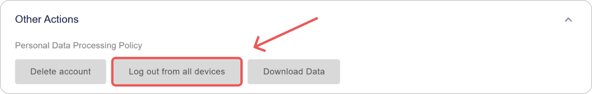

# Gestione Utenti in Encvoy ID

In questa guida imparerai come creare e modificare i profili utente in **Encvoy ID**, assegnare ruoli e diritti di accesso, bloccare ed eliminare account, terminare sessioni attive, gestire la privacy ed esportare i dati del profilo.

**Sommario:**

- [Panoramica e Operazioni di Base](#overview-and-basics)
- [Gestione dei Dati del Profilo](#profile-data-management)
- [Accesso e Sicurezza](#access-and-security)
- [Stato dell'Account](#account-status)
- [Eliminazione di un Utente](#deleting-user)
- [Vedi Anche](#see-also)

---

## Panoramica e Operazioni di Base { #overview-and-basics }

### Informazioni sulla Sezione "Utenti"

L'elenco di tutti gli utenti registrati in **Encvoy ID** si trova nella sezione **Utenti**. Qui, gli amministratori possono gestire gli account, visualizzare i profili e controllare l'accesso al sistema.

> ⚠️ **Requisiti di Accesso**: Questa sezione è disponibile nel pannello di amministrazione per gli utenti con permessi di sistema **Amministratore**.

### Creazione di un Utente in Encvoy ID

> 📌 In **Encvoy ID**, esistono diversi modi per registrare gli utenti: l'autoregistrazione tramite widget e la creazione manuale da parte di un utente con diritti di **Amministratore**.

In questa istruzione, vedremo come creare manualmente un utente:

1. Vai al pannello di amministrazione → scheda **Utenti**.
2. Clicca sul pulsante **Crea utente** .
3. Si aprirà il modulo di creazione utente.
4. Compila i campi del profilo nel modulo:
   - **Nome pubblico** — il nome visualizzato dell'utente nel sistema;
   - **Nome** — il nome e il secondo nome dell'utente;
   - **Cognome** — il cognome dell'utente;
   - **Login** — deve essere univoco per il servizio; può essere utilizzato per l'autorizzazione futura;
   - **E-mail** — l'indirizzo deve essere univoco per il servizio; può essere utilizzato per l'autorizzazione futura;
   - **Numero di telefono** — deve essere univoco per il servizio; può essere utilizzato per l'autorizzazione futura;
   - **Password** — deve essere conforme alla politica delle password specificata nelle impostazioni del servizio.

     > 🔗 Per maggiori dettagli, consulta la guida [Configurazione della Politica delle Password](./docs-05-box-userfields-settings.md#password-policy).

   - **Data di nascita**;
   - **Foto del profilo**.

5. Clicca su **Salva**.

   > 💡 Un profilo utente può contenere [campi aggiuntivi](./docs-05-box-userfields-settings.md#password-policy).

   > 📌 La validazione dei campi viene eseguita in base alle regole di validazione. Per maggiori dettagli, consulta la guida [Regole di Validazione dei Campi](./docs-05-box-userfields-settings.md#validation-rules).

### Visualizzazione e Modifica di un Profilo Utente

#### Visualizzazione di un Profilo Utente

Per ottenere informazioni dettagliate su un account, apri il suo profilo.

1. Vai al pannello di amministrazione → scheda **Utenti**.
2. Clicca sul pannello dell'utente di cui desideri visualizzare il profilo.
3. Si aprirà il profilo utente con informazioni dettagliate: dati di contatto, identificatori e impostazioni sulla privacy.


#### Modifica dei Dati del Profilo

Per apportare modifiche a un profilo utente:

1. Vai al pannello di amministrazione → scheda **Utenti**.
2. Apri il profilo utente.
3. Clicca su **Modifica** nel blocco **Informazioni principali**.
4. Nel modulo **Modifica Utente** che si apre, apporta le modifiche necessarie.

   > 📌 La validazione dei campi viene eseguita in base alle regole di validazione. Per maggiori dettagli, consulta la guida [Regole di Validazione dei Campi](./docs-05-box-userfields-settings.md#validation-rules).

5. Clicca su **Salva**.

---

## Gestione dei Dati del Profilo { #profile-data-management }

### Gestione degli Identificatori del Profilo

La sezione **Identificatori** del profilo utente mostra i metodi di accesso che l'utente ha aggiunto personalmente o utilizzato per accedere all'applicazione o all'account personale di **Encvoy ID**. L'amministratore può configurare la privacy di un identificatore e rimuoverlo dal profilo utente.

> 💡 **Importante:** Solo il proprietario dell'account può aggiungere nuovi identificatori. Per maggiori dettagli, consulta la guida [Identificatori di Servizi Esterni](./docs-12-common-personal-profile.md#external-service-identifiers).

Per eliminare un identificatore:

1. Vai al pannello di amministrazione → scheda **Utenti**.
2. Apri il profilo utente.
3. Clicca su **Elimina** nel pannello del metodo di accesso che desideri rimuovere dal profilo.


L'identificatore verrà rimosso immediatamente dal profilo.

### Configurazione della Privacy dei Campi del Profilo

Per ogni campo del profilo, è possibile impostare un livello di privacy che determina chi può vedere queste informazioni. Le impostazioni sono disponibili per i dati utente di base e aggiuntivi, nonché per i metodi di accesso.

#### Livelli di Privacy

| Livello                      | Icona                                               | Descrizione                                                                                                                                   |
| ---------------------------- | --------------------------------------------------- | --------------------------------------------------------------------------------------------------------------------------------------------- |
| **Accessibile solo a te**    |         | I dati non vengono trasferiti a sistemi di terze parti e sono accessibili solo all'utente.                                                    |
| **Disponibile su richiesta** |  | I dati sono disponibili in sistemi di terze parti integrati con **Encvoy ID**. <br> È richiesto il consenso dell'utente per accedere ai dati. |
| **Accessibile a tutti**      |        | I dati sono sempre pubblici. Il consenso dell'utente non è richiesto per accedervi.                                                           |

#### Come Modificare la Privacy di un Campo del Profilo

1. Vai al pannello di amministrazione → scheda **Utenti**.
2. Apri il profilo utente.
3. Clicca sull'icona della privacy corrente accanto al campo.
4. Seleziona un nuovo livello dal menu a discesa.


La modifica viene applicata istantaneamente.

### Esportazione dei Dati del Profilo

**Encvoy ID** consente di esportare tutti i dati del profilo in formato JSON.

Per scaricare i dati del profilo:

1. Vai al pannello di amministrazione → scheda **Utenti**.
2. Apri il profilo utente.
3. Espandi il blocco **Altre azioni**.


4. Seleziona l'azione **Scarica i dati**.
5. Il download del file JSON inizierà automaticamente.

#### Struttura del File Esportato

Il file esportato contiene un elenco completo dei dati utente:

```json
{
  "user": {
    "id": 1573,
    "email": "ivanov.petr89@mail.com",
    "birthdate": "1992-11-14T15:22:11.123Z",
    "family_name": "Ivanov",
    "given_name": "Petr",
    "nickname": "Petya",
    "login": "petr_ivanov92",
    "phone_number": "+79991234567",
    "picture": "public/images/profile/3f7b21d8e4c2a6f1b2c9d3a0e5f7b1c4",
    "public_profile_claims_oauth": "id email family_name given_name picture",
    "public_profile_claims_gravatar": "family_name given_name email picture",
    "blocked": false,
    "deleted": null,
    "custom_fields": {
      "country": "Russia"
    },
    "password_updated_at": "2025-10-12T08:45:33.222Z"
  },
  "role": "ADMIN"
}
```

---

## Accesso e Sicurezza { #access-and-security }

### Terminazione delle Sessioni Utente

La funzione per terminare forzatamente tutte le sessioni attive è un importante strumento di sicurezza. Utilizzala in caso di smarrimento di un dispositivo, sospetto di compromissione dell'account o per aggiornare immediatamente i token di accesso.

> 📌 Questa operazione invalida immediatamente tutti i token di accesso e di aggiornamento per l'utente, terminando tutte le sue sessioni correnti in tutte le applicazioni. L'utente dovrà effettuare nuovamente l'accesso.

#### Come Terminare le Sessioni Utente

**Metodo 1: Dall'Elenco Generale Utenti**

1. Vai al pannello di amministrazione → scheda **Utenti**.
2. Clicca su **Termina sessioni** nel menu azioni dell'utente.


**Metodo 2: Dal Profilo Utente**

1. Vai al pannello di amministrazione → scheda **Utenti**.
2. Clicca su **Termina sessioni** nel profilo utente all'interno del blocco **Altre azioni**.



**Cosa succede dopo la conferma:**

- **Tutte le sessioni attive** dell'utente vengono terminate.
- I **token di accesso** (`access_token`) diventano non validi.
- I **token di aggiornamento** (`refresh_token`) vengono revocati.
- L'utente dovrà **effettuare nuovamente l'accesso** al prossimo tentativo di accesso all'applicazione.

> 📌 Questa operazione non blocca l'utente. Potrà autorizzarsi nuovamente.

### Assegnazione e Modifica dei Permessi Utente

Encvoy ID utilizza un sistema di accesso a tre livelli che definisce chiaramente i diritti degli utenti:

- **Partecipante** — il ruolo base. Consente di gestire il proprio profilo, configurare i permessi di accesso ai dati personali e utilizzare l'account per accedere alle applicazioni integrate.
- **Gestore** — il ruolo di amministratore per una specifica organizzazione o dipartimento. Gestisce gli utenti e l'accesso alle applicazioni all'interno della propria unità organizzativa.
- **Amministratore** — il ruolo con i massimi privilegi. Fornisce pieno accesso a tutte le funzioni della piattaforma, incluse le impostazioni di sicurezza globali e la gestione di tutte le organizzazioni.

Di seguito sono riportate le istruzioni per l'assegnazione dei ruoli di sistema **Gestore** e **Amministratore**.

#### Assegnazione dei Permessi "Gestore"

1. Vai al pannello di amministrazione → scheda **Utenti**.
2. Apri il menu azioni cliccando sul pulsante **Altro** per l'utente di cui desideri modificare i diritti.
3. Seleziona l'azione **Cambia permessi**.


4. Nella finestra che si apre, seleziona il ruolo **Gestore** e clicca su **Salva**.


L'utente riceverà il ruolo selezionato e i relativi diritti.

#### Assegnazione dei Permessi di Sistema "Amministratore"

1. Vai al pannello di amministrazione → scheda **Utenti**.
2. Apri il menu azioni cliccando sul pulsante **Altro** per l'utente di cui desideri modificare i diritti.
3. Seleziona l'azione **Cambia permessi**.
4. Nella finestra che si apre, seleziona il ruolo **Amministratore** e clicca su **Salva**.

L'utente riceverà il ruolo selezionato e i relativi diritti.

> 🔍 Per assegnare i permessi di **Amministratore** per un'applicazione, utilizza l'[istruzione](./docs-10-common-app-settings.md#assigning-app-administrator).

---

## Stato dell'Account { #account-status }

### Blocco degli Utenti in Encvoy ID

Il blocco impedisce l'accesso a tutti i servizi che utilizzano **Encvoy ID** per l'accesso.

Per bloccare un utente:

1. Apri il menu azioni per un utente attivo in una delle interfacce:
   - Nel menu azioni dell'utente all'interno del [profilo dell'applicazione](./docs-10-common-app-settings.md#viewing-application).
   - Nel menu azioni dell'utente nella scheda **Utenti**.

   

2. Seleziona l'azione **Blocca in Encvoy ID**.
3. Conferma l'azione nella finestra modale.


**Cosa succede dopo il blocco**:

- Lo stato dell'utente cambierà in **Bloccato**.

    

- L'utente bloccato non potrà accedere al servizio o alle applicazioni.

  Al tentativo di accesso, verrà visualizzato il seguente widget:

    

### Sblocco degli Utenti in Encvoy ID

Per sbloccare un utente:

1. Apri il menu azioni per un utente bloccato in una delle interfacce:
   - Nel menu azioni dell'utente all'interno del [profilo dell'applicazione](./docs-10-common-app-settings.md#viewing-application).
   - Nel menu azioni dell'utente nella scheda **Utenti**.

2. Seleziona l'azione **Sblocca in Encvoy ID**.
3. Conferma l'azione nella finestra modale.

Dopo aver confermato l'azione, lo stato dell'utente cambierà in **Attivo**.

---

## Eliminazione di un Utente { #deleting-user }

Un amministratore può eliminare definitivamente un utente. Una volta confermata l'eliminazione, l'account e tutti i dati scompariranno irrevocabilmente. L'utente perderà l'accesso a tutte le applicazioni in cui è stato utilizzato il suo account **Encvoy ID**.

> 💡 Un utente può eliminare autonomamente il proprio account tramite il proprio profilo personale. L'eliminazione è implementata con un **meccanismo di ritardo**. Entro un certo periodo, l'utente può ripristinare l'accesso al proprio account. Puoi saperne di più nella guida [Profilo Utente](./docs-12-common-personal-profile.md).

### Come Eliminare un Utente in Encvoy ID

> 💡 **Alternativa**: Considera il **blocco dell'account** invece dell'eliminazione se esiste la possibilità di ripristinare l'accesso.

Per eliminare un utente:

1. Clicca su **Elimina account** in una delle interfacce:
   - Nel menu azioni dell'utente nella scheda **Utenti**.

      

   - Nel profilo utente all'interno del blocco **Altre azioni**.

      

2. Conferma l'azione nella finestra modale.

Dopo la conferma, l'utente verrà eliminato.

**Cosa succede dopo l'eliminazione**:

- Le applicazioni in cui l'utente eliminato è l'unico proprietario verranno eliminate irrevocabilmente.
- Tutti i dati dell'account vengono cancellati senza possibilità di recupero dopo l'eliminazione finale.
- L'utente perde l'accesso a tutti i servizi integrati.

---

## Vedi Anche { #see-also }

- [Profilo Personale e Gestione dei Permessi delle Applicazioni](./docs-12-common-personal-profile.md) — una guida alla gestione del proprio profilo personale.
- [Gestione delle Applicazioni](./docs-10-common-app-settings.md) — una guida alla creazione, configurazione e gestione delle applicazioni OAuth 2.0 e OpenID Connect (OIDC).
- [Gestione delle Organizzazioni](./docs-02-box-system-install.md) — una guida al lavoro con le organizzazioni in **Encvoy ID**.
