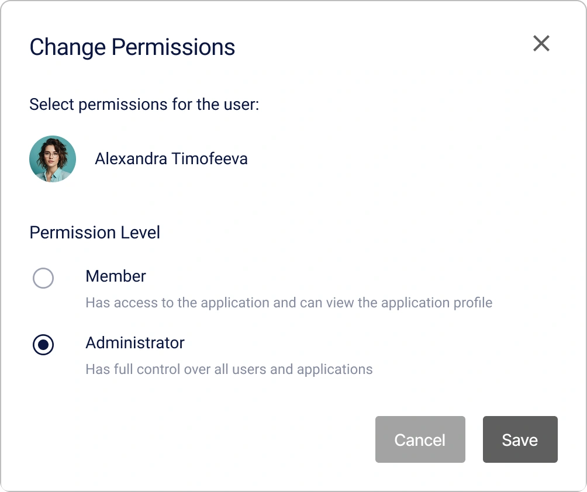

# Come Creare e Configurare un'Applicazione in Encvoy ID

In questa guida imparerai come creare e configurare applicazioni OAuth 2.0 e OIDC in **Encvoy ID**. Copriremo in dettaglio la creazione di applicazioni web e native, la configurazione del widget di login e la gestione degli utenti e degli accessi.

**Sommario:**

- [Creazione di un'Applicazione](#creating-application)
- [Gestione delle Applicazioni](#managing-applications)
- [Inviti all'Applicazione](#application-invitations)
- [Impostazioni del Widget di Login dell'Applicazione](#app-login-widget-settings)
- [Utenti dell'Applicazione](#application-users)
- [Riferimento Completo dei Parametri](#full-parameters-reference)
- [Vedi Anche](#see-also)

> ⚠️ **Restrizione**: La gestione delle applicazioni è disponibile nel dashboard amministratore, organizzazione o applicazione (small) a seconda del tuo ruolo.

---

## Creazione di un'Applicazione { #creating-application }

### Creazione di un'Applicazione Web OAuth

> **Applicazione Web** — un'applicazione standard che gira nel browser dell'utente e interagisce con **Encvoy ID** utilizzando i protocolli OAuth 2.0 e OpenID Connect.

Per creare un'applicazione web:

1. Vai al dashboard amministratore, organizzazione o applicazione (small).
2. Apri la scheda **Applicazioni**.
3. Clicca sul pulsante **Crea** .
4. Si aprirà il modulo di creazione dell'applicazione.
5. Specifica i [parametri dell'applicazione](#full-parameters-reference) richiesti:
   - **Nome dell'applicazione**,
   - **Indirizzo dell'applicazione** nel formato `protocollo://nome-dominio:porta`,
   - **URL di reindirizzamento #** (`redirect_uris`) — l'indirizzo a cui l'utente viene reindirizzato dopo l'autorizzazione,
   - **URL di post-logout #** (`post_logout_redirect_uris`) — l'indirizzo a cui l'utente viene reindirizzato dopo il logout.

6. Clicca su **Crea**.

> 💡 Al momento della creazione, vengono generati campi aggiuntivi dell'applicazione, che possono essere visualizzati e modificati nelle impostazioni dell'applicazione:
>
> - **Identificatore (client_id)** — utilizzato per identificare l'applicazione;
> - **Chiave segreta (client_secret)** — utilizzato per autenticare l'identità dell'applicazione quando questa richiede l'accesso all'account di un utente. La chiave segreta deve essere nota solo all'applicazione.

### Creazione di un'Applicazione OAuth Nativa

> **Applicazione Nativa** — un'applicazione sviluppata specificamente per un particolare sistema operativo.

Per creare un'applicazione nativa:

1. Vai al dashboard amministratore, organizzazione o applicazione (small).
2. Apri la scheda **Applicazioni**.
3. Clicca sul pulsante **Crea** .
4. Si aprirà il modulo di creazione dell'applicazione.
5. Specifica i [parametri dell'applicazione](#full-parameters-reference) richiesti:
   - **Nome dell'applicazione**,
   - **Indirizzo dell'applicazione** — l'indirizzo locale dell'applicazione nel formato `myapp://callback` (richiesto per completare la creazione, ma **non utilizzato** nelle applicazioni native),
   - **URL di reindirizzamento #** (`redirect_uris`) — l'indirizzo locale a cui l'utente tornerà dopo l'autorizzazione, ad es. `myapp://callback`,
   - **URL di post-logout #** (`post_logout_redirect_uris`) — l'indirizzo di reindirizzamento locale dopo il logout (ad es. `myapp://logout`).

6. Clicca su **Crea**.
7. Apri l'applicazione creata e clicca su **Modifica** .
8. Nel modulo di modifica che si apre:
   - Seleziona `native` nell'impostazione **Tipo di applicazione**;
   - Seleziona `none` nelle impostazioni del metodo di autenticazione.

     

9. Salva le modifiche.

Successivamente, configura l'autorizzazione sul lato della tua applicazione:

- Usa PKCE (Proof Key for Code Exchange) quando richiedi un codice di autorizzazione;
- Usa il `redirect_uri` precedentemente specificato per gestire il risultato dell'autorizzazione;
- Esegui il refresh del token utilizzando il protocollo OAuth 2.0.

---

## Gestione delle Applicazioni { #managing-applications }

### Visualizzazione di un'Applicazione { #viewing-application }

1. Vai al dashboard amministratore, organizzazione o applicazione (small).
2. Apri la scheda **Applicazioni**.
3. Clicca sul pannello dell'applicazione di cui vuoi visualizzare il profilo.

4. Si aprirà il modulo del profilo dell'applicazione.

### Modifica di un'Applicazione { #editing-application }

1. Vai al dashboard amministratore, organizzazione o applicazione (small).
2. Apri la scheda **Applicazioni**.
3. Clicca sul pannello dell'applicazione che vuoi modificare.
4. Si aprirà il modulo di visualizzazione dell'applicazione.
5. Clicca sul pulsante **Modifica** .
6. Si aprirà il modulo di modifica dell'applicazione.
7. Apporta le modifiche necessarie ai [parametri dell'applicazione](#full-parameters-reference).
8. Salva le modifiche.

### Eliminazione di un'Applicazione

> ⚠️ **Attenzione:** L'eliminazione di un'applicazione è un'operazione irreversibile. Tutti i dati associati verranno rimossi dal sistema.

Per eliminare un'applicazione:

1. Vai al dashboard amministratore, organizzazione o applicazione (small).
2. Apri la scheda **Applicazioni**.
3. Clicca sul pannello dell'applicazione che vuoi modificare.
4. Si aprirà il modulo di visualizzazione dell'applicazione.
5. Clicca sul pulsante **Elimina** .
6. Conferma l'azione nella finestra modale.

Dopo la conferma, l'applicazione verrà eliminata da **Encvoy ID**.

---

## Inviti all'Applicazione { #application-invitations }

Il meccanismo di invito ti consente di limitare l'accesso all'applicazione e concederlo solo a utenti preselezionati. Questo è utile se l'applicazione è destinata a una **cerchia ristretta di utenti**.

### Abilitazione della Restrizione di Accesso

Per rendere l'applicazione disponibile solo agli utenti invitati:

1. Apri il modulo di modifica dell'applicazione. [Come aprire il modulo di modifica →](#editing-application)
2. Abilita l'impostazione **Divieto di accesso per utenti esterni**.
3. Salva le modifiche.

**Cosa succede dopo l'abilitazione:**

- Membri dell'applicazione — possono accedere normalmente.
- Utenti non invitati — visualizzano un messaggio di accesso negato.
- Nuovi utenti — possono accedere solo dopo aver ricevuto un invito.

### Invio di Inviti agli Utenti

Per inviare un invito a un utente:

1. Apri il modulo di visualizzazione dell'applicazione. [Come aprire il modulo di visualizzazione →](#viewing-application).
2. Clicca sul pulsante **Invita**.

3. Nella finestra che si apre, specifica gli indirizzi email degli utenti:
   - Inserisci l'indirizzo e premi **Invio**, oppure clicca sul pulsante ;
   - Per aggiungere più indirizzi, usa i separatori: spazio, virgola `,` o punto e virgola `;`.

   

4. Clicca su **Invia**.

Un'email con un link per l'accesso rapido all'applicazione viene inviata agli indirizzi email specificati.

> 💡 Gli inviti rimarranno attivi finché non verranno annullati o accettati.

### Cosa Vedono gli Utenti

Un utente che riceve un invito riceve un'email contenente un link per accedere all'applicazione. L'invito viene visualizzato anche nella sezione **Richieste** del profilo personale dell'utente. L'invito può essere accettato in due modi: cliccando sul link nell'email o selezionando l'invito nella sezione "Richieste" del profilo.

> [Come accettare un invito all'applicazione →](./docs-12-common-personal-profile.md#closed-app-invitations)

L'invito è protetto da un meccanismo di verifica: è valido solo per l'indirizzo email a cui è stato inviato. L'utente deve accedere al sistema utilizzando quello specifico indirizzo per accettare l'invito. Ciò impedisce che l'accesso venga trasferito a terzi.

Se l'utente non è ancora registrato nel sistema, deve registrarsi utilizzando la stessa email a cui è stato inviato l'invito. Dopo la registrazione avvenuta con successo, l'accesso all'applicazione viene concesso automaticamente.

### Gestione degli Inviti

#### Visualizzazione dell'Elenco degli Inviti Inviati

1. Apri il modulo di visualizzazione dell'applicazione. [Come aprire il modulo di visualizzazione →](#viewing-application).
2. Espandi la sezione **Elenco degli inviti all'applicazione inviati**.

Per ogni invito nell'elenco, viene visualizzato:

- Email del destinatario
- Data di invio

#### Annullamento di un Invito

Se hai bisogno di revocare un invito inviato:

1. Trova l'invito nell'elenco degli inviati.
2. Clicca sul pulsante **Elimina**  sul pannello dell'invito.
3. Conferma l'annullamento dell'invito.

**Conseguenze dell'annullamento:**

- Il link nell'email diventa non valido.
- L'utente non potrà accettare l'invito.

---

## Impostazioni del Widget di Login dell'Applicazione { #app-login-widget-settings }

Il **Widget di Login** è il modulo di autorizzazione che gli utenti vedono quando tentano di accedere a **questa specifica applicazione**. Le sue impostazioni ti consentono di adattare l'aspetto e i metodi di login al brand e alle esigenze del tuo servizio.

### Come Trovare le Impostazioni del Widget

1. Apri il modulo di modifica dell'applicazione. [Come aprire il modulo di modifica →](#editing-application)
2. Trova il blocco **Metodi di accesso** e clicca su **Configura**.

Cosa può essere configurato:

- **Titolo e Copertina** — adattali al brand dell'applicazione,
- **Schema Colori** — colori dei pulsanti corrispondenti al tuo design,
- **Metodi di accesso** — scegli quali provider mostrare,
- **Blocchi Informativi** — aggiungi regole di utilizzo o link.

> **📚 Guida Completa a Tutte le Impostazioni:**  
> Per un esame dettagliato di tutti i parametri e le opzioni di personalizzazione, vai alla [guida completa alla configurazione del widget di login →](./docs-06-github-en-providers-settings.md#login-widget-settings).

---

## Utenti dell'Applicazione { #application-users }

Gli **Utenti dell'Applicazione** (membri) sono utenti del sistema **Encvoy ID** che hanno concesso alla tua applicazione il permesso di accedere ai loro dati.

**Come un utente diventa un membro:**

1. L'utente accede alla tua applicazione per la prima volta.
2. Il sistema lo reindirizza al widget di login di **Encvoy ID**.
3. L'utente si autentica e **fornisce il consenso** per accedere ai dati richiesti.
4. L'applicazione riceve un token di accesso e l'utente viene aggiunto all'elenco dei membri.

**Dove gestire i membri:**

- **Dashboard Amministratore** — per gestire tutte le applicazioni del servizio.
- **Dashboard Organizzazione** — per le applicazioni appartenenti all'organizzazione.
- **Small Dashboard (Applicazioni)** — per gestire una specifica applicazione.

> 💡 **Importante:** La gestione dei membri avviene a livello di **applicazione**. Le azioni non influenzano l'account globale **Encvoy ID** dell'utente, ma solo la sua connessione alla specifica applicazione.

### Visualizzazione dei Membri dell'Applicazione

1. Vai al dashboard amministratore, organizzazione o applicazione (small).
2. Apri la scheda **Applicazioni**.
3. Clicca sul pannello dell'applicazione desiderata.
4. Si aprirà il profilo dell'applicazione con le informazioni generali.
5. Nel profilo dell'applicazione, trova la sezione membri.
6. Clicca sul pannello dell'utente di cui vuoi visualizzare il profilo.
7. Si aprirà il profilo dell'utente, contenente un elenco dei dati a cui l'utente ha concesso l'accesso.

### Assegnazione di un Amministratore dell'Applicazione { #assigning-app-administrator }

**Quando è necessario:** Per delegare i diritti di gestione dell'applicazione a utenti fidati. Gli amministratori dell'applicazione possono gestirne le impostazioni e gli utenti.

Per assegnare un amministratore dell'applicazione:

1. Vai al dashboard amministratore, organizzazione o applicazione (small).
2. Apri la scheda **Applicazioni**.
3. Clicca sul pannello dell'applicazione.
4. Si aprirà il profilo dell'applicazione.
5. Apri il menu delle azioni per l'utente di cui vuoi modificare i permessi.

6. Seleziona l'azione **Cambia permessi**.
7. Nella finestra che appare, seleziona il livello di permesso **Amministratore**.

8. Clicca su **Salva**.

Dopo aver salvato le modifiche, i permessi dell'utente nell'applicazione verranno aggiornati.

**✅ Cosa cambierà:**

- L'utente otterrà l'accesso allo **Small Dashboard** di questa applicazione.
- Potrà gestire le impostazioni dell'applicazione e i suoi utenti.
- Non otterrà l'accesso ad altre applicazioni o alle impostazioni dell'organizzazione/servizio.

> ⚠️ **Sicurezza:** Assegna i diritti di amministratore solo a utenti fidati. Un amministratore dell'applicazione può eliminare altri utenti e modificare le impostazioni di integrazione.

### Terminare le Sessioni Utente nell'Applicazione

**Quando è necessario:** In caso di sospetta compromissione dell'account, smarrimento del dispositivo o per forzare un aggiornamento del token di accesso.

Per terminare le sessioni di un utente:

1. Vai al dashboard amministratore, organizzazione o applicazione (small).
2. Apri la scheda **Applicazioni**.
3. Clicca sul pannello dell'applicazione.
4. Si aprirà il profilo dell'applicazione.
5. Apri il menu delle azioni per l'utente le cui sessioni vuoi terminare.
6. Seleziona l'azione **Termina sessioni**.
7. Conferma l'azione nella finestra modale.

Dopo la conferma, tutte le sessioni e i token per l'utente verranno eliminati.

**✅ Cosa succede dopo la conferma:**

- **Tutte le sessioni attive** dell'utente in questa applicazione vengono terminate.
- I **token di accesso** (`access_token`) diventano non validi.
- I **token di refresh** (`refresh_token`) vengono revocati.
- All'utente verrà richiesto di **accedere nuovamente** al prossimo accesso all'applicazione.

> 📌 Questa operazione non blocca l'utente. Potrà autorizzarsi di nuovo.

### Rimozione di un Utente dall'Applicazione

**Quando è necessario:** Quando un utente non ha più bisogno di accedere all'applicazione, in caso di cessazione del rapporto di lavoro o su richiesta dell'utente.

Per rimuovere un utente dall'applicazione:

1. Vai al dashboard amministratore, organizzazione o applicazione (small).
2. Apri la scheda **Applicazioni**.
3. Clicca sul pannello dell'applicazione.
4. Si aprirà il profilo dell'applicazione.
5. Apri il menu delle azioni per l'utente che vuoi rimuovere dall'applicazione.
6. Seleziona l'azione **Elimina utente**.
7. Conferma l'azione nella finestra modale.

Dopo la conferma, l'utente verrà rimosso dall'applicazione.

**✅ Cosa succede dopo la rimozione:**

- L'utente **scompare** dall'elenco dei membri dell'applicazione.
- Tutti i suoi **token di accesso** per questa applicazione vengono revocati.
- Al prossimo accesso all'applicazione, gli verrà **mostrata nuovamente la richiesta di consenso**.
- L'**account globale** dell'utente in **Encvoy ID** rimane intatto.

### Blocco di un Utente nell'Applicazione

**Quando è necessario:** Per un divieto completo e permanente all'accesso di un utente all'applicazione senza possibilità di ripristino.

Il **blocco** è un'azione più seria della rimozione. Un utente bloccato non potrà ottenere l'accesso all'applicazione.

Per bloccare un utente:

1. Apri il menu delle azioni per un utente attivo nel [profilo dell'applicazione](./docs-10-common-app-settings.md#viewing-application).

2. Seleziona l'azione **Blocca in Encvoy ID**.
3. Conferma l'azione nella finestra modale.

**Cosa succede dopo il blocco**:

- Lo stato dell'utente cambierà in **Bloccato**.
- L'utente bloccato non potrà accedere all'applicazione.

### Sblocco degli Utenti Encvoy ID

Per sbloccare un utente:

1. Apri il menu delle azioni per un utente bloccato nel [profilo dell'applicazione](./docs-10-common-app-settings.md#viewing-application).
2. Seleziona l'azione **Sblocca in Encvoy ID**.
3. Conferma l'azione nella finestra modale.

Dopo la conferma, lo stato dell'utente cambierà in **Attivo**.

---

## Riferimento Completo dei Parametri { #full-parameters-reference }

### Informazioni di Base

Dettagli di base per la visualizzazione nell'interfaccia e sul widget di login.

| Parametro                         | Descrizione                                                                    | Tipo                                                            | Obbligatorio |
| --------------------------------- | ------------------------------------------------------------------------------ | --------------------------------------------------------------- | ------------ |
| **Nome dell'applicazione**        | Visualizzato nell'interfaccia del dashboard personale e nel widget di login    | Testo (fino a 64 caratteri)                                     | ✓            |
| **Descrizione dell'applicazione** | Breve descrizione visualizzata nell'interfaccia del servizio **Encvoy ID**     | Testo (fino a 255 caratteri)                                    | ✗            |
| **Logo dell'applicazione**        | Visualizzato nell'interfaccia del servizio **Encvoy ID** e nel widget di login | Immagine in formato JPG, GIF, PNG, WEBP. Dimensione max - 1 MB. | ✗            |
| **Mostra nel mini-widget**        | Aggiunge l'applicazione al mini-widget per l'accesso rapido.                   | Interruttore (`On`/`Off`)                                       | -            |

### Catalogo

Impostazioni per la pubblicazione dell'applicazione nel [Catalogo](./docs-12-common-personal-profile.md#application-catalog).

| Parametro                | Descrizione                                                                                                                                 | Tipo                      | Predefinito |
| ------------------------ | ------------------------------------------------------------------------------------------------------------------------------------------- | ------------------------- | ----------- |
| **Mostra nel catalogo**  | Aggiunge l'applicazione al Catalogo                                                                                                         | Interruttore (`On`/`Off`) | `Off`       |
| **Tipo di applicazione** | Categoria a cui appartiene l'applicazione nel **Catalogo**.   La creazione del tipo è disponibile per l'**Amministratore** del servizio. | Elenco a discesa          | `Other`     |

### Campi Richiesti

Campi del profilo utente necessari per il funzionamento dell'applicazione.

| Parametro                        | Descrizione                                                                                                                                                                                                                                                                                                                                                                                                                                                              |
| -------------------------------- | ------------------------------------------------------------------------------------------------------------------------------------------------------------------------------------------------------------------------------------------------------------------------------------------------------------------------------------------------------------------------------------------------------------------------------------------------------------------------ |
| **Campi principali del profilo** | Definisce l'elenco dei campi principali e aggiuntivi del profilo utente a cui l'applicazione richiede l'accesso.   - Se i campi mancano nel profilo utente, verranno richiesti durante l'autorizzazione nell'applicazione.   - Se i campi sono presenti ma impostati sul [livello di privacy](./docs-12-common-personal-profile.md#privacy-levels) **Accessibile solo a te**, all'utente verrà chiesto di cambiare questo livello in **Disponibile su richiesta**. |

### Parametri dell'Applicazione

Parametri tecnici che influenzano l'interazione dell'applicazione con **Encvoy ID**.

#### Identificatori Principali

| Nome                               | Parametro       | Descrizione                                                                | Tipo                                                | Obbligatorio             |
| ---------------------------------- | --------------- | -------------------------------------------------------------------------- | --------------------------------------------------- | ------------------------ |
| **Identificatore (client_id)**     | `client_id`     | Identificatore univoco dell'applicazione                                   | Testo                                               | Generato automaticamente |
| **Chiave segreta (client_secret)** | `client_secret` | Chiave privata del client. Deve essere mantenuta sicura.                   | Testo                                               | Generato automaticamente |
| **Indirizzo dell'applicazione**    | -               | URL della risorsa web dove verrà utilizzato il login tramite **Encvoy ID** | Testo nel formato `protocollo://nome-dominio:porta` | ✓                        |

### Impostazioni di Accesso

| Nome                                      | Parametro | Descrizione                                                                                                 | Tipo                      | Predefinito |
| ----------------------------------------- | --------- | ----------------------------------------------------------------------------------------------------------- | ------------------------- | ----------- |
| **Accesso limitato**                      | -         | Se abilitato, il login all'applicazione sarà disponibile solo agli utenti con diritti di **Amministratore** | Interruttore (`On`/`Off`) | `Off`       |
| **Divieto di accesso per utenti esterni** | -         | Se abilitato, solo i membri o gli utenti invitati avranno accesso all'applicazione                          | Interruttore (`On`/`Off`) | `Off`       |

#### URL di Reindirizzamento

| Nome                          | Parametro      | Descrizione                                                                                                                                                                                                                                                                                          | Obbligatorio |
| ----------------------------- | -------------- | ---------------------------------------------------------------------------------------------------------------------------------------------------------------------------------------------------------------------------------------------------------------------------------------------------- | ------------ |
| **URL di reindirizzamento #** | `Redirect_uri` | L'URL a cui **Encvoy ID** reindirizzerà l'utente dopo l'autenticazione. Dopo che l'utente si è autenticato e ha fornito il consenso, il server reindirizza l'utente al **Redirect_uri** con un codice di autorizzazione, un ID token o altre informazioni a seconda del **response_type** richiesto. | ✓            |

#### URL di Logout

| Nome                     | Parametro                  | Descrizione                                                                                                                                                          | Obbligatorio |
| ------------------------ | -------------------------- | -------------------------------------------------------------------------------------------------------------------------------------------------------------------- | ------------ |
| **URL di post-logout #** | `post_logout_redirect_uri` | L'URL a cui il servizio reindirizzerà l'utente dopo il logout. Se non viene specificato alcun valore, viene utilizzato l'**URL di Reindirizzamento (Redirect_uri)**. | ✗            |

#### URL della Richiesta di Autenticazione

| Nome                                                                           | Parametro      | Descrizione                                                                                                                                                                                                                                                                                                                                                          | Obbligatorio |
| ------------------------------------------------------------------------------ | -------------- | -------------------------------------------------------------------------------------------------------------------------------------------------------------------------------------------------------------------------------------------------------------------------------------------------------------------------------------------------------------------- | ------------ |
| **URL della richiesta di autenticazione o ripristino dopo l'autenticazione #** | `request_uris` | Un elenco di URL dove sono ospitate le richieste di autorizzazione JWT. Quando il sistema invia una richiesta di autorizzazione al server, può semplicemente specificare il parametro `request_uri`, che fa riferimento a uno degli URL definiti in questo elenco. Il server recupera quindi l'oggetto della richiesta JWT da questo URL per elaborare la richiesta. | ✗            |

#### Tipi di Risposta (Response Types)

| Nome                                  | Parametro        | Descrizione                                                                                                                                                                                                                                                                                                                                                                                                                                                                                                                               |
| ------------------------------------- | ---------------- | ----------------------------------------------------------------------------------------------------------------------------------------------------------------------------------------------------------------------------------------------------------------------------------------------------------------------------------------------------------------------------------------------------------------------------------------------------------------------------------------------------------------------------------------- |
| **Tipo di risposte (response_types)** | `response_types` | 
Definisce quali token vengono restituiti al client.
 
 - `code` — solo codice di autorizzazione;  - `id_token` — solo ID token;   - `code id_token` — codice e ID token;   - `code token` — codice di autorizzazione e token di accesso;   - `code id_token token` — set completo;   - `none` — utilizzato quando non è richiesto alcun codice di autorizzazione, token di accesso o ID token tramite reindirizzamento. Utile per confermare l'autenticazione dell'utente senza richiedere l'accesso ai dati. 
 |

#### Tipi di Concessione (Grant Types)

| Nome                                  | Parametro     | Descrizione                                                                                                                                                                                                                                                                               |
| ------------------------------------- | ------------- | ----------------------------------------------------------------------------------------------------------------------------------------------------------------------------------------------------------------------------------------------------------------------------------------- |
| **Tipi di concessione (grant_types)** | `grant_types` | 
Metodo per ottenere l'autorizzazione ad accedere a risorse protette.
 
 - `authorization code` — metodo standard e sicuro;   - `implicit` — opzione legacy senza scambio lato server;   - `refresh_token` — aggiornamento del token senza dover rieffettuare il login. 
 |

#### Metodi di Autenticazione

| Nome                                                                                                                     | Parametro                            | Descrizione                                                                                                                                                                                                                                                                                                                                                                                                                                                                                                                                                                                                                                                                                                                                                                                                                                                                                                                                                                                                 |
| ------------------------------------------------------------------------------------------------------------------------ | ------------------------------------ | ----------------------------------------------------------------------------------------------------------------------------------------------------------------------------------------------------------------------------------------------------------------------------------------------------------------------------------------------------------------------------------------------------------------------------------------------------------------------------------------------------------------------------------------------------------------------------------------------------------------------------------------------------------------------------------------------------------------------------------------------------------------------------------------------------------------------------------------------------------------------------------------------------------------------------------------------------------------------------------------------------------- |
| **Metodo di autenticazione del client per l'endpoint del token (token_endpoint_auth_method)**                            | `token_endpoint_auth_method`         | 
Metodo che il client utilizza per autenticarsi quando accede al `token endpoint` del server.
 
 - `none` - non fornisce credenziali. Utilizzato quando il client non può memorizzare le credenziali in modo confidenziale o l'autenticazione non è richiesta;   - `client_secret_post` - invia le credenziali nel corpo della richiesta;   - `client_secret_basic` - utilizza l'autenticazione HTTP Basic, inviando le credenziali nell'intestazione della richiesta;   - `client_secret_jwt` - firma un JWT utilizzando il suo segreto e lo invia come credenziali;   - `private_key_jwt` - firma un JWT utilizzando la sua chiave privata e lo invia come credenziali. 
 La scelta dipende dai requisiti di sicurezza e dalla capacità del client di memorizzare le credenziali in modo sicuro. Ad esempio, `client_secret_jwt` e `private_key_jwt` offrono una sicurezza maggiore utilizzando la crittografia asimmetrica ed evitando la trasmissione del segreto sulla rete. 
 |
| **Metodo di autenticazione utilizzato per l'accesso all'endpoint di introspezione (introspection_endpoint_auth_method)** | `introspection_endpoint_auth_method` | 
Metodo che il client utilizza quando accede all'`introspection endpoint`. Questo endpoint viene utilizzato per controllare lo stato di un token di accesso e recuperare informazioni su di esso.
 
 - `none` - nessuna credenziale fornita;   - `client_secret_post` - credenziali nel corpo della richiesta;   - `client_secret_basic` - autenticazione HTTP Basic;   - `client_secret_jwt` - firma un JWT con il suo segreto;   - `private_key_jwt` - firma un JWT con la sua chiave privata. 
 La scelta dipende dai requisiti di sicurezza e dalle capacità del client. I metodi basati su JWT offrono una sicurezza extra tramite token firmati. 
                                                                                                                                                                                                                                                                                                                            |
| **Metodo di autenticazione utilizzato per l'accesso all'endpoint di revoca (revocation_endpoint_auth_method)**           | `introspection_endpoint_auth_method` | 
Definisce il metodo di autenticazione utilizzato quando si accede al `revocation endpoint`. Questo endpoint viene utilizzato per revocare l'accesso o i token di refresh. Questo metodo solitamente corrisponde a quelli utilizzati per il `token endpoint` e l'`introspection endpoint`.
 
- `none` - nessuna credenziale fornita;  - `client_secret_post` - credenziali nel corpo della richiesta;   `client_secret_basic` - autenticazione HTTP Basic;  - `client_secret_jwt` - firma un JWT con il suo segreto; - `private_key_jwt` - firma un JWT con la sua chiave privata.
                                                                                                                                                                                                                                                                                                                                                                                                   |

#### Algoritmo di Firma dell'ID Token

| Nome                                                                                                    | Parametro                      | Descrizione                                                                                                                                                            |
| ------------------------------------------------------------------------------------------------------- | ------------------------------ | ---------------------------------------------------------------------------------------------------------------------------------------------------------------------- |
| **Algoritmo di firma utilizzato per la creazione dell'ID Token firmato (id_token_signed_response_alg)** | `id_token_signed_response_alg` | Specifica l'algoritmo utilizzato per firmare l'ID token. Un **ID token** è un JSON Web Token (JWT) contenente rivendicazioni (claims) sull'autenticazione dell'utente. |

#### Richiedi Tempo di Autenticazione

| Nome                                                                       | Parametro           | Descrizione                                                                                                                                                                                                                              |
| -------------------------------------------------------------------------- | ------------------- | ---------------------------------------------------------------------------------------------------------------------------------------------------------------------------------------------------------------------------------------- |
| **Verifica della presenza dell'ora di autenticazione (require_auth_time)** | `require_auth_time` | Specifica se il server di autorizzazione deve fornire il tempo di autenticazione dell'utente nell'ID token. Se abilitato, il server include la rivendicazione `auth_time`, che rappresenta l'ultima volta che l'utente si è autenticato. |

#### Tipo di Soggetto (Subject Type)

| Nome                                                                                  | Parametro      | Descrizione                                                                                                                                                                                                                                                                                                                                                                                                                                                        |
| ------------------------------------------------------------------------------------- | -------------- | ------------------------------------------------------------------------------------------------------------------------------------------------------------------------------------------------------------------------------------------------------------------------------------------------------------------------------------------------------------------------------------------------------------------------------------------------------------------ |
| **Metodo di trasmissione dell'ID utente nel token di identificazione (subject_type)** | `subject_type` | 
Definisce come l'identificatore utente (`sub claim`) viene presentato al client. Ciò influisce sul modo in cui gli ID utente vengono generati e gestiti.
 
 - `public` - l'ID utente è lo stesso per tutti i client. Ogni client vede lo stesso `sub claim` per l'utente;   - `pairwise` - l'ID utente è univoco per ogni client. Ciò garantisce una maggiore privacy poiché client diversi non possono collegare tra loro l'attività dell'utente. 
 |

#### Tipo di Applicazione

| Nome                                        | Parametro          | Descrizione                                                                                                                                                                                       |
| ------------------------------------------- | ------------------ | ------------------------------------------------------------------------------------------------------------------------------------------------------------------------------------------------- |
| **Tipo di applicazione (application_type)** | `application_type` | 
Definisce la piattaforma a cui è destinata l'applicazione:
 
 - `web` - applicazione web che gira in un browser;   - `native` - applicazione nativa installata su un dispositivo. 
 |

#### Token di Accesso

| Nome                                    | Parametro          | Descrizione                           |
| --------------------------------------- | ------------------ | ------------------------------------- |
| **Token di accesso (access_token_ttl)** | `access_token_ttl` | Durata dell'`access_token` in secondi |

#### Token di Refresh

| Nome                                           | Parametro           | Descrizione                           |
| ---------------------------------------------- | ------------------- | ------------------------------------- |
| **Token di aggiornamento (refresh_token_ttl)** | `refresh_token_ttl` | Durata del `refresh_token` in secondi |

---

## Vedi Anche { #see-also }

- [Gestione delle Organizzazioni](./docs-09-common-mini-widget-settings.md) — guida al lavoro con le organizzazioni del sistema **Encvoy ID**.
- [Profilo Personale e Gestione dei Permessi dell'Applicazione](./docs-12-common-personal-profile.md) — guida alla gestione del tuo profilo personale.
- [Metodi di Login e Configurazione del Widget di Login](./docs-06-github-en-providers-settings.md) — guida ai metodi di login e alla configurazione del widget di login.
