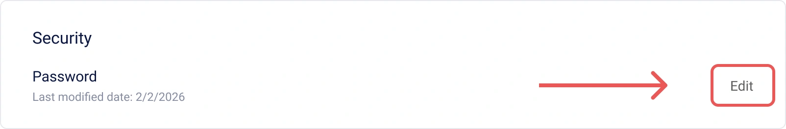
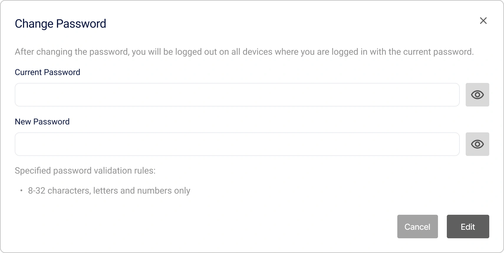
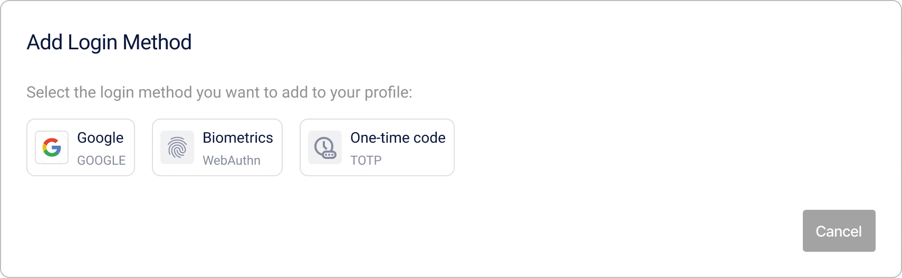
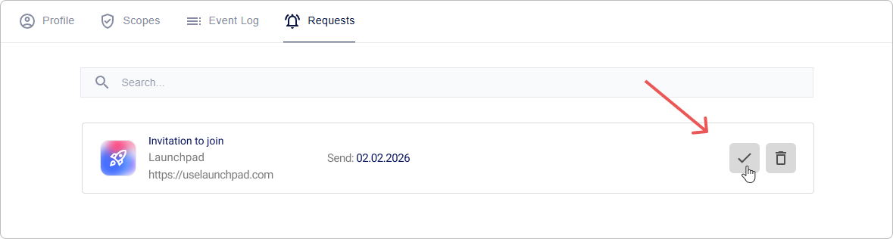

# Come gestire il tuo Profilo Personale Encvoy ID

**Il Profilo Encvoy ID** è il tuo centro di controllo per i dati dell'account e la sicurezza.

In questa guida imparerai a gestire il tuo profilo personale in **Encvoy ID**: modificare i dati e le impostazioni sulla privacy, aggiornare la password, controllare l'accesso alle applicazioni, visualizzare il registro delle attività ed esportare i dati del profilo.

**Sommario:**

- [Gestione del Profilo Personale](#personal-profile-management)
- [Permessi App e Accesso OAuth](#app-permissions-and-oauth)
- [Inviti ad App Chiuse](#closed-app-invitations)
- [Catalogo Applicazioni](#application-catalog)
- [Registro Attività e Cronologia Accessi](#activity-log-and-login-history)
- [Vedi Anche](#see-also)

---

## Gestione del Profilo Personale { #personal-profile-management }

Il tuo profilo contiene informazioni di base per l'identificazione all'interno del sistema. A seconda del metodo di registrazione, alcuni campi potrebbero non essere modificabili. Se hai bisogno di modificarli, contatta l'amministratore del servizio.

### Modifica delle Informazioni Personali

1. Vai alla scheda **Profilo**.
2. Clicca su **Modifica** nel blocco **Informazioni principali**.


3. Apporta le modifiche necessarie nel modulo che si apre.

   > 💡 Per alcuni campi sono impostate regole di validazione. Presta attenzione durante le modifiche.
   >
   > 

4. Clicca su **Salva**.

> 📌 **Importante:** Il profilo può essere salvato anche con campi obbligatori vuoti. Il sistema richiederà i dati mancanti al prossimo accesso.

### Aggiunta di una Foto Profilo

Puoi caricare una foto dal tuo dispositivo o utilizzare un avatar da servizi esterni collegati.

1. Vai alla scheda **Profilo**.
2. Clicca su **Modifica** nel blocco **Informazioni principali**.
3. Si aprirà il modulo di modifica.
4. Aggiungi una foto utilizzando uno dei seguenti metodi:
   - Clicca sul pulsante **Carica** e specifica il percorso del file foto,

       

   - Clicca sul pulsante **Disponibili** e seleziona una foto da un sistema esterno.

       

   > 📌 Se nel profilo non sono presenti identificatori di sistemi esterni collegati con una foto, il pulsante **Disponibili** sarà nascosto.

   > 💡 **Suggerimento**: Per eliminare una foto, clicca sul pulsante **Elimina** nel blocco **Foto del profilo**.

5. Clicca su **Salva** nel modulo di modifica.

### Aggiunta di un Indirizzo Email

> 💡 L'email richiede una verifica — l'inserimento di un codice monouso o il clic su un link nell'email.

1. Vai alla scheda **Profilo**.
2. Trova il blocco **Contatti** e clicca su **Modifica** nel pannello **E-mail**.


3. Si aprirà il modulo di aggiunta.


4. Inserisci l'email e clicca su **Ottieni codice**.

   Un codice di conferma verrà inviato all'indirizzo specificato.

5. Inserisci il codice e clicca su **Conferma**, oppure segui il link nell'email.

> 💡 **Suggerimento**: Per eliminare un'email, clicca sul pulsante **Elimina** nel pannello **E-mail**.

### Aggiunta di un Numero di Telefono

> 💡 Il numero di telefono richiede una verifica — l'inserimento di un codice monouso ricevuto tramite SMS o chiamata in arrivo.

1. Vai alla scheda **Profilo**.
2. Trova il blocco **Contatti** e clicca su **Modifica** nel pannello **Numero di telefono**.


3. Si aprirà il modulo di modifica.


4. Inserisci il numero e clicca su **Ottieni codice**.

   Un SMS o una chiamata verranno inviati al numero specificato.

5. Inserisci il codice di conferma e clicca su **Conferma**.

> 💡 **Suggerimento**: Per eliminare un numero di telefono, clicca sul pulsante **Elimina** nel pannello **Numero di telefono**.

### Cambio Password

1. Vai alla scheda **Profilo**.
2. Clicca su **Modifica** nel blocco **Sicurezza**.



3. Nella finestra che si apre, specifica la password attuale e la nuova password.



Dopo aver cambiato la password, verrai disconnesso. Per continuare a lavorare, dovrai effettuare nuovamente l'accesso utilizzando la nuova password.

### Impostazioni sulla Privacy { #privacy-settings }

Puoi controllare autonomamente quali informazioni saranno disponibili per altri utenti o sistemi di terze parti. Questo avviene tramite le impostazioni di privacy dei campi.

Questa impostazione ti consente di definire la privacy per ogni campo nei blocchi **Informazioni principali**, **Informazioni aggiuntive** e **Identificatori**.

#### Livelli di Privacy { #privacy-levels }

| Livello                      | Icona                                                                                                    | Descrizione                                                                                                                        |
| ---------------------------- | -------------------------------------------------------------------------------------------------------- | ---------------------------------------------------------------------------------------------------------------------------------- |
| **Accessibile solo a te**    |                       | I dati non vengono trasmessi a sistemi di terze parti e sono disponibili solo per te.                                              |
| **Disponibile su richiesta** |  | I dati sono disponibili nei sistemi di terze parti integrati con Encvoy ID. <br> È richiesto il tuo consenso per accedere ai dati. |
| **Accessibile a tutti**      |                   | I dati sono sempre pubblici. Il tuo consenso non è richiesto per accedervi.                                                        |

#### Come Configurare la Privacy dei Campi

1. Vai alla scheda **Profilo**.
2. Clicca sul pulsante delle impostazioni sulla privacy accanto al campo.
3. Seleziona il livello richiesto.


A seconda del valore selezionato, il valore del campo nel profilo diventa pubblico o privato.

L'impostazione viene applicata senza ulteriore conferma.

### Gestione degli Identificatori di Servizi Esterni { #external-service-identifiers }

**Gli Identificatori** sono servizi esterni che hai aggiunto al tuo profilo o attraverso i quali hai effettuato l'accesso alle applicazioni o all'account personale.

L'elenco degli identificatori disponibili per l'aggiunta nel profilo è formato dai metodi di accesso pubblici creati nel dashboard di **Encvoy ID**.

> 🔍 Gli identificatori disponibili per il collegamento sono configurati nel dashboard dell'amministratore.

> 💡 Puoi accedere alle applicazioni utilizzando gli identificatori, a condizione che siano aggiunti al widget di accesso.

#### Aggiunta di un Nuovo Identificatore

1. Vai alla scheda **Profilo**.
2. Clicca su **Aggiungi** nel blocco **Identificatori**.


3. Nella finestra che si apre, seleziona un servizio esterno.



4. Completa l'autenticazione nel servizio.

   Dopo un accesso riuscito all'account del servizio esterno, l'identificatore sarà collegato al profilo.

> 💡 **Suggerimento**: Se un identificatore di un servizio esterno è già collegato a un altro utente, devi rimuoverlo dal profilo di quell'utente e poi collegarlo al nuovo account.

#### Eliminazione di un Identificatore

1. Vai alla scheda **Profilo**.
2. Clicca sull'identificatore che desideri eliminare.
3. Seleziona l'azione **Elimina**.


L'identificatore sarà **immediatamente rimosso** dal profilo.

### Configurazione del Profilo Pubblico

Il **Profilo Pubblico** consiste in dati pubblici disponibili per la visualizzazione da parte di altri membri del sistema **Encvoy ID** e delle applicazioni collegate. Ti consente di controllare quali informazioni dell'utente sono visibili agli altri senza concedere l'accesso completo all'account.

#### Visualizzazione del Profilo Pubblico

1. Vai alla scheda **Profilo**.
2. Clicca sul pulsante **Dati pubblici** nel blocco **Privacy del profilo**.
3. Si aprirà una finestra con il profilo pubblico contenente i dati con il livello **Accessibile a tutti**.

#### Download dei Dati del Profilo Pubblico

> 📌 I dati del profilo pubblico vengono esportati in formato **vCard**.

1. Vai alla scheda **Profilo**.
2. Clicca sul pulsante **Dati pubblici** nel blocco **Privacy del profilo**.
3. Si aprirà la finestra **Profilo Pubblico** con i dati impostati sul livello **Accessibile a tutti**.
4. Clicca sul pulsante **Esporta vCard** .
5. Inizierà il download del file.

Esempio di un file **vCard** con i dati del profilo pubblico:

```VCARD
BEGIN:VCARD
VERSION:3.0
FN:Timofeeva Alex
N:Timofeeva;Alex;;;
PHOTO:https://service-adress/public/images/profile/90211313d753e1d1b83ab19ecfd4af5e
EMAIL:timofeeva-alexs@gmail.com
UID:null
REV:2025-05-26T12:52:24.630Z
END:VCARD
```

#### Disattivazione del Profilo Pubblico

> 💡 **Suggerimento**: Puoi proibire la trasmissione dei dati del profilo pubblico che hanno il livello di privacy "Disponibile per tutti".

1. Vai alla scheda **Profilo**.
2. Attiva l'interruttore **Profilo privato** nel blocco **Privacy del profilo**.

   

   L'impostazione viene applicata senza ulteriore conferma.

Dopo aver attivato l'impostazione, i dati con il livello di privacy "Disponibile per tutti" diventano disponibili solo su richiesta.

### Biglietto da Visita Digitale del Profilo Personale { #digital-business-card }

> 🔬 **Funzionalità sperimentale**: La disponibilità è regolata dall'amministratore di sistema.

**Il Biglietto da Visita Encvoy ID** è un moderno sostituto digitale del biglietto da visita cartaceo, accessibile tramite un link unico.

**Contenuto del Biglietto da Visita:**

- Foto profilo,
- Nome e cognome,
- Dettagli di contatto (email, telefono),
- Data di nascita.

**Caratteristiche:**

- I dati vengono visualizzati indipendentemente dalle [impostazioni sulla privacy](#privacy-settings).
- Il biglietto da visita è disponibile tramite un link unico: `https://<tuo-servizio>/api/cards/<identificatore>`.
- Supporta l'esportazione del biglietto da visita in formato **vCard** per l'integrazione in varie applicazioni.

#### Attività del Biglietto da Visita

È disponibile un'impostazione di attività per il biglietto da visita.

1. Vai alla scheda **Profilo**.
2. Nel blocco **Biglietto da visita**, attiva l'interruttore **Attività**.

   

   Assicurati che il tuo biglietto da visita sia ora accessibile. Per farlo, segui il link: `https://<tuo-dominio>/api/cards/<identificatore>`:

#### Configurazione di un Indirizzo Link Personalizzato

Per rendere il link del biglietto da visita più breve e facile da ricordare, puoi impostare il tuo identificatore unico.

1. Vai alla scheda **Profilo**.
2. Nel blocco **Biglietto da visita**, specifica un nuovo identificatore.
3. Clicca su **Salva**.

> 💡 L'identificatore deve essere unico nel sistema e contenere solo lettere latine, numeri e trattini.

#### Come Condividere un Biglietto da Visita

1. Vai alla scheda **Profilo**.
2. Nel blocco **Biglietto da visita**:
   - Clicca su **Apri codice QR**  e scansiona il codice con la fotocamera del tuo dispositivo.
   - Clicca sul pulsante **Copia link**  per copiare l'indirizzo del link del biglietto da visita.

### Azioni Aggiuntive del Profilo Personale

#### Terminare Tutte le Sessioni

La funzione per forzare la chiusura di tutte le sessioni attive è un importante strumento di sicurezza. Usala in caso di smarrimento del dispositivo, sospetto di compromissione dell'account o per aggiornare immediatamente i token di accesso.

> 📌 Questa operazione invalida immediatamente tutti i token di accesso e di refresh, terminando TUTTE le sessioni correnti in tutte le applicazioni.

Per terminare tutte le sessioni attive:

1. Vai alla scheda **Profilo**.
2. Espandi il blocco **Altre azioni** e seleziona **Disconnetti da tutti i dispositivi**.

Dopo questa operazione, dovrai **effettuare nuovamente l'accesso** su tutti i dispositivi.

#### Download dei Dati del Profilo Personale

**Encvoy ID** ti consente di esportare tutti i dati del profilo in formato JSON.

Questo file contiene tutte le informazioni relative al tuo profilo in **Encvoy ID**, così come i dettagli degli account esterni che hai aggiunto come metodi di accesso, indipendentemente dal fatto che il parametro di privacy sia impostato per essi.

Per scaricare i dati del profilo:

1. Vai alla scheda **Profilo**.
2. Espandi il blocco **Altre azioni** e seleziona **Scarica i dati**.
3. Il download del file JSON inizierà automaticamente.

#### Informativa sul Trattamento dei Dati Personali

Leggi il documento su come **Encvoy ID** tratta i tuoi dati.

Per leggere l'informativa:

1. Vai alla scheda **Profilo**.
2. Espandi il blocco **Altre azioni** e seleziona **Informativa sul Trattamento dei Dati Personali**.
3. Inizierà il download del file dell'informativa.

### Eliminazione e Recupero dell'Account

L'eliminazione dell'account in **Encvoy ID** è un'operazione irreversibile, dopo la quale sarà impossibile recuperare i dati. Il sistema utilizza un meccanismo di eliminazione ritardata: il tuo account viene contrassegnato per l'eliminazione ma rimane disponibile per il recupero per un certo periodo. Questo serve a proteggere da eliminazioni accidentali e ti dà il tempo di cambiare idea.

Per eliminare un account:

1. Vai alla scheda **Profilo**.
2. Espandi il blocco **Altre azioni** e seleziona l'azione **Elimina account**.
3. Nella finestra che si apre, inserisci la password del tuo account per confermare l'azione e clicca su **Elimina**.


**Cosa succede:**

- L'account viene contrassegnato per l'eliminazione
- Verrai disconnesso automaticamente
- Il recupero dell'account è disponibile per un certo periodo

Per un certo periodo dopo l'eliminazione dell'account, hai la possibilità di ripristinare l'accesso. Per farlo, devi accedere nuovamente all'account personale **Encvoy ID**, quindi cliccare su **Ripristina Account**.

> 💡 Il recupero dell'account è disponibile solo quando si accede all'account personale **Encvoy ID**. Quando si accede a un'applicazione tramite il servizio **Encvoy ID**, il recupero dell'account non è disponibile.

---

## Permessi App e Accesso OAuth { #app-permissions-and-oauth }

**I Permessi** sono i diritti che concedi alle applicazioni esterne per accedere a dati specifici nel tuo profilo **Encvoy ID**. Puoi limitare l'accesso, terminare le sessioni attive o revocare completamente i permessi in qualsiasi momento.

Tutte le applicazioni che hanno accesso ai tuoi dati sono visualizzate nel **Profilo** nella scheda **Permessi**.

### Navigazione verso un'App dall'Elenco dei Permessi

Per aprire rapidamente un'applicazione a cui hai precedentemente concesso l'accesso:

1. Vai alla scheda **Profilo** → scheda **Permessi**.


2. Clicca sul **nome dell'applicazione** nell'elenco.
3. Verrai reindirizzato automaticamente all'applicazione selezionata.

### Terminare le Sessioni Attive delle App

Se desideri terminare immediatamente tutte le sessioni in una specifica applicazione:

1. Vai alla scheda **Profilo** → scheda **Permessi**.
2. Apri il menu delle azioni per l'applicazione in cui devi terminare le sessioni.
3. Seleziona l'azione **Termina sessioni**.


4. Conferma l'azione nella finestra modale.

**Cosa succederà:** Tutte le sessioni attive in questa applicazione verranno terminate. Al prossimo accesso all'applicazione, sarà richiesta una **nuova autorizzazione**.

Terminare le sessioni è utile se sospetti un accesso non autorizzato o se hai utilizzato l'applicazione su un dispositivo condiviso.

### Revoca dei Permessi delle App

Per proibire completamente a un'applicazione l'accesso ai tuoi dati:

1. Vai alla scheda **Profilo** → scheda **Permessi**.
2. Apri il menu delle azioni per l'applicazione i cui permessi desideri revocare.
3. Seleziona l'azione **Revoca Permesso**.
4. Conferma l'azione nella finestra modale.

**Conseguenze:** L'applicazione **perderà l'accesso** a tutti i dati del tuo profilo. Al prossimo accesso, il sistema richiederà un **nuovo consenso** per l'accesso.

---

## Inviti ad App Chiuse { #closed-app-invitations }

Un **invito** è un modo per ottenere l'accesso a un'applicazione chiusa. L'amministratore dell'applicazione invia un invito alla tua email, dopodiché puoi accedere all'applicazione che non è disponibile per gli altri utenti.

### Come Ricevere un Invito?

Un invito arriva in due modi:

1. **Tramite email**: Riceverai un'email con un invito e un link per l'accesso rapido all'applicazione.
2. **Nel tuo profilo Encvoy ID**: un nuovo invito appare nella sezione **Richieste**.

### Come Accettare un Invito?

Puoi accettare un invito in qualsiasi modo conveniente.

#### Metodo 1: Accetta l'Invito dall'Email

1. Apri l'email di invito.
2. Clicca sul link nell'email.
3. Sono quindi possibili due opzioni:
   - se hai già effettuato l'accesso al sistema — entrerai immediatamente nell'applicazione;
   - se non hai effettuato l'accesso — accedi al sistema.

> 🔐 Devi accedere **con l'account** collegato all'email specificata nell'invito.

#### Metodo 2: Accetta l'Invito dal Profilo

1. Vai alla scheda **Profilo** → scheda **Richieste**.
2. Trova l'invito richiesto nell'elenco.
3. Clicca sul pulsante **Accetta**.



Dopo questa operazione, l'accesso all'applicazione sarà attivato e potrai navigare verso di essa.

#### Se Non Hai Ancora un Account

Se hai ricevuto un invito ma non sei ancora registrato nel sistema **Encvoy ID**:

1. Segui il link dall'email di invito.
2. Registrati nel sistema **Encvoy ID**.
3. Durante la registrazione, specifica lo stesso indirizzo email a cui è stato inviato l'invito.
4. Dopo aver completato la registrazione, riceverai automaticamente l'accesso all'applicazione.

---

## Catalogo Applicazioni { #application-catalog }

> 🔬 **Funzionalità sperimentale**: La disponibilità è regolata dall'amministratore di sistema.

### Cos'è il Catalogo?

**Il Catalogo** è un marketplace centralizzato per tutte le applicazioni disponibili nell'ecosistema **Encvoy ID**.

Il catalogo riunisce tutte le applicazioni pubbliche in un unico posto, consentendoti di trovare rapidamente le app di cui hai bisogno, visualizzare nomi e descrizioni e accedere alle applicazioni senza dover ricordare link o percorsi complessi.

Per comodità, tutte le applicazioni nel catalogo sono suddivise per tipo.

Le applicazioni del catalogo possono essere aggiunte ai preferiti. Per un accesso rapido, tutte le applicazioni preferite sono visualizzate nella barra laterale sinistra.

### Come Usare le App dal Catalogo?

1. Clicca sul pulsante .
2. Si aprirà una finestra con un elenco di applicazioni aggiunte al catalogo.


3. Seleziona l'applicazione desiderata nel catalogo.
4. Verrai reindirizzato automaticamente alla pagina dell'applicazione.
5. Autenticati nell'applicazione utilizzando **Encvoy ID** e concedi all'applicazione l'accesso ai tuoi dati.

Ora puoi accedere all'applicazione con il tuo profilo **Encvoy ID**.

### Azioni nel Catalogo

#### Aggiunta di un'App ai Preferiti

1. Clicca sul pulsante **Catalogo applicazioni** .
2. Si aprirà una finestra con un elenco di applicazioni aggiunte al catalogo.
3. Clicca sul pulsante  situato accanto all'applicazione che desideri aggiungere ai preferiti.

   L'applicazione verrà aggiunta ai preferiti e visualizzata nel gruppo corrispondente.

   

#### Rimozione di un'App dai Preferiti

1. Clicca sul pulsante **Catalogo applicazioni** .
2. Si aprirà una finestra con un elenco di applicazioni aggiunte al catalogo.
3. Clicca sul pulsante  situato accanto all'applicazione che desideri rimuovere dai preferiti.

L'applicazione verrà rimossa dai preferiti e scomparirà dal menu laterale.

---

## Registro Attività e Cronologia Accessi { #activity-log-and-login-history }

**Il Registro Attività** è uno strumento di sicurezza che ti consente di tracciare dove e da quali dispositivi hai effettuato l'accesso a **Encvoy ID** o alle applicazioni.

### Dettagli dell'Evento

Informazioni dettagliate sono disponibili per ogni evento.

| Parametro               | Contenuto                                    |
| ----------------------- | -------------------------------------------- |
| **Intestazione Evento** | Categoria dell'azione                        |
| **Data e Ora**          | Timestamp esatti                             |
| **Applicazione**        | Identificatore dell'applicazione (client_id) |
| **Utente**              | Identificatore dell'utente (id)              |
| **Dispositivo**         | Tipo di dispositivo e browser                |
| **Posizione**           | Indirizzo IP                                 |

### Come Visualizzare il Registro Attività?

1. Vai alla scheda **Profilo**.
2. Apri la scheda **Log**.

---

## Vedi Anche { #see-also }

- [Registrazione e Accesso Utente](./docs-13-common-user-authentication.md) — istruzioni per la creazione di un account, l'accesso con nome utente/password e servizi di autenticazione esterni.
