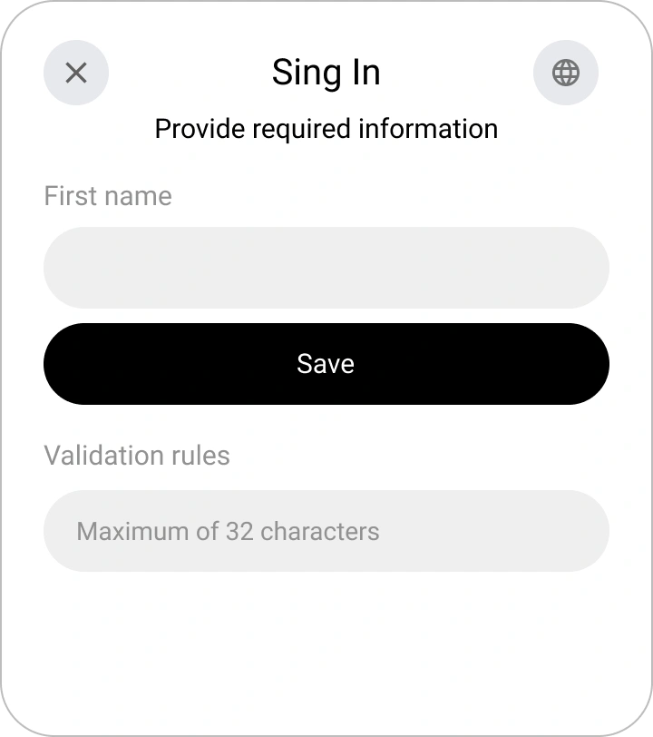
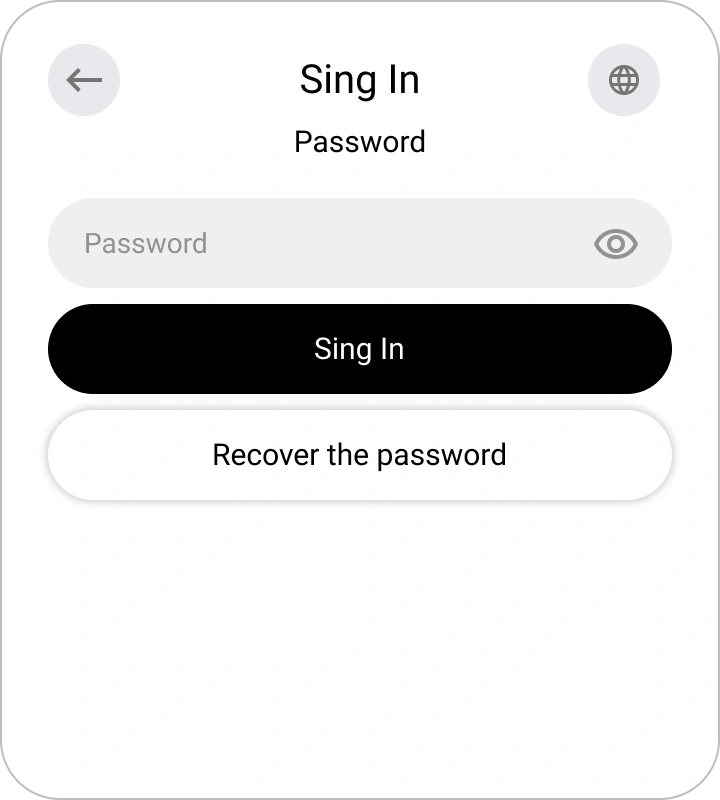

# Registrazione, Login e Recupero Password in Encvoy ID

In questa guida imparerai come creare un account in **Encvoy ID**, accedere utilizzando un nome utente e una password o tramite servizi esterni, e recuperare in sicurezza l'accesso al tuo profilo se necessario.

**Sommario:**

- [Registrazione, Login e Recupero Password in Encvoy ID](#registrazione-login-e-recupero-password-in-encvoy-id)
  - [Registrazione Nuovo Account { #new-account-registration }](#registrazione-nuovo-account--new-account-registration-)
    - [Dove è Disponibile la Registrazione](#dove-è-disponibile-la-registrazione)
    - [Come Creare un Account in Encvoy ID](#come-creare-un-account-in-encvoy-id)
  - [Login con Nome Utente e Password { #login-with-password }](#login-con-nome-utente-e-password--login-with-password-)
  - [Login tramite Servizi Esterni { #login-via-external-services }](#login-tramite-servizi-esterni--login-via-external-services-)
  - [Login Rapido per Utenti Autenticati { #quick-login-for-authenticated-users }](#login-rapido-per-utenti-autenticati--quick-login-for-authenticated-users-)
  - [Recupero Password { #password-recovery }](#recupero-password--password-recovery-)
    - [Come Recuperare una Password in Encvoy ID](#come-recuperare-una-password-in-encvoy-id)
  - [Vedi Anche { #see-also }](#vedi-anche--see-also-)

---

## Registrazione Nuovo Account { #new-account-registration }

### Dove è Disponibile la Registrazione

La funzione di creazione dell'account può essere disponibile in due casi:

1. **Nel modulo di login**;

2. **Nel modulo di selezione azione durante l'accesso tramite un metodo di login**, se l'identificatore specificato non è collegato ad alcun profilo in **Encvoy ID**

> 💡 **Il design del modulo** può variare a seconda delle impostazioni della specifica applicazione

### Come Creare un Account in Encvoy ID

1. Clicca su **Crea account** nel modulo di login o di selezione azione.
2. Inserisci i dati richiesti nel modulo di registrazione.

   Esempio della finestra di inserimento nome:

   

3. Se il sistema richiede un'e-mail — fornisci un indirizzo che non sia collegato ad altri utenti.
4. Inserisci il codice o segui il link contenuto nell'e-mail inviata all'indirizzo specificato.

   

   > 💡 Se la conferma viene eseguita tramite un link, la finestra di inserimento del codice può essere chiusa.

5. Al primo accesso all'applicazione, concedi l'accesso ai dati necessari.

Dopo aver completato questi passaggi, l'account sarà creato e sarai loggato nel sistema.

> 🔗 Se la registrazione viene avviata tramite un servizio esterno, l'identificatore del sistema esterno verrà automaticamente collegato al nuovo profilo. Potrà essere utilizzato per i login successivi.

---

## Login con Nome Utente e Password { #login-with-password }

Puoi autenticarti nell'applicazione utilizzando il tuo account **Encvoy ID**.

> 📌 **Nota**: In alcune applicazioni, il login tramite password potrebbe essere disabilitato. In questo caso, utilizza i [metodi di login esterni](#login-via-external-services).

Per accedere:

1. Al primo passaggio del widget di login, inserisci i tuoi dati di identificazione (es. nome utente, e-mail o numero di telefono) e clicca su **Accedi**.

2. Inserisci la tua password al secondo passaggio e clicca su **Accedi**.

   > 💡 Se hai commesso un errore durante l'inserimento dei dati, segui i suggerimenti a schermo.

   

**Dopo l'autenticazione riuscita:**

- al primo accesso, si aprirà un modulo di conferma dell'accesso ai dati;

  Esempio di modulo che richiede l'accesso ai dati del profilo:

    

- se l'applicazione richiede campi obbligatori del profilo, il sistema ne richiederà la compilazione;

  Esempio di richiesta del numero di telefono:

    

- se i dati sono nascosti dalle [impostazioni sulla privacy](./docs-12-common-personal-profile.md#privacy-levels), ti verrà chiesto di modificare il livello di accesso.

  Esempio di modifica della privacy della data di nascita:

    

---

## Login tramite Servizi Esterni { #login-via-external-services }

I servizi di identificazione esterna (o metodi di login) includono social network e servizi esterni.

Per accedere tramite un servizio esterno:

1. Seleziona il metodo di login desiderato nel widget.

2. Completa l'autorizzazione nel servizio selezionato utilizzando i metodi disponibili per i social network.
3. Al primo accesso, si aprirà un modulo di richiesta di accesso ai dati. Fornisci il consenso per accedere ai tuoi dati.

---

## Login Rapido per Utenti Autenticati { #quick-login-for-authenticated-users }

Se hai già effettuato l'accesso a **Encvoy ID** nel tuo browser, non sarà richiesta una nuova autorizzazione.

1. All'ingresso, si aprirà una finestra per la selezione di un account salvato.
2. Clicca sul nome utente.

3. Dopo aver selezionato l'utente, avverrà il login.

Inoltre:

- Per accedere come utente diverso, seleziona **Metodi di accesso** e autenticati come un altro utente.
- Per terminare la sessione corrente, clicca sul pulsante **Logout**.

---

## Recupero Password { #password-recovery }

Se hai dimenticato la password del tuo account **Encvoy ID**, puoi recuperarla facilmente.

### Come Recuperare una Password in Encvoy ID

1. Al primo passaggio del widget di login, inserisci i tuoi dati di identificazione (es. nome utente, e-mail o numero di telefono) e clicca su **Accedi**.
2. Al passaggio successivo, seleziona **Recupera password**.

3. Un codice di conferma verrà inviato alla tua e-mail.
4. Inserisci il codice ricevuto via e-mail.

   > ⚠️ Il codice è valido per un tempo limitato. Se è scaduto, richiedi un nuovo codice.

   

5. Imposta una nuova password e clicca su **Salva**.

Dopo aver aggiornato la password, il login verrà eseguito automaticamente.

> ✅ Password recuperata con successo; ora puoi utilizzare la nuova combinazione per accedere al sistema.

---

## Vedi Anche { #see-also }

- [Profilo Personale e Gestione Permessi Applicazione](./docs-12-common-personal-profile.md) — una guida alla gestione del tuo profilo personale.
