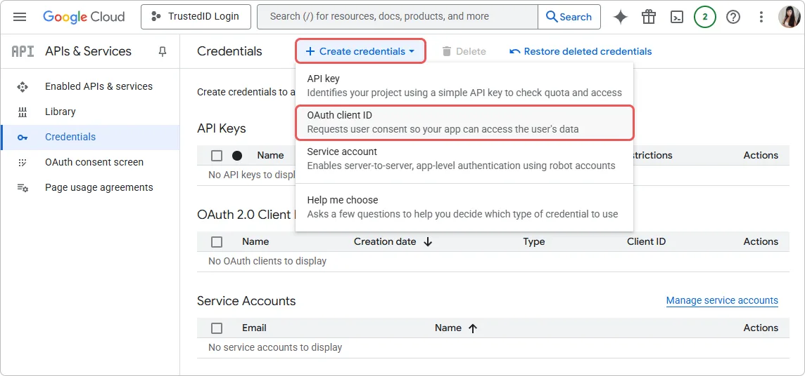
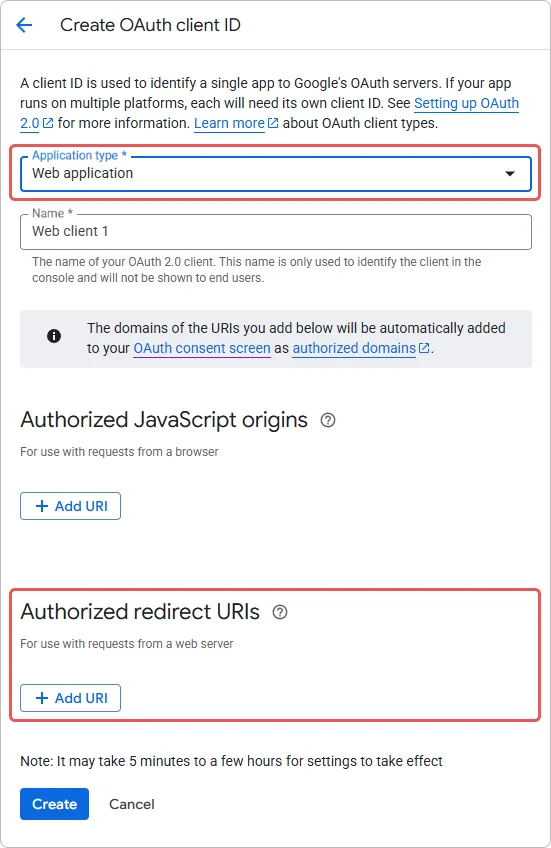
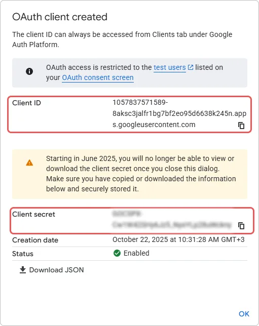

# Come Connettere il Login Google in Encvoy ID

> 📋 Questa istruzione fa parte di una serie di articoli sulla configurazione dei metodi di accesso. Per maggiori dettagli, leggi la guida [Metodi di Accesso e Configurazione del Widget](./docs-06-github-en-providers-settings.md).

In questa guida imparerai come connettere l'autenticazione tramite un account **Google** al sistema **Encvoy ID**. Questo metodo di accesso consente agli utenti di accedere alle applicazioni utilizzando il proprio account dei servizi **Google**.

La configurazione del login **Google** consiste in tre passaggi chiave eseguiti in due sistemi diversi:

- [Passaggio 1. Configura l'Applicazione in Google](#step-1-configure-google-app)
- [Passaggio 2. Crea il Metodo di Accesso](#step-2-create-login-method)
- [Passaggio 3. Aggiungi al Widget](#step-3-add-to-widget)
- [Descrizione dei Parametri](#parameters-description)
- [Vedi Anche](#see-also)

---

## Passaggio 1. Configura l'Applicazione in Google { #step-1-configure-google-app }

Prima di configurare il metodo di accesso in **Encvoy ID**, devi registrare la tua applicazione nella console per sviluppatori di **Google** e ottenere le chiavi di accesso:

1. Accedi con il tuo account **Google**.
2. Apri la [Google Cloud Console](https://code.google.com/apis/console#access).
3. Crea un nuovo progetto:
   - Nel pannello superiore, clicca su **Select a project** → **New Project**.
   - Specifica il nome del progetto (es. `Encvoy.ID Login` o il nome del tuo sito web).
   - Clicca su **Create**.

   > 🔗 Per maggiori dettagli, leggi le istruzioni su [developers.google.com](https://developers.google.com/workspace/guides/create-project?hl=en).

4. Configura la **OAuth consent screen**. Se hai già eseguito queste impostazioni in precedenza, salta questo passaggio.
   - Vai su **APIs and Services** → **OAuth consent screen**.

     

   - Apri la sezione **Branding**.
   - Clicca sul pulsante **Get started** al centro della finestra.
   - Fornisci le **App Information**: il nome dell'applicazione e l'indirizzo email che verranno visualizzati agli utenti nella schermata di consenso.
   - Seleziona il tipo di **Audience** → **External**.

     

   - Fornisci un indirizzo email per ricevere le notifiche del progetto.
   - Accetta la policy per gli utenti.

     

5. Crea un **OAuth Client ID**:
   - Vai su **APIs and Services** → **Credentials**.
   - Clicca su **Create credentials** → **OAuth client ID**.

     

   - Seleziona **Type** → **Web application**.
   - Inserisci il nome e l'URL di ritorno \#1 (`Redirect_uri`).
   - Clicca su **Create**.

     

     > ⚠️ Dopo la creazione, apparirà una finestra con i dati: `Client ID` e `Client Secret`. Salva questi valori: ti serviranno durante la configurazione in **Encvoy ID**.

     

6. Controlla le impostazioni della **OAuth consent screen**:

   Prima dell'uso, assicurati che:
   - Lo stato della schermata di consenso sia **Published** (Abilitato), non **In development**,
   - Siano stati aggiunti gli **scope** richiesti — `email` e `profile`.

---

## Passaggio 2. Crea il Metodo di Accesso { #step-2-create-login-method }

Ora, con le chiavi ottenute da **Google**, creiamo il provider corrispondente nel sistema **Encvoy ID**.

1. Vai al pannello di amministrazione → scheda **Impostazioni**.

   > 💡 Per creare un metodo di accesso per un'organizzazione, apri la **dashboard dell'organizzazione**. Se il metodo di accesso è necessario per un'applicazione specifica, apri le **impostazioni di quell'applicazione**.

2. Trova il blocco **Metodi di accesso** e clicca su **Configura**.
3. Nella finestra che si apre, clicca sul pulsante **Crea** .
4. Si aprirà una finestra con un elenco di template.
5. Seleziona il template **Google**.
6. Compila il modulo di creazione:

   **Informazioni di Base**
   - **Nome** — Il nome che gli utenti vedranno.
   - **Descrizione** (opzionale) — Una breve descrizione.
   - **Logo** (opzionale) — Puoi caricare la tua icona, altrimenti verrà utilizzata quella standard.

   **Parametri di Autenticazione**
   - **Identificativo risorsa (client_id)** — Incolla l'**ID Applicazione** copiato (`Client ID`).
   - **Chiave segreta (client_secret)** — Incolla il **Segreto** copiato (`Client Secret`).
   - **URL di reindirizzamento (Redirect URI)** — Questo campo verrà compilato automaticamente in base al tuo dominio.

   **Impostazioni Aggiuntive**
   - **Metodo di accesso pubblico** — Abilita questa opzione se desideri che questo metodo di accesso sia disponibile per l'aggiunta ad altre applicazioni del sistema (o dell'organizzazione), nonché al profilo utente come [identificatore di servizio esterno](./docs-12-common-personal-profile.md#external-service-identifiers).
   - **Pubblicità** — Imposta il livello di pubblicità predefinito per l'identificatore del servizio esterno nel profilo utente.

7. Clicca su **Crea**.

Dopo la creazione con successo, il nuovo metodo di accesso apparirà nell'elenco generale dei provider.

---

## Passaggio 3. Aggiungi al Widget { #step-3-add-to-widget }

Per rendere visibile il pulsante **Accedi con Google** nel modulo di autorizzazione, è necessario attivare questa funzione nelle impostazioni del widget:

1. Nell'elenco generale dei provider, trova il metodo di accesso creato.
2. Attiva l'interruttore sul pannello del provider.

> **Verifica**: Dopo il salvataggio, apri il modulo di login in un'applicazione di test. Sul widget dovrebbe apparire un nuovo pulsante con il logo **Google**.

---

## Descrizione dei Parametri { #parameters-description }

### Informazioni di Base

| Nome            | Descrizione                                                                                         | Tipo                 | Vincoli              |
| --------------- | --------------------------------------------------------------------------------------------------- | -------------------- | -------------------- |
| **Nome**        | Il nome che verrà visualizzato nell'interfaccia del servizio **Encvoy ID**                          | Testo                | Max 50 caratteri     |
| **Descrizione** | Una breve descrizione che verrà visualizzata nell'interfaccia del servizio **Encvoy ID**            | Testo                | Max 255 caratteri    |
| **Logo**        | L'immagine che verrà visualizzata nell'interfaccia del servizio **Encvoy ID** e nel widget di login | JPG, GIF, PNG o WEBP | Dimensione max: 1 MB |

### Parametri di Autenticazione

| Nome                                                          | Parametro       | Descrizione                                                                                                       |
| ------------------------------------------------------------- | --------------- | ----------------------------------------------------------------------------------------------------------------- |
| **Identificativo risorsa (client_id)**                        | `Client_id`     | L'ID dell'applicazione creata in **Google**                                                                       |
| **Chiave segreta (client_secret)**                            | `Client_secret` | La chiave di accesso al servizio dell'applicazione creata in **Google**                                           |
| **URL di reindirizzamento (Redirect URI)** (non modificabile) | `Redirect URI`  | L'indirizzo **Encvoy ID** al quale l'utente viene reindirizzato dopo l'autenticazione nel servizio di terze parti |

### Impostazioni Aggiuntive

| Nome                           | Descrizione                                                                                                                                                                                                                                                                                                         |
| ------------------------------ | ------------------------------------------------------------------------------------------------------------------------------------------------------------------------------------------------------------------------------------------------------------------------------------------------------------------- |
| **Metodo di accesso pubblico** | Quando attivato:   - Il metodo di accesso diventa disponibile per l'aggiunta ad altre applicazioni del servizio.   - Il metodo di accesso diventa disponibile per l'aggiunta come [identificatore di servizio esterno](./docs-12-common-personal-profile.md#external-service-identifiers) nel profilo utente. |
| **Pubblicità**                 | Imposta il livello di pubblicità predefinito per l'identificatore del servizio esterno nel profilo utente                                                                                                                                                                                                           |

---

## Vedi Anche { #see-also }

- [Metodi di Accesso e Configurazione del Widget di Login](./docs-06-github-en-providers-settings.md) — una guida ai metodi di accesso e alla configurazione del widget di login.
- [Gestione dell'Organizzazione](./docs-09-common-mini-widget-settings.md) — una guida al lavoro con le organizzazioni nel sistema **Encvoy ID**.
- [Profilo Personale e Gestione dei Permessi delle Applicazioni](./docs-12-common-personal-profile.md) — una guida alla gestione del profilo personale.
