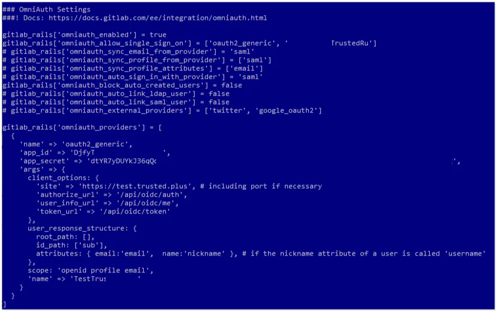

# Come configurare l'integrazione di GitLab con {{projectName}}

In questa guida imparerai come configurare il single sign-on (SSO) in **GitLab** tramite il sistema **{{projectName}}**.

> 📌 [GitLab](https://about.gitlab.com/) è una piattaforma web per la gestione di progetti e repository di codice software, basata sul popolare sistema di controllo versione **Git**.

La configurazione dell'accesso tramite **{{projectName}}** consiste in diverse fasi chiave eseguite in due sistemi differenti.

- [Passaggio 1. Creazione dell'applicazione](#step-1-create-application)
- [Passaggio 2. Configurazione del sistema GitLab](#step-2-configure-gitlab)
- [Passaggio 3. Verifica dell'integrazione](#step-3-verify-integration)

---

## Passaggio 1. Creazione dell'applicazione { #step-1-create-application }

1. Accedi al sistema **{{projectName}}**.  
2. Crea un'applicazione con le seguenti impostazioni:

   - **Indirizzo Applicazione** - l'indirizzo della tua installazione **GitLab**;  
   - **URL di reindirizzamento \#1 (`Redirect_uri`)** - `<indirizzo installazione GitLab>/users/auth/oauth2_generic/callback`.  

    > 🔍 Per maggiori dettagli sulla creazione di applicazioni, consulta le [istruzioni](./docs-10-common-app-settings.md#creating-application).

3. Apri le [impostazioni dell'applicazione](./docs-10-common-app-settings.md#editing-application) e copia i valori dei seguenti campi:

    - **Identificativo** (`Client_id`),
    - **Chiave segreta** (`client_secret`).

---

## Passaggio 2. Configurazione del sistema GitLab { #step-2-configure-gitlab }

La configurazione dell'autorizzazione utente per il servizio **GitLab** tramite **{{projectName}}** viene eseguita nel file di configurazione **gitlab.rb** di GitLab, situato nella cartella di configurazione del servizio (/config).  

1. Apri il file di configurazione **gitlab.rb** in modalità modifica e vai al blocco **OmniAuth Settings**.  
2. Imposta i seguenti valori per i parametri:  

    ```bash
        gitlab_rails['omniauth_enabled'] = true  
        gitlab_rails['omniauth_allow_single_sign_on'] = ['oauth2_generic', '<{{projectName}}SystemName>']  
        gitlab_rails['omniauth_block_auto_created_users'] = false  

        Il valore per gitlab_rails['omniauth_providers'] dovrebbe apparire come segue:  

        gitlab_rails['omniauth_providers'] = [  
        {  
        'name' => 'oauth2_generic',   
        'app_id' => '<Client_id dell'applicazione creata in {{projectName}}>',  
        'app_secret' => '<Client_secret dell'applicazione creata in {{projectName}}>',  
        'args' => {  
        client_options: {  
        'site' => 'https://<indirizzo sistema {{projectName}}>/',  
        'authorize_url' => '/api/oidc/auth',  
        'user_info_url' => '/api/oidc/me',  
        'token_url' => '/api/oidc/token'  
        },  
        user_response_structure: {  
        root_path: [],  
        id_path: ['sub'],  
        attributes: { email:'email',  name:'nickname' },  
        },  
        scope: 'openid profile email',  
        'name' => '<{{projectName}}SystemName>’  
        }  
        }  
        ]  
    ```

    

3. Riavvia il servizio **GitLab** per applicare le nuove impostazioni.
4. Se necessario, accedi come amministratore all'interfaccia del servizio **GitLab**. Vai al percorso delle impostazioni **Admin (Admin Area) — Settings-General**.  

    Nella pagina che si apre, nel blocco **Sign-in restrictions**, spunta la casella accanto a <{{projectName}}SystemName> nel sotto-blocco **Enabled OAuth authentication sources**.  

    

---

## Passaggio 3. Verifica dell'integrazione { #step-3-verify-integration }

1. Apri la pagina di login di **GitLab**.
2. Assicurati che sia apparso il pulsante **Login via {{projectName}}**.
3. Clicca sul pulsante e accedi utilizzando il tuo account aziendale:

   * Il sistema ti reindirizzerà alla pagina di autenticazione di **{{projectName}}**.
   * Inserisci le tue credenziali aziendali.

    

4. Dopo l'autenticazione riuscita, dovresti essere reindirizzato a **GitLab** ed effettuare automaticamente l'accesso al tuo account.