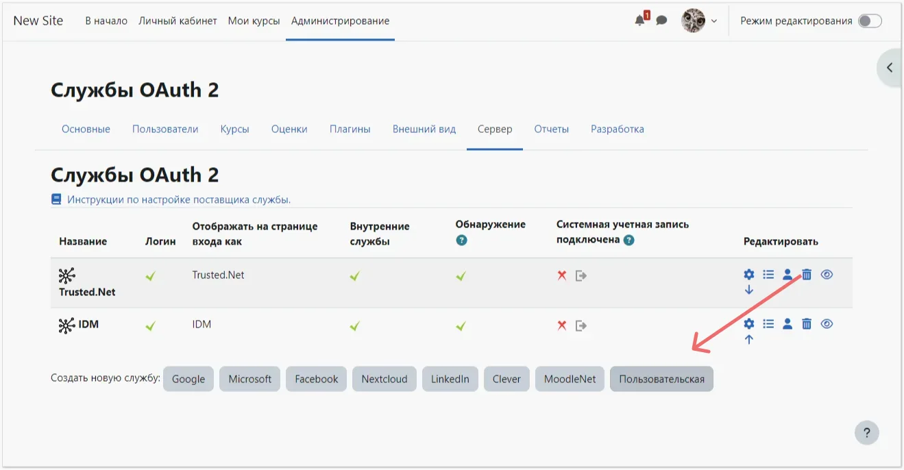
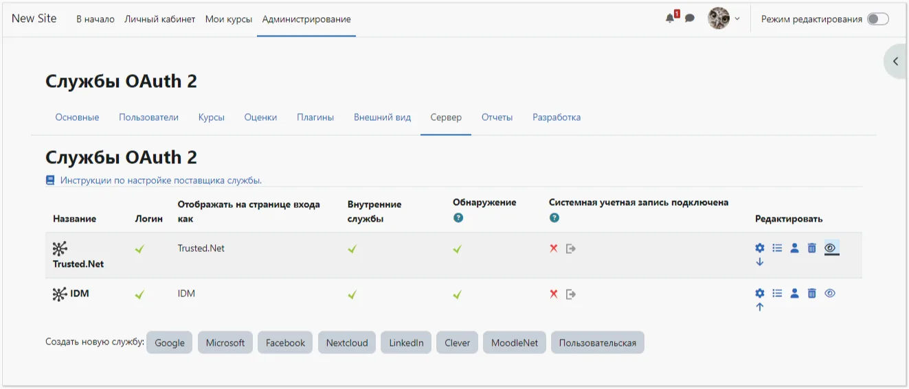
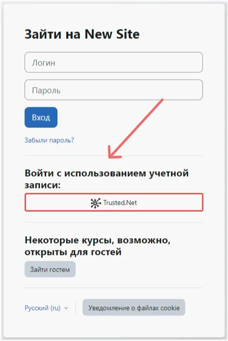

# Come configurare l'integrazione di Moodle con Encvoy ID

In questa guida imparerai come configurare il Single Sign-On (SSO) in **Moodle** utilizzando il sistema **Encvoy ID**.

> 📌 [Moodle](https://moodle.org/) è un sistema di gestione dell'apprendimento per corsi didattici elettronici (e-learning).

La configurazione dell'accesso tramite **Encvoy ID** consiste in diverse fasi chiave eseguite in due sistemi differenti:

- [Passaggio 1. Creazione dell'applicazione](#step-1-create-application)
- [Passaggio 2. Configurazione del sistema Moodle](#step-2-configure-moodle)
- [Passaggio 3. Verifica della connessione](#step-3-verify-connection)

---

## Passaggio 1. Creazione dell'applicazione { #step-1-create-application }

1. Accedi al sistema **Encvoy ID**.
2. Crea un'applicazione con le seguenti impostazioni:
   - **Indirizzo dell'applicazione** - l'indirizzo della tua installazione **Moodle**;
   - **URL di reindirizzamento \#1 (Redirect_uri)** - `<Indirizzo installazione Moodle>/admin/oauth2callback.php`.

   Per maggiori dettagli sulla creazione di applicazioni, leggi le [istruzioni](./docs-10-common-app-settings.md#creating-application).

3. Apri le [impostazioni dell'applicazione](./docs-10-common-app-settings.md#editing-application) e copia i valori dei seguenti campi:
   - **Identificativo** (`Client_id`),
   - **Chiave Segreta** (`client_secret`).

---

## Passaggio 2. Configurazione del sistema Moodle { #step-2-configure-moodle }

> Per configurare l'autenticazione utente sono necessari i diritti di amministratore in **Moodle**.

### Abilitare il plugin OAuth2

1. Accedi a **Moodle** con diritti amministrativi.
2. Vai su **Amministrazione del sito - Plugin - Autenticazione** e attiva il plugin **OAuth 2** abilitandolo nella colonna **Abilita**.

### Creare un provider personalizzato

1. Vai su **Amministrazione del sito** → **Server** → **Servizi OAuth 2**.
2. Clicca sul pulsante **Personalizzato**.

3. Si aprirà il modulo di creazione del provider.
4. Compila i campi:
   - **Nome** — qualsiasi nome visualizzato per il servizio;
   - **ID client** — il `Client_id` dell'applicazione **Encvoy ID**;
   - **Segreto client** — il `Client_secret` dell'applicazione **Encvoy ID**;
   - **URL di base del servizio** — `<Indirizzo Encvoy ID>/api/oidc`;
   - **Mostra nella pagina di login** — **Pagina di login e servizi interni**;
   - **Scope inclusi in una richiesta di login** — `openid profile email offline_access`;
   - **Scope inclusi in una richiesta di login per accesso offline** — `offline_access`.

   

5. Salva le modifiche.

### Configurare gli Endpoint

1. Clicca su **Configura endpoint** nella colonna **Modifica**.

2. Se tutti i dati sono stati inseriti correttamente, le impostazioni verranno compilate automaticamente.

   

   > Se necessario, puoi compilare gli URL degli endpoint manualmente. Consulta l'elenco degli URL disponibili all'indirizzo: `https://<indirizzo servizio Encvoy ID>/api/oidc/.well-known/openid-configuration`

### Configurare la mappatura dei campi utente

1. Clicca su **Configura mappatura campi utente** nella colonna **Modifica**.

2. Se tutti i dati sono stati inseriti correttamente, le impostazioni verranno compilate automaticamente.

   

   > Se necessario, le mappature possono essere configurate manualmente.

### Configurare l'invio di email in Moodle

Se l'LMS richiede l'invio di email agli utenti, è necessario configurare le impostazioni email (se non impostate precedentemente):

1. Vai su **Amministrazione del sito → Server → Email → Configurazione posta in uscita**.
2. Compila i campi:
   - **Host SMTP** — il nome completo del server SMTP, inclusa la porta separata da due punti;
   - **Sicurezza SMTP** — seleziona un valore dall'elenco;
   - **Tipo di autenticazione SMTP** — seleziona il valore richiesto. Se viene selezionato il tipo di autenticazione **LOGIN**, compila i campi **Nome utente SMTP** e **Password SMTP**. Si raccomanda di compilare il campo **Indirizzo no-reply** per evitare potenziali problemi durante l'invio delle email.

   

> 💡 Il collegamento tra un utente Moodle LMS e un utente Encvoy ID si basa sull'indirizzo email. L'assenza di un'email nel profilo Encvoy ID renderà impossibile l'autenticazione in Moodle. L'eliminazione di un indirizzo email precedentemente collegato a Moodle in Encvoy ID e l'aggiunta di un nuovo indirizzo email comporterà la creazione di un nuovo utente in Moodle.

---

## Passaggio 3. Verifica della connessione { #step-3-verify-connection }

1. Torna all'elenco dei **Servizi OAuth 2** e assicurati che il provider creato sia attivo.

2. Apri la pagina di login di **Moodle**.
3. Assicurati che sia apparso il pulsante **Accedi tramite Encvoy ID**.
4. Clicca sul pulsante e accedi utilizzando le tue credenziali aziendali:
   - Verrai reindirizzato alla pagina di autenticazione di **Encvoy ID**;
   - Dopo un accesso riuscito, verrai reindirizzato a **Moodle** come utente autorizzato.

   
