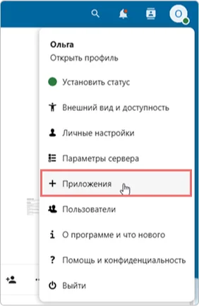
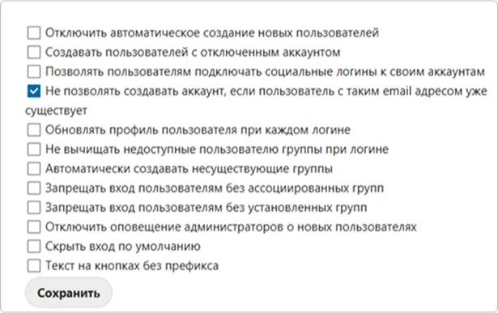

# Come configurare l'integrazione di Nextcloud con Encvoy ID

In questa guida imparerai come configurare il Single Sign-On (SSO) in **Nextcloud** utilizzando il sistema **Encvoy ID**.

> 📌 [Nextcloud](https://nextcloud.com/) è un ecosistema di servizi per la comunicazione aziendale e la collaborazione, che combina chiamate, videoconferenze, chat e gestione delle attività.

La configurazione dell'accesso con **Encvoy ID** si compone di due fasi chiave eseguite in due sistemi diversi.

- [Passaggio 1. Creazione dell'applicazione](#step-1-create-application)
- [Passaggio 2. Configurazione di Nextcloud](#step-2-configure-nextcloud)
- [Passaggio 3. Verifica della connessione](#step-3-verify-connection)

---

## Passaggio 1. Creazione dell'applicazione

1. Accedi a **Encvoy ID**.
2. Crea una nuova applicazione e specifica:
   - **Indirizzo dell'applicazione** - l'indirizzo della tua installazione **Nextcloud**. Ad esempio: `https://<indirizzo-installazione-nextcloud>`.
   - **URL di reindirizzamento \#1** (`Redirect_uri`) - l'indirizzo nel formato `https://<indirizzo-installazione-nextcloud>/api/oauth/return`.

     > 🔍 Per maggiori dettagli sulla creazione di applicazioni, consulta le [istruzioni](./docs-10-common-app-settings.md#creating-application).

3. Apri le [impostazioni dell'applicazione](./docs-10-common-app-settings.md#editing-application) e copia i valori dei seguenti campi:
   - **Identificatore** (`Client_id`),
   - **Chiave segreta** (`client_secret`).

---

## Passaggio 2. Configurazione di Nextcloud

1. Accedi a **Nextcloud** con privilegi di amministratore.
2. Installa l'applicazione **Social Login**. Questa app consente agli utenti di accedere al sistema **Nextcloud** utilizzando account di servizi di terze parti. Maggiori informazioni sull'app sono disponibili su [apps.nextcloud.com](https://apps.nextcloud.com/apps/sociallogin).
   - Vai alla sezione **App** → **Social & communication**.

     

   - Clicca su **Scarica e abilita** per l'app **Social Login**.

     

     Dopo l'installazione dell'app, apparirà una sottosezione **Social login** nella sezione **Impostazioni di amministrazione**.

3. Vai in **Impostazioni di amministrazione** → sottosezione **Social login**.
4. Clicca sul pulsante  accanto al campo **Custom OpenID Connect**.
5. Compila i parametri di connessione:
   - **Internal name** - specifica il nome interno del servizio di autenticazione come apparirà nelle impostazioni di **Nextcloud**.
   - **Title** - specifica un nome intuitivo per il servizio di autenticazione. Questo nome verrà visualizzato sul pulsante della pagina di login e nelle impostazioni di **Nextcloud**.
   - **Authorize url** - specifica l'URL di autorizzazione. Ad esempio, `https://<indirizzo-installazione-Encvoy ID>/api/oidc/auth`.
   - **URL token** - specifica l'URL per ottenere il token di accesso. Ad esempio, `https://<indirizzo-installazione-Encvoy ID>/api/oidc/token`.
   - **Client id** - specifica il valore creato al **Passaggio 1**.
   - **Client Secret** - specifica il valore creato al **Passaggio 1**.
   - **Scope** - specifica i permessi richiesti per il recupero dei dati. Lo scope obbligatorio è `openid` e lo scope standard è `profile`. Quando specifichi più permessi, separali con uno spazio. Ad esempio: `profile email openid`.

   

6. Se necessario, configura le impostazioni aggiuntive:

Al termine di tutti i passaggi, il pulsante di accesso per **Encvoy ID** verrà visualizzato nel widget di autorizzazione di **Nextcloud**.

---

## Passaggio 3. Verifica della connessione

1. Apri la pagina di login di **Nextcloud**.
2. Assicurati che sia apparso il pulsante **Accedi con Encvoy ID**.
3. Clicca sul pulsante e accedi utilizzando le tue credenziali aziendali:
   - Verrai reindirizzato alla pagina di autenticazione di **Encvoy ID**;
   - Dopo un accesso riuscito, verrai riportato su **Nextcloud** come utente autorizzato.

   
