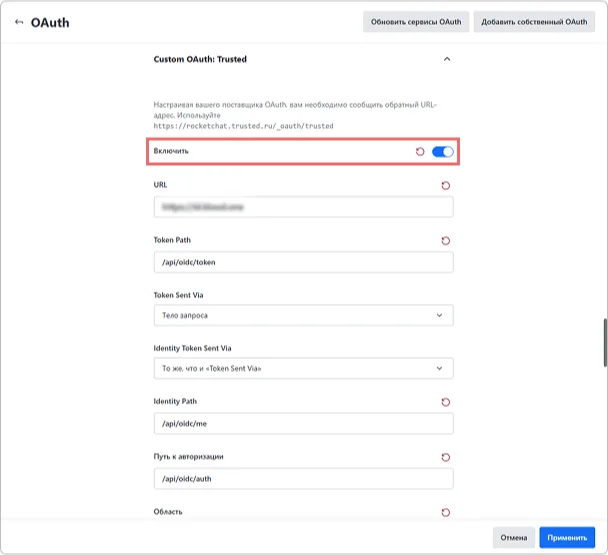

# Come configurare l'integrazione di Rocket.Chat con Encvoy ID

In questa guida imparerai come configurare il Single Sign-On (SSO) in **Rocket.Chat** tramite il sistema **Encvoy ID**.

> 📌 [Rocket.Chat](https://www.rocket.chat/) è una piattaforma di messaggistica open-source progettata per il lavoro di squadra e la comunicazione. Offre funzionalità simili a servizi come **Slack** o **Microsoft Teams**, ma con l'opzione di auto-distribuzione sul proprio server.

La configurazione dell'accesso tramite **Encvoy ID** consiste in diverse fasi chiave eseguite in due sistemi differenti:

- [Passaggio 1. Creare una connessione in Rocket.Chat](#step-1-create-rocketchat-connection)
- [Passaggio 2. Creare un'applicazione](#step-2-create-application)
- [Passaggio 3. Configurare la connessione in Rocket.Chat](#step-3-configure-rocketchat)
- [Passaggio 4. Verificare la connessione](#step-4-verify-connection)

---

## Passaggio 1. Creare una connessione in Rocket.Chat { #step-1-create-rocketchat-connection }

1. Accedi a **Rocket.Chat** con diritti di amministratore.
2. Apri il menu e seleziona **Workspace**.

3. Si aprirà la sezione **Administration**.
4. Vai alla sottosezione **Settings** e clicca su **Open** nel blocco **OAuth**.

5. Clicca sul pulsante **Add custom OAuth**.

6. Nella finestra che appare, specifica un nome univoco per il **servizio OAuth** che stai connettendo e clicca su **Add**.

7. La connessione creata apparirà nell'elenco generale delle connessioni. In caso contrario, aggiorna la pagina del browser.
8. Espandi le impostazioni della connessione e copia la **Callback URL**.

---

## Passaggio 2. Creare un'applicazione { #step-2-create-application }

1. Accedi a **Encvoy ID**.
2. Crea una nuova applicazione e specifica:
   - **Indirizzo Applicazione** - l'indirizzo della tua installazione di **Rocket.Chat**;
   - **Callback URL \#1 (Redirect_uri)** - incolla il valore copiato dalla connessione creata in **Rocket.Chat**.

     > 🔍 Per maggiori dettagli sulla creazione di applicazioni, consulta le [istruzioni](./docs-10-common-app-settings.md#creating-application).

3. Apri le [impostazioni dell'applicazione](./docs-10-common-app-settings.md#editing-application) e copia i valori dei seguenti campi:
   - **Identificatore** (`Client_id`),
   - **Chiave Segreta** (`client_secret`).

---

## Passaggio 3. Configurare la connessione in Rocket.Chat { #step-3-configure-rocketchat }

1. Torna su **Rocket.Chat**.
2. Apri le impostazioni per la connessione creata al Passaggio 1.
3. Attiva l'interruttore **Enable** per attivare la connessione, oppure attivala in seguito dopo aver configurato tutti i parametri.

4. Specifica i parametri di connessione:
   - **URL** — L'URL del servizio Encvoy ID. Ad esempio: `https://<indirizzo installazione Encvoy ID>`
   - **Token Path** — Questa è la parte dell'URL del Token Endpoint che specifica il percorso per ottenere i token. Ad esempio: **/api/oidc/token**.
   - **Identity Path** — L'endpoint con le informazioni dell'utente. Ad esempio: **/api/oidc/me**.
   - **Authorize Path** — Il percorso dall'endpoint di autorizzazione. Ad esempio: **/api/oidc/auth**.
   - **Scope** — I permessi necessari per recuperare i dati. Lo scope richiesto è **openid** e lo scope standard è **profile**. Quando specifichi più permessi, separali con uno spazio. Ad esempio: **profile email openid**.
   - **Id** — L'Identificatore (`Client_id`). Copia il valore creato al Passaggio 2.
   - **Secret** — La Chiave Segreta (`Client_secret`). Copia il valore creato al Passaggio 2.

5. Specifica le restanti impostazioni. Descrizioni dettagliate delle impostazioni possono essere trovate sul portale della documentazione [docs.rocket.chat](https://docs.rocket.chat/docs/oauth).
6. Salva le impostazioni della connessione.

Dopo aver completato tutti i passaggi, un pulsante di accesso per **Encvoy ID** apparirà nel widget di autorizzazione di **Rocket.Chat**.

---

## Passaggio 4. Verificare la connessione { #step-4-verify-connection }

1. Apri la pagina di login di **Rocket.Chat**.
2. Assicurati che sia apparso il pulsante **Login with Encvoy ID**.
3. Clicca sul pulsante e accedi utilizzando le tue credenziali aziendali:
   - Verrai reindirizzato alla pagina di autenticazione di **Encvoy ID**;
   - Dopo un accesso riuscito, verrai riportato su **Rocket.Chat** come utente autorizzato.

   
